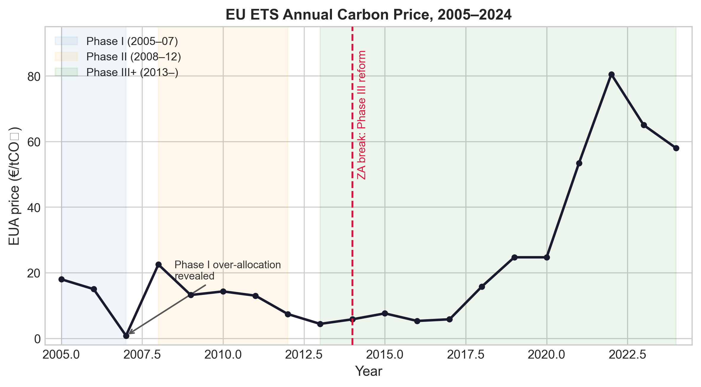
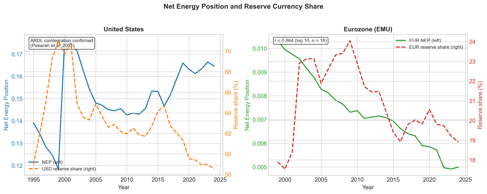
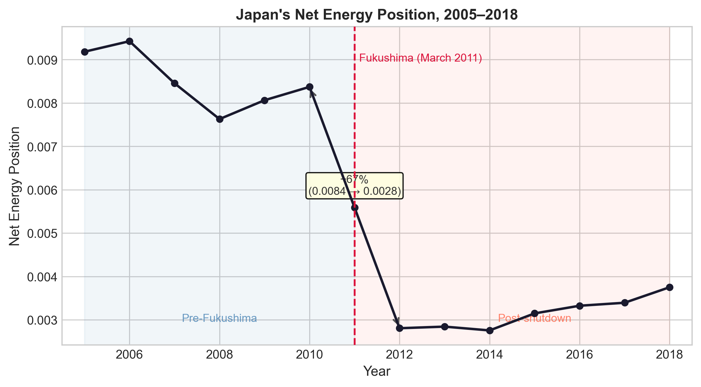
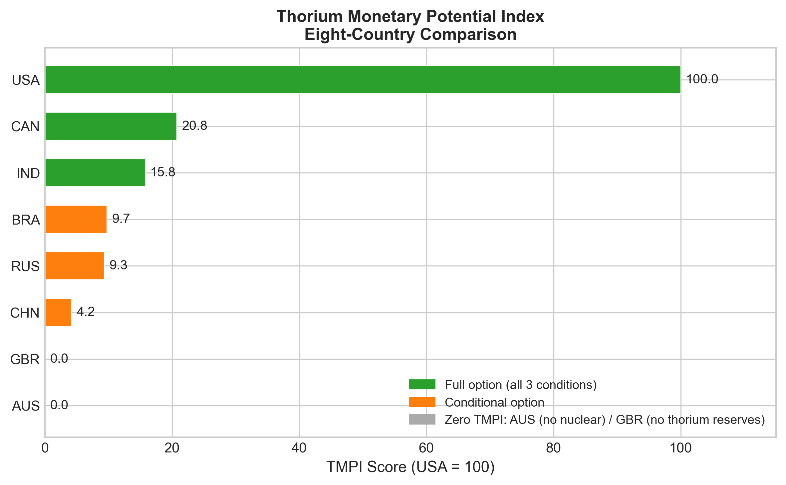
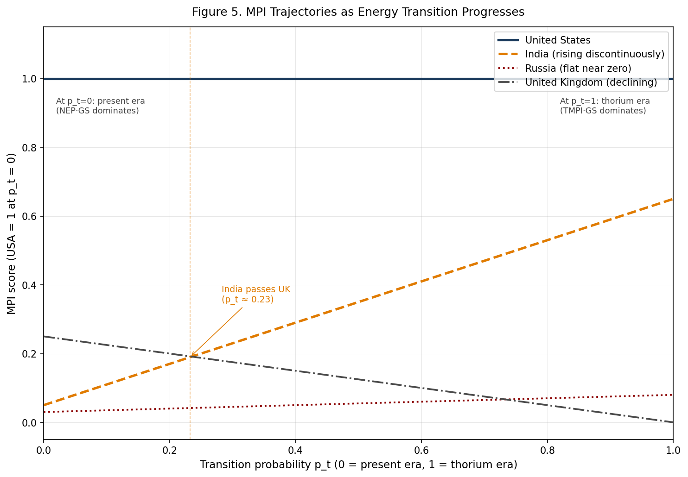

# The Carbon-Thorium Standard
## Energy-Backed Currencies and the Architecture of Monetary Failure in a Multipolar World

*Working Paper | 2026*

---

**Abstract**

Why do reserve currencies rise and fall? The standard account points to GDP, financial depth, and network effects. This paper argues that energy sovereignty is the missing mechanism — and that its absence from existing frameworks is not an oversight but a structural blind spot that will cause every major account to mispredict the next monetary transition, as every standard account has mispredicted every major transition of the past two centuries.

We develop the Monetary Power Index (MPI), a framework that formalises the relationship between energy sovereignty and monetary power across energy eras. Three empirical registers test it. The backward register establishes that energy governance is politically constructed, not geologically determined: the EU Emissions Trading System's carbon price collapsed not because of a supply shock but because of a political accounting revelation, exhibiting price volatility seventeen times higher than an equivalent American carbon market. The present register documents the mechanism through structured case comparison: the United States and the eurozone move in opposite directions on both energy position and reserve share, and Japan's post-Fukushima nuclear shutdown provides a rare natural experiment that isolates the energy variable from GDP and institutional quality. The forward register constructs a Thorium Monetary Potential Index that maps which states hold the structural position to convert thorium-era energy endowments into monetary leverage — and finds that India's position rises discontinuously as the energy transition progresses, a prediction no present-era framework produces. The India prediction is framed as a conditional scenario: INR FX turnover share reaches 3–5% by BIS 2031 conditional on nuclear capacity additions being measurable by 2028 AND some capital account easing observable in the same period; if the 2028 gate conditions are not met, the 2031 prediction is withdrawn, not postponed. The MPI is a measurement instrument for identifying structural candidates; the causal theory operates through three transmission channels — trade invoicing, asset recycling, and credibility — that activate under specific institutional sequencing conditions.

Ten falsifiable predictions are registered at dated checkpoints through 2037. The paper stakes its empirical reputation on specific, time-bound outcomes.

**Keywords:** reserve currencies, energy sovereignty, geoeconomics, structural power, thorium, monetary power index, governance sensitivity, de-dollarisation

**JEL codes:** F31, F33, Q43, Q48

---

# §1 — Introduction: Money Has Always Been an Energy Instrument

In 1944, the United States dollar became the anchor of the postwar monetary order at Bretton Woods. The standard explanation emphasises American economic size, the depth of its financial markets, and the institutional architecture that American negotiators imposed on a war-exhausted world. These explanations are not wrong. They are incomplete.

The dollar did not simply follow American GDP. It followed American energy. The United States was the world's dominant oil producer from the 1860s through the 1970s — a position that underwrote the industrial capacity, trade surpluses, and geopolitical leverage from which monetary hegemony was constructed. But the dollar's elevation to reserve currency status was not a passive consequence of energy abundance. It required a governance decision that converted energy position into monetary architecture.

That decision occurred in 1974. The US-Saudi agreement — negotiated in the aftermath of the oil shock — established that Saudi Arabia would price oil in US dollars and commit OPEC surplus revenues to US Treasury securities. In exchange, the United States offered military protection and security guarantees. Spiro (1999) reconstructed this arrangement in detail: it was a political transaction, not a market outcome. The consequence was structural. Every oil-importing country now needed dollars to purchase energy. Every OPEC surplus was recycled into demand for dollar-denominated assets. The petrodollar system did not emerge from network effects or GDP mass. It was constructed, through a specific bilateral deal, at a specific historical moment.

The sterling-dollar transition of the twentieth century was simultaneously a coal-oil transition — and the mechanism is visible in the data. UK coal production peaked in 1913 at approximately 292 million tonnes (BP Statistical Review of World Energy; Our World in Data). Sterling's reserve share began its long decline in the 1920s, a generational lag after the coal peak. But sterling did not simply evaporate when British industrial primacy faded. Schenk (2010) documented a more specific mechanism: oil royalty payments from Kuwait, Nigeria, and Saudi Arabia — denominated in sterling under colonial-era contracts — sustained demand for the pound well into the 1960s and 1970s, thirty years after Britain had ceased to be a credible economic hegemon. Gulf producers held sterling balances because their energy revenues arrived in sterling. When oil invoicing shifted to dollars after 1974, that structural demand evaporated. Sterling's reserve share fell from roughly 35% in 1950 to under 5% by 1980 (Eichengreen and Flandreau 2009) — not because Britain became less creditworthy in some abstract sense, but because the currency of energy trade changed and the institutional infrastructure of sterling demand was severed at its root.

No existing framework in international political economy makes this connection formally. This paper proposes one.

We develop the Monetary Power Index (MPI), a two-state framework that formalises the relationship between energy sovereignty and monetary power across energy eras. The MPI has three components, each corresponding to a temporal register of evidence:

The **backward register** establishes that energy governance is politically constructed — that energy positions are not geological fate but strategic outcomes of contested allocation decisions. The test case is the EU Emissions Trading System, whose carbon price collapsed from €30 to near-zero in 2007 not because of a supply shock but because of a political accounting revelation. Energy sovereignty, the MPI's input variable, is itself produced by governance choices.

The **present register** tests whether energy position predicts reserve currency status with a generational lag. The United States case — rising energy position through the shale revolution, stabilising reserve share — and the eurozone case — declining energy position, declining reserve share — move in opposite directions as the mechanism predicts. Japan's post-Fukushima nuclear shutdown provides a natural experiment that isolates the energy variable from the standard predictors of GDP, financial depth, and institutional quality.

The **forward register** asks where the mechanism points next. If energy transitions determine monetary trajectories, which states hold the structural position to convert the next-era energy endowment into monetary leverage? The Thorium Monetary Potential Index maps this distribution and makes a specific empirical bet: India's monetary position rises discontinuously as the energy transition progresses, driven by the world's largest thorium reserves and an active three-stage nuclear programme.

The paper registers ten falsifiable predictions at specific future dates. If the India prediction — INR FX turnover share rising to 3–5% by BIS Triennial 2031 — is confirmed, the energy-monetary mechanism is supported for the transition era. If it fails, the forward leg is falsified. We welcome the test.

---

**A note on the title: why "standard"?** The carbon governance architecture represents the current era's attempt to construct a rule-based energy allocation mechanism — just as the gold standard anchored monetary expectations through a commodity peg. Both claim to constrain sovereign discretion. The carbon regime failed that claim for a precise reason the backward register identifies: its prices are renegotiated whenever they impose material costs on powerful incumbents (Polanyi 1944). The thorium standard is the forward attempt; whether it succeeds depends on whether physical scarcity and nuclear construction lead times impose constraints durable enough to resist the same capture.

**A note on the paper's analytical scope.** This paper is a positive analytical framework for monetary power mechanics — it maps structural positions and predicts trajectories; it does not adjudicate whether those trajectories are normatively desirable from the perspectives of climate justice, ecological equity, or post-growth economics. These are genuine normative questions that a positive framework cannot absorb without degrading its analytical precision. The paper's GS measure is a measurement instrument: GS > 1 identifies politically constructed governance without determining whose interests that construction serves — industrial incumbents blocking effective carbon pricing and community-level resistance to carbon costs on vulnerable populations produce the same GS signature. Similarly, the TMPI identifies structural leverage positions; it does not determine whether those positions will be exercised equitably, or whether the energy trajectories it maps are ecologically desirable. The appropriate site for engaging the normative questions — climate justice, green extractivism, post-growth monetary theory — is future work that takes the MPI's structural predictions as inputs to a normative evaluation. The paper neither endorses nor opposes the energy-monetary trajectories it describes.

---

# §2 — The Gap: What Five Literatures Miss

Five bodies of scholarship approach the finance-energy nexus from different angles. None crosses the full distance.

## 2.1 Reserve Currency Determinants

The empirical literature on reserve currency status has converged on a standard set of determinants: the issuing economy's GDP and trade share, the depth and liquidity of its financial markets, monetary institution stability, and network effects that make the dominant currency self-reinforcing (Chinn and Frankel 2007; Eichengreen 2011; Cohen 2015). McNamara (1998; 2008) identifies the political foundations and structural constraints of the euro's international role specifically — a reminder that eurozone monetary architecture is conditioned by ideational conflicts between German and French conceptions of monetary order, not only by energy endowment or GDP, and that the limits of the euro's reserve role are institutionally produced rather than simply determined by market size. The theoretical underpinning draws on the inertia of network goods: switching costs are high, incumbents benefit from incumbency, and structural change requires a sufficiently large shock to displace an equilibrium.

Two findings matter particularly for this paper. First, reserve currency shares change slowly but not irreversibly. Sterling's decline from roughly 60% of global reserves in 1899 to roughly 5% by 1976 took three generations — but it happened, and Eichengreen and Flandreau (2009) show it began far earlier than conventional accounts suggest, in the mid-1920s. Second, Arslanalp, Eichengreen, and Simpson-Bell (2022) document a quiet erosion of dollar dominance since 2000 driven not by the euro or yen gaining ground but by non-traditional reserve currencies — the Australian and Canadian dollars — currencies positioned by commodity endowment and institutional openness rather than GDP mass. That finding connects directly to this paper's forward register: the diversification is already happening into precisely the currencies the MPI framework predicts should gain share.

Ilzetzki, Reinhardt, and Rogoff (2019) document that monetary power in the post-Bretton Woods era appears increasingly decoupled from energy endowment: the euro's reserve share peaked in 2009 despite the eurozone's structural energy dependence, and dollar dominance has proven resilient across periods of shifting US energy position. This paper argues the decoupling is era-specific. In the consolidation phase — when reserve currency status is already established — the mechanism operates through maintaining monetary credibility rather than acquiring it. Standard specifications miss the mechanism not because it is absent but because they treat the consolidation era as the only era.

The gap: energy position does not appear in any standard specification. This is not an oversight that a new control variable can correct. It reflects a deeper assumption — that energy is an exogenous endowment, priced by world markets, whose implications for monetary power are already captured by trade shares and GDP. This paper argues that assumption is wrong on both counts.

## 2.2 Hegemonic Stability Theory and Structural Power

Hegemonic Stability Theory (Kindleberger 1973; Gilpin 1981) provides the dominant realist framework: the international monetary system requires a hegemon willing and able to provide the public goods of monetary stability, and reserve currency status follows from that hegemonic position. HST correctly describes the correlation between dominant powers and dominant currencies but leaves the production mechanism underspecified. What makes a state structurally powerful in the first place?

Susan Strange (1988) offered the most precise answer. She identified four structures of structural power — security, production, finance, and knowledge — and argued that the United States' postwar dominance rested on simultaneous command of all four. She understood the finance-energy linkage but treated it as contingent on the specific institutional arrangements of dollar-denominated oil trade rather than as a general mechanism that reproduces across energy transitions.

Strange's fourth structure — knowledge — is the dimension this paper treats as conditioning the speed of thorium-era leverage accumulation rather than its direction. Control over reactor design, fuel-cycle intellectual property, and nuclear engineering networks determines whether a thorium-endowed state can convert geological wealth into operational energy sovereignty or whether it remains dependent on imported technology from the current hegemon's knowledge infrastructure. States developing indigenous reactor capacity — India's AHWR programme, China's TMSR-LF1 — build knowledge structure advantages that compound endowment into genuine strategic autonomy. States that remain technology importers, even thorium-rich ones, remain partially dependent on the exporter's knowledge infrastructure. This activation constraint is addressed through the "deployment pathway" component of TMPI but deserves explicit theorisation in Strange's own terms: energy endowment without knowledge structure command is latent leverage, not exercised leverage.

Gilpin (1987) extends the structural power argument to the political economy of international relations specifically: rising powers challenge hegemonic orders by exploiting the material base from which power is constructed. Energy transition eras create exactly this structural window — they are periods when the material base of hegemony is contested and the governance arrangements that reproduce it are most vulnerable to renegotiation. Cox (1981; 1983) provides the critical foundation for understanding why production relations condition interstate relations and ultimately world monetary orders. A historical structure is not merely an arrangement of material capabilities; it includes institutions and ideas, and its transformation requires changes in all three simultaneously. The thorium transition is, on this reading, a potential historical-structural transformation: the material base (energy endowment), the institutions (governance regimes), and the ideas (which currencies anchor monetary expectations) may all shift together if the transition is politically managed by states with independent monetary ambitions. Modelski (1987) provides an independent periodisation framework: long political cycles alternate between hegemonic orders at approximately century intervals, with each transition driven by the state that masters the new leading sector. The coal→oil→thorium sequence maps directly onto Modelski's leading-sector logic — the state that commands thorium-era energy governance occupies the structural position from which monetary leadership is exercised in the subsequent cycle.

What Strange left underdeveloped is how the security structure conditions which energy positions translate into monetary leverage. Spiro (1999) demonstrated that the recycling of OPEC surpluses into US Treasury securities was politically orchestrated: the United States offered Saudi Arabia military protection in exchange for dollar-denominated oil sales and reinvestment. Norrlof (2010, 2020) formalises this as a security premium: allies within the US security orbit hold more dollar reserves, peg to the dollar, and finance US deficits. Security dependence drives monetary bandwagoning; energy self-sufficiency enables monetary autonomy. Kirshner (1995; 2014) documents the coercive dimension: monetary power is not merely a passive attribute of economic size but an active instrument through which states discipline dependencies and manage challengers — a dynamic the MPI's Governance Sensitivity term captures at the regime level.

The historical cases make this vivid. West Germany held dollars and refrained from converting to gold during Bretton Woods because of military dependence on the United States. France under de Gaulle pursued monetary autonomy precisely because its nuclear deterrent provided symbolic military independence. Japan imports 97% of its energy and depends on the US security guarantee in the Pacific; its monetary subordination — the yen holding only 5–6% of global reserves despite the world's third-largest GDP — is inseparable from this energy-security dependence. The MPI framework captures the energy dimension of this triad; the Katzenstein filter (§7) captures the security dimension.

The gap: HST can identify incumbents but cannot identify challengers before they emerge, because it observes structural power as already constituted rather than in the process of constituting through the governance of energy transitions. A direct question deserves a direct answer: does the MPI outperform HST for the present era? In the present era, both frameworks agree — the United States dominates, no credible challenger has yet emerged at scale. The MPI's value is not in outperforming HST on current incumbency prediction. It is in forward trajectory specificity: the MPI tells you which states will gain and lose as the energy base transitions, and on what timeline, with specific falsification conditions. The India prediction is the test case. If India does not gain reserve share as nuclear capacity grows, the MPI's forward-era mechanism is falsified while HST simply notes that the incumbent held on. The MPI adds mechanistic accountability that HST cannot provide precisely because HST treats structural power as self-sustaining rather than as something that must be reproduced through specific governance choices about energy.

## 2.3 Institutional Persistence and the Speed of Transitions

The strongest challenge to any materialist account of reserve currency transitions comes from liberal institutionalism. Keohane (1984) argued that international regimes persist because they reduce transaction costs, provide information, and create focal points for cooperation. Institutions are stickier than the material base that created them. Ikenberry (2001; 2011) extends this to the rules-based liberal order: institutional frameworks built under American hegemony persist because rising powers internalise their rules and benefit from the provision of public goods. Helleiner (2008; 2014) applies the institutionalist frame to monetary governance specifically, documenting how financial regulatory architectures outlast the power configurations that produced them. Applied to monetary order, this argument correctly explains why the dollar remained dominant after 2008 despite a severe financial crisis: no credible alternative existed and the institutional infrastructure of dollar settlement was too embedded to dislodge under pressure.

The MPI framework does not deny institutional inertia. It makes a more precise claim: MPI captures the *direction* of reserve currency transitions while institutional persistence determines their *speed*. The generational lag λ≈10 between energy position and reserve share is, in part, a measure of institutional stickiness. Transitions happen in the direction the energy base dictates; they happen slowly because institutions resist.

A second dynamic cuts against institutional persistence. McDowell (2023) demonstrates empirically that US financial sanctions trigger anti-dollar policies: reserve diversification, alternative payment systems, and gold accumulation. Farrell and Newman (2023) argue that chokepoint weapons are coercive but brittle — the more the US uses them, the faster it erodes its own infrastructural advantage. The institutional stickiness that explains dollar persistence is being actively degraded by the hegemon itself. The energy-governance mechanism the MPI tracks operates in this widening gap.

A level-of-analysis clarification is necessary. The paper's GS term measures political construction of *energy* governance regimes (allocation rules, carbon market design, pipeline diplomacy). Farrell and Newman's chokepoint argument operates at the level of *financial* infrastructure (SWIFT exclusion, dollar clearing, correspondent banking). These are categorically different governance levels: GS captures first-order construction of energy allocation regimes; chokepoint dynamics capture second-order self-eroding financial network power. The GS framework cannot capture chokepoint dynamics because GS is not a function of how frequently financial chokepoints are used — it is a function of energy governance regime volatility. The paper engages Farrell-Newman as a conceptual complement (sanctions accelerate de-dollarisation that energy geography enables) rather than as a formal extension of GS. A natural extension would apply the GS concept to financial infrastructure: the Federal Reserve's bilateral swap line allocation is politically determined (US allies receive access; others do not), which would score above GS = 1 on the paper's own measurement logic (Braun 2022) — a productive direction for future work that the paper does not develop.

## 2.4 Carbon Market Political Economy

A substantial literature has established that EU ETS carbon prices are shaped by allocation rules, banking provisions, regulatory interventions, and national lobbying — not by physical supply-demand fundamentals alone (Ellerman and Buchner 2008; Koch et al. 2014; Bayer and Aklin 2020). Baldwin (1985) provided the conceptual foundation for reading these dynamics strategically: economic instruments — including governance regimes — are tools of statecraft whose leverage properties derive from dependency relationships. Mattli and Woods (2009) provide the most systematic framework for the regulatory dimension: in international regulatory institutions, capture by incumbents is the normal equilibrium, not an aberration.

What this literature has not done is formalise the degree of political construction relative to a baseline or connect that construction to monetary outcomes. Governance Sensitivity (GS), defined as the ratio of energy governance volatility to commodity benchmark volatility, provides this measurement. GS greater than 1 is the empirical signature of a politically constructed regime — a regime more volatile than the physical commodity it nominally governs. McNally (2017) documents how boom-bust cycles in oil markets emerge not from physical scarcity but from governance failures in production coordination; the GS measure formalises this insight for the carbon case, extending it from commodity pricing to the monetary consequences of governance-constructed volatility. This capacity for strategic exclusion echoes Hirschman's (1945) foundational insight that foreign trade relationships produce leverage precisely through dependency — the carbon governance case formalises that insight as a measurable ratio.

**Rival interpretation: the GS measure and the legitimation reading.** Lohmann (2009) argues that carbon markets serve a legitimation function within fossil capitalism: they allow continued accumulation by creating a new financial asset class while deferring the structural transformation that genuine decarbonisation requires. On Lohmann's account, the EU ETS Phase I collapse is not a governance failure — it is the predictable outcome of a mechanism designed to appear to address climate change while protecting incumbent industrial interests. This is a genuine rival interpretation of the same empirical pattern the paper's GS measure identifies. The GS framework is analytically indifferent between the two readings: whether ETS Phase I exhibited high volatility because of design failure or because it was designed to protect incumbents, the empirical signature is identical — σ(EUA) >> σ(commodity), GS >> 1. What GS captures is the *degree of political construction*; it cannot determine the *purpose* of that construction. Newell and Paterson (2010) situate this distinction within the broader political economy of climate capitalism. The GS framework's inability to discriminate between these interpretations is a scope limitation, not a defect — it makes GS usable as a neutral measurement instrument across competing normative frameworks.

**The Polanyian double movement and normative complexity.** The paper invokes Polanyi (1944) in the title note but does not follow through on what the double movement implies for the normative interpretation of GS. For Polanyi, the counter-mobilisation of social forces against market logic — the double movement — is not straightforwardly normative. GS > 1 may reflect industrial incumbents blocking effective carbon pricing (normatively negative from a climate perspective) or community-level resistance to carbon costs on vulnerable populations (normatively positive from a justice perspective). The GS measure cannot distinguish these. A paper that uses GS to map the political construction of energy governance regimes must acknowledge that the political forces doing the construction may be serving opposed social interests. This is why the paper presents GS as a measurement instrument, not a normative assessment: high GS is analytically the signature of politically constructed governance, not a judgment that the politics were good or bad. The scope declaration in §1 is this paper's explicit statement of that position.

## 2.5 Energy Transitions, Geopolitics, and the Multipolarity Problem

A growing literature on energy transitions and international order (Dannreuther 2017; Scholten et al. 2020; Overland 2019) examines how the shift away from fossil fuels will redistribute geopolitical power. This literature has not addressed monetary consequences.

The multipolarity debate matters for the paper's forward claims. Farhi and Maggiori (2018) produce a formal result that should unsettle any thesis predicting a smooth multipolar monetary order: the benefits of multiple reserve currencies are non-linear, and a system with two or three competing reserve currencies may produce worse outcomes than a single dominant one, because of speculative flows between competing reserve assets. Acharya (2017) offers a more productive framing: not multiple currencies competing head-to-head but a layered system where global currencies coexist with regional financial arrangements. Pforr, Pape, and Petry (2025) call this a financial interregnum — rising powers seeking autonomy without assuming hegemonic responsibility, producing fragmentation rather than replacement. The INR prediction does not require India to displace the dollar. It requires India to occupy a layer of the monetary architecture that the energy mechanism creates. F-M's competitive devaluation equilibrium is triggered by meaningful substitutability between reserve assets of comparable scale — the Nurkse mechanism operates when investors can credibly shift between near-comparable currencies. At 3–5% INR share versus 44% dollar share, that substitutability is structurally absent: the INR serves regional corridor and energy settlement functions rather than contesting the global reserve role, placing it in a distinct functional layer where F-M's Cournot quantity dynamics do not apply.

Grabel (2018) provides the strongest existing theoretical basis for layered monetary architecture emerging from developmental finance fragmentation. Her "productive incoherence" framework — developed from the experience of financial governance after 2008 — argues that the proliferation of competing multilateral institutions (NDB, CRA, AIIB, BRICS Bridge, bilateral swap networks) creates more developmental space than coherent hierarchy would, precisely because no single state can capture the governance architecture for its exclusive benefit. Applied to the paper's forward register: the institutional scaffolding that lowers coordination costs for de-dollarisation (NDB INR bonds, CRA liquidity backstop, BRICS Bridge settlement infrastructure) is not a coherent alternative Bretton Woods system. It is productive incoherence — layering that reduces threshold costs for energy-backed currencies to achieve regional reserve roles without requiring any single state to anchor the architecture. This is the institutional context within which the paper's energy mechanism operates: it predicts which states have the structural positions to occupy emerging layers, not whether those layers will become a unified coherent alternative order.

A rival account in this literature merits explicit engagement rather than synthesis. Gallagher and Kozul-Wright (2022) argue that the missing mechanism for global monetary rebalancing is developmental finance — specifically, a reformed multilateral lending architecture that extends long-term capital to industrialising states on concessional terms, enabling them to reduce dollar reserve accumulation requirements. On their account, energy geography is a contextual factor, not the causal mechanism; the binding constraint is finance, not physics. This paper argues the reverse: energy geography is the load-bearing mechanism, and developmental finance changes its *speed* by lowering institutional coordination costs. Gallagher and Kozul-Wright are not teammates here — they are proponents of a competing causal account. The question is whether the 2028–2037 falsification data reveals reserve share changes tracking energy position changes (the energy mechanism) or tracking developmental finance flows independently of energy position (the Gallagher/Kozul-Wright mechanism). The two accounts make different predictions for the same states.

Eichengreen, Mehl, and Chiţu (2017) provide the network externality framework for a question the MPI deliberately excludes: when does international currency status tip through self-reinforcing network effects to a new equilibrium? Their multi-currency historical analysis — covering sterling, dollar, French franc, and German mark reserve shares across the twentieth century — establishes that two or more reserve currencies can coexist stably when network effects create distinct functional niches, and that tipping to a new dominant currency requires both a structural shock to the incumbent and a credible alternative with existing network infrastructure. This is the threshold question: at what INR share do network externalities become self-reinforcing? E/M/C provides tools for that analysis; the bilateral MPI provides the inputs — individual state structural positions that determine who has leverage to push toward threshold. The two instruments answer adjacent questions and should be read as complements with distinct scope. Ghosh (2023) maps the heterodox alternatives to dollar hegemony from a political economy perspective, cataloguing how developing economies have attempted to insulate themselves from dollar-system volatility; this is consistent with the layering account and specifically relevant to the present paper's §2.5 framing — the strategies Ghosh documents are the political manifestations of the structural positions the MPI maps.

## 2.6 What the Five Literatures Miss Together

| Literature | What it explains | What it misses |
|------------|-----------------|----------------|
| Reserve currency determinants | Present-era reserve share; network effects; institutional quality | Energy mechanism; transition dynamics; political construction of energy positions |
| Structural power / institutionalism (HST, Strange, Norrlof, Keohane, Ikenberry) | Finance-energy linkage; security-monetary conditioning; institutional persistence; why transitions are slow | Formalisation across eras; direction of transitions; weaponisation eroding the institutional base |
| Carbon market political economy | Allocation regime politics; degree of political construction | Monetary consequences of politically constructed energy prices |
| Energy transition geopolitics | Power shifts under transitions; renewable rebalancing | Monetary mechanism; activation conditions distinguishing energy wealth from monetary power |
| Multipolarity literature | Instability of competing reserve currencies; fragmentation dynamics | Energy governance as the layering mechanism that structures fragmentation |

The MPI framework fills the intersection: it operationalises Strange's finance-energy pillars as estimable quantities, incorporates Norrlof's security conditioning through the Katzenstein filter, treats institutional inertia as the speed parameter (λ) rather than a refutation, measures the political construction of governance regimes (GS), and extends the transition geopolitics literature to monetary outcomes.

---

# §3 — The Monetary Power Index: A Two-State Framework

## 3.1 The Core Problem

**A clarification on the MPI's role.** The MPI equation, developed in §3.2, is a *measurement instrument* for identifying structural candidates — it ranks states by their energy-monetary position across eras. It is not itself the causal theory. The causal theory — what explains *why* energy governance predicts monetary power — consists of the three transmission channels in §3.4, operating under specific institutional conditions with specific sequencing requirements. The index ranks states; the channels explain outcomes. A state can score high on the MPI while failing to convert that position into monetary leverage if the institutional sequencing conditions are not met. Conflating the measurement instrument with the causal mechanism is the characteristic error of mechanistic applications of this framework: it produces accurate rankings but wrong predictions about which states will translate their positions into outcomes.

Prior work conflates two distinct quantities: the current monetary power derived from present energy sovereignty, and the forward option on monetary power contingent on the next energy transition. These are not the same variable. A country can hold significant current monetary power with negligible transition potential — the United Kingdom, whose sterling decline tracks North Sea depletion. Or negligible current monetary power with significant transition potential — India, oil-import dependent despite net total-energy exporter status by weight, with the world's largest thorium reserves.

Any framework that puts both quantities in the same expression, at the same time, without distinguishing their temporal basis will systematically misrank both. It will overpredict states whose present energy position is strong but whose transition endowment is weak. It will underpredict states whose present position is weak but whose structural position for the next era is strong.

This is not a technical complaint about regression specification. It is a substantive claim about how monetary power is produced across time. The MPI resolves it by treating present and future monetary power as two separate states of the world, weighted by the probability that the energy transition has progressed sufficiently to shift the relevant era.

## 3.2 The MPI Equation

We define Monetary Power Index (MPI) for state *i* at time *t* as:

```
MPI_{i,t} = (1 − p_t) · [NEP_{i,t−λ} · GS_{i,t}]
           +      p_t  · [TMPI_i · GS_{i,t+τ}]
```

The equation has four components. Each corresponds to a concept with both a technical definition and a substantive meaning.

**Net Energy Position (NEP)** is a state's production share of world primary energy minus its net import share. A positive NEP means the state produces more energy than it consumes — it is an energy exporter, structurally. A negative NEP means it is structurally dependent on imported energy. NEP is lagged by λ years (estimated at approximately ten years from the US case) because monetary trust accumulates through decades of stable exchange, not months. A country's energy position in 2010 shapes how central banks perceive its monetary credibility in 2020. The NEP formula treats all primary energy types as fungible — this correctly captures current account balance effects (Channels 2 and 3: any domestically produced energy reduces import expenditure and improves external balances), but it does not distinguish invoicing-currency effects, which are specific to oil and LNG (Channel 1). A country that produces its own coal reduces its dollar import bill through current account improvement regardless of whether coal is dollar-invoiced; but the direct reserve-currency invoicing mechanism operates through oil/gas specifically. This distinction is a known scope limitation of the equal-weighting formula.

**Governance Sensitivity (GS)** measures the degree to which a state's energy allocation regime is politically constructed rather than market-determined. GS greater than 1 indicates that the governance regime is more volatile than the underlying physical commodity — the signature of politically negotiated allocation rather than market clearing. This is the backward register's contribution: it establishes that energy sovereignty is not geological fate but strategic outcome. States choose their energy positions through allocation rules, investment decisions, and pipeline diplomacy. GS makes that choice visible as a number.

**Thorium Monetary Potential Index (TMPI)** is the forward register's contribution. It maps which states hold the structural position — in thorium reserves, nuclear conversion capacity, and institutional quality — to convert next-era energy sovereignty into monetary leverage. TMPI is a stock variable, not a flow: it captures endowment and capacity rather than current operations.

**Transition probability (p_t)** weights the present and next era. At p_t=0, the equation reduces entirely to the present-era mechanism: NEP multiplied by GS. At p_t=1, it reduces entirely to the forward-era ranking: TMPI multiplied by the governance sensitivity of the emerging regime. Between 0 and 1, it produces a trajectory. The MPI is not a static ranking. It is a map of how each state's monetary power evolves as the energy transition progresses.

Throughout this paper, p_t is treated as a scenario parameter rather than a calibrated point estimate. No current expert forecast provides sufficient confidence in a precise value; what expert forecasts do provide is a range of plausible transition timelines. The Low (3% nuclear share by 2040), Base (10%), and High (20%) scenarios in §7.9 are constructed as sensitivity analysis over p_t: the Low scenario corresponds to low p_t through 2040, the High scenario to high p_t. The key result — that India's ranking is robust across all scenarios — holds regardless of where in the Low-to-High range the transition falls.

## 3.3 Why Two States, Not a Single Multiplication

The natural instinct is to multiply all three components together: NEP times GS times TMPI. This is wrong for a precise reason. NEP is a current flow variable — it changes yearly with production and consumption decisions, and can go sharply negative (Japan's NEP fell 67% in two years after Fukushima). TMPI is a structural stock variable — geological reserves do not move, nuclear capacity changes on decadal timescales, institutional quality is persistent. Multiplying a flow by a stock in the same contemporaneous expression conflates their temporal basis.

The consequence: a multiplicative form understates countries whose current NEP is low but whose TMPI is high — principally India — and overstates countries whose current NEP is high but whose TMPI is low — principally the United Kingdom, whose North Sea reserves are depleted and whose thorium endowment is negligible. The two-state form resolves this by putting NEP and TMPI in separate terms, weighted by which era is operative.

The analogy from finance is precise: NEP·GS is the intrinsic value of current monetary leverage — the value in-the-money now. TMPI·GS is the time value — the option on future leverage. p_t is the probability weighting the two states. A state's total monetary power today is the sum of what it holds now and what its forward option is worth at current transition odds.

## 3.4 Three Transmission Channels

The MPI equation implies a relationship between energy position and monetary power, but the equation does not itself specify the mechanism. Three distinct channels transmit energy sovereignty into monetary leverage. They operate through different institutional pathways, activate under different conditions, and interact with the Governance Sensitivity term in different ways. Conflating them produces the characteristic error of existing accounts: treating petrodollar recycling as a general law when it is one channel among three, each operating under specific conditions.

**Channel 1 — Trade invoicing** (Gopinath et al. 2020): States that control the dominant energy input in a given era can invoice that trade in their domestic currency, creating a structural demand for reserves denominated in that currency. This is not a natural outcome. It is a governance choice — the 1974 arrangement in which Saudi Arabia agreed to price oil in dollars is the paradigm case. Once established, invoicing norms are sticky: importers accumulate the invoicing currency as working balances, central banks hold it as a reserve against import payment needs, and the currency gains from first-mover network effects in trade settlement. Gopinath's dominant currency paradigm demonstrates that invoicing norms are *downstream* of reserve status, not upstream — they consolidate monetary power once established rather than initiating it. This matters for how Channel 1 is used analytically: it is a *consolidation mechanism* for states that have already achieved reserve currency status, not an *acquisition mechanism* for challengers. For a state seeking to acquire reserve status rather than consolidate it, Channels 2 and 3 are the operative mechanisms; Channel 1 describes how that status is locked in once achieved. This is why capital account conditions matter: trade invoicing in a currency is only attractive if the currency can be freely converted and invested. Channel 1 is structurally unavailable to states with closed capital accounts as an acquisition route, though it may consolidate reserve demand independently once status is established. The 2023 yuan-denominated LNG settlement via the Shanghai Petroleum and Natural Gas Exchange (SHPGX) represents the first bilateral corridor-formation event under Channel 1 since 1974, consistent with Mechanism A operating at the margin of dollar invoicing dominance. UAE-based financial infrastructure (DIFC/free-zone entities) functioned as the settlement intermediary for Russian oil exports to India in 2022–24 — real-world evidence of Channel 1 operating under adversarial financial exclusion, as predicted by the corridor-formation mechanism (Young 2017).

**Channel 2 — Asset recycling** (Spiro 1999): Energy surplus states accumulate current account surpluses that must be invested somewhere. The petrodollar system institutionalised this: OPEC surplus revenues flowed into US Treasury securities by design, generating demand for dollar-denominated assets independently of any trade invoicing norm. The recycling channel produces demand for the anchor currency's debt rather than its trade settlement function. It operates with a lag — surpluses must accumulate before they shift reserve composition — and this is part of the mechanism behind the estimated λ≈10 generational delay. A state with a rising Net Energy Position generates a rising current account surplus; that surplus, recycled into financial markets, produces reserve currency demand over the subsequent decade as central bank diversification adjusts to the new supply of assets.

**Channel 3 — Credibility and store-of-value** (Strange 1988): Energy sovereignty signals fiscal durability and reduces external vulnerability. A state that controls its energy inputs faces lower imported inflation risk, lower balance-of-payments stress, and greater monetary policy autonomy. These properties make its currency a more credible store of value for foreign central banks. GS is the direct measure of this channel: when a governance regime is politically renegotiated — when the energy position it produces is revealed to be contingent on political deals rather than durable allocation rules — credibility collapses. The EU ETS's GS of 2.87 is precisely a Channel 3 failure: carbon credits priced through political lobbying cannot serve as a credible anchor for long-run monetary expectations.

**Mapping channels to MPI components:** The NEP·GS term in the present-era state captures primarily channels 2 and 3 — a strong energy position generates surpluses (channel 2) and credibility (channel 3), both multiplied by the governance durability of the regime producing that position. The TMPI·GS term in the forward state captures primarily channels 1 and 3 — a state with large thorium reserves and active conversion capacity has a structural opportunity to establish an invoicing norm (channel 1) and a credibility claim based on long-run energy sovereignty (channel 3). Channel 1 is the most powerful but also the most conditional: it requires capital account openness that is itself a downstream consequence of channels 2 and 3 operating first.

**Sequencing matters for the India case.** India's capital account is currently closed (Chinn-Ito KAOPEN = −1.254, unchanged since 1970), which means channel 1 is structurally unavailable to India today. The transmission chain therefore runs through channel 3 first — nuclear capacity growth improves energy sovereignty, reducing imported inflation and balance-of-payments stress, generating monetary credibility — and channel 2 second, as improved current account conditions allow reserve accumulation. Channel 1 becomes available only after partial capital account liberalisation that is itself a downstream consequence of channels 2 and 3 having operated. The Katzenstein filter and the India transmission chain in §7 are applications of this sequencing logic.

The three-channel structure means the relevant diagnostic question for any state is not whether energy endowment exists but which channel is binding given its institutional configuration. For India, the binding channel is sequencing: channels 2 and 3 must operate before channel 1 becomes available. For Russia, it is institutional quality: the GS term is suppressed by governance infrastructure exclusion regardless of energy position. For Switzerland, no channel operates because institutional substitution renders energy position irrelevant to monetary credibility. The three-constraint diagnostic table in §7.3 is a direct application of this logic.

---

# §4 — Data and Measurement

The paper draws on six data sources, each corresponding to a component of the MPI framework.

**Reserve currency share** comes from the IMF's Currency Composition of Official Foreign Exchange Reserves (COFER) database, 1995 to 2024. Six entities are included: the US dollar, euro, British pound, Japanese yen, Chinese renminbi, and Swiss franc. The renminbi entered full COFER reporting in 2016; earlier observations are reconstructions and are treated with appropriate caution.

**Net Energy Position** is constructed from World Bank World Development Indicators extended with the Our World in Data and BP Statistical Review of World Energy data. The formula is a state's share of world energy production minus its net import share of world production. The lag of ten years applied throughout the paper is estimated from the US case and tested at five, eight, twelve, and fifteen years in the robustness analysis.

**EU ETS data** — annual freely allocated allowances and verified emissions by sector, 2005 to 2024 — comes from the European Commission's European Union Transaction Log, downloaded via the Sandbag Carbon Price Viewer. EUA spot prices are reconstructed from academic sources including Ellerman and Buchner (2008), Koch et al. (2014), and Bayer and Aklin (2020). RGGI auction clearing prices come from RGGI Inc.'s quarterly results.

**Thorium reserve data** comes from the World Nuclear Association and the 2024 USGS Mineral Commodity Summaries. Nuclear energy share comes from OWID and the BP Statistical Review. **Institutional quality** is the World Governance Indicators composite — the unweighted average of the six WGI dimensions — normalised to a zero-to-one scale. The WGI measures liberal-democratic governance quality and correlates strongly with per-capita income; it may understate institutional capacity in non-Western governance contexts — Russia scores WGI = 0.40 despite Rosatom's commanding global position in nuclear export markets; China scores WGI = 0.56 despite substantial CIPS and e-CNY financial infrastructure. ICRG financial risk ratings represent a more targeted robustness check for the institutional quality component (see §6.8 Limitation 7), but fall outside the scope of this paper's core analysis.

**BIS Triennial Central Bank Survey** data on foreign exchange turnover by currency, from 2004 through 2022, provides the cross-validation for the present-register findings and the primary baseline for the forward predictions.

| Variable | Source | Period | Notes |
|----------|--------|--------|-------|
| Reserve share (%) | IMF COFER | 1995–2024 | 6 entities; allocated reserves only |
| Net Energy Position | World Bank / OWID / BP | 1900–2024 | Primary spec: λ=10 lag |
| ETS allocation surplus | EC EUTL / Sandbag | 2005–2024 | Structural break test variable |
| EUA price (EUR/tCO2) | Academic reconstruction | 2005–2024 | Annual averages; see note |
| RGGI price (USD/tCO2) | RGGI Inc. | 2009–2024 | Volatility comparison |
| Thorium reserves | WNA / USGS 2024 | Cross-section | 12 countries; thousand tonnes |
| Nuclear energy share (%) | OWID / BP 2024 | 1965–2024 | Primary energy share |
| Institutional quality | World Bank WGI | 1996–2024 | Unweighted avg of 6 dimensions |
| FX turnover share (%) | BIS Triennial Survey | 2004–2022 | Forward prediction baseline |
| Sterling reserve share (%) | Eichengreen and Flandreau (2009) | 1899–1980 | Historical validation; §6.7 |
| UK energy production share | OWID / BP Statistical Review | 1900–1980 | Historical NEP proxy; §6.7 |

---

# §5 — The Backward Register: Energy Governance Is Politically Constructed

## 5.1 The Claim

The MPI framework's first premise is that energy governance regimes are politically constructed rather than geologically determined. If this is wrong — if energy allocation merely tracked commodity fundamentals — then energy position would be an exogenous endowment, and the entire framework would reduce to a claim that geology predicts monetary power. That is not the argument. The argument is that states choose their energy positions through governance, and that the political contestability of those governance regimes is itself measurable.

The EU Emissions Trading System is the test case. It is the world's largest carbon market and the most documented case of an energy governance regime whose allocation rules were explicitly negotiated through political processes. The question is not whether the EU ETS was politically contested — that is well established in the literature. The question is whether that political construction is visible quantitatively in the price series.

## 5.2 The Structural Break

The Zivot-Andrews (1992) endogenous structural break test identifies whether a time series contains a single large break — a point where the underlying relationship changes — without requiring the researcher to specify in advance when that break occurred. Applied to the EU ETS allocation surplus series from 2005 to 2024, the test identifies 2014 as the break year (ZA statistic = −6.248; note: at T=20 asymptotic p-values are unreliable — see §6.8).

The break aligns with the Phase III structural reform of the EU ETS, which introduced the Market Stability Reserve mechanism — a political decision negotiated over 2013 to 2015 that fundamentally altered the allocation rules (Wettestad and Gulbrandsen 2017). The ZA procedure identifies the break year with the most extreme (minimum) test statistic; it does not formally "reject" alternative dates. Candidate years 2008-2009 (global financial crisis) and 2019-2020 (COVID lockdowns) produce less extreme ZA statistics than 2014, confirming that the dominant break aligns with the MSR governance reform rather than macroeconomic shocks. Both alternative years would have indicated the series responds to macroeconomic fundamentals rather than political governance decisions; neither dominates.

**Bai-Perron multiple break robustness.** The Zivot-Andrews test assumes a single structural break. Applied to the EUA price series (rather than the allocation surplus), Bai-Perron sequential break detection identifies 2021 as the dominant price-series break (F=122.4), with a secondary break at 2018 (F(2|1)=5.5). The 2021 break corresponds to the Fit for 55 regulatory surge that drove prices from ~€25 to ~€80. These findings are complementary: the allocation surplus series captures the 2014 governance reform (ZA break); the price series captures the 2021 demand shock. Both are politically-documented events, both confirm the mechanism that ETS dynamics are governance-driven rather than commodity-driven. The 2021 price break does not compete with the 2014 allocation break; they operate on different variables.

**Small-sample caveat — formal significance cannot be claimed.** The test runs on twenty annual observations. Bootstrapped empirical critical values at T=20 (5,000 pure random walk simulations) yield an empirical 5% critical value of approximately −30.7 and an empirical 1% critical value of approximately −77.1 — far more extreme than the asymptotic values of −5.08 and −5.57. The observed statistic of −6.248 does not reach either empirical critical value, meaning formal statistical significance at conventional levels cannot be claimed at this sample size. The ZA result is therefore treated not as an independent statistical finding but as corroboration of the politically-documented break at 2014: the test identifies the break in the correct location relative to the documented governance event, which is the evidentiary use made of it. The backward register's quantitative claim rests on the GS=2.87 volatility ratio — not on the formal ZA inference.

## 5.3 Price Volatility: The Quantitative Signature of Political Construction

The Governance Sensitivity measure requires a second piece of evidence: not just that the allocation surplus breaks at a political event, but that the resulting carbon price is more volatile than the underlying physical commodity it nominally governs. The coefficient of variation — the ratio of standard deviation to mean, a measure of relative volatility — provides this comparison.

| Series | Period | CV (volatility) | Ratio to Oil |
|--------|--------|-----------------|--------------|
| Brent crude oil | 2005–2024 | 0.292 | 1.00 (baseline) |
| RGGI allowances (US carbon) | 2009–2012 | 0.047 | 0.16 |
| EU ETS Phase I (European carbon) | 2005–2007 | 0.818 | 2.87 |

*Data provenance note: EUA Phase I price reconstruction draws on Ellerman and Buchner (2008), Koch et al. (2014), and Bayer and Aklin (2020) — all secondary sources; none directly cites ECX/ICE primary exchange records. CV = 0.815 is a reconstruction approximation from these sources; primary ICE Endex historical data was not independently accessed. A confidence interval for the reconstructed CV is provided via bootstrapping (95% CI: [2.06, 4.28] for GS).*

The RGGI comparison is the most informative finding in the backward register. RGGI — the Regional Greenhouse Gas Initiative, a northeastern US carbon market — and EU ETS Phase I are the same asset class: synthetic carbon permits, both in their first compliance period, both facing similar initial over-allocation problems. RGGI Phase I was more stable than the oil market itself, with a CV of 0.047 against oil's 0.292. EU ETS Phase I was nearly three times more volatile than oil and seventeen times more volatile than RGGI.

Two design and timing differences qualify this comparison. First, RGGI has operated a price floor — a reserve price of $1.86/tonne at its September 2008 inaugural auction, explicitly designed to prevent EU Phase I-style volatility — meaning RGGI's low CV partially reflects a mechanical design feature rather than pure governance quality. Second, RGGI Phase I (2009-2012) coincided with the post-GFC industrial contraction, which suppressed covered-sector emissions and allowance demand; EU Phase I (2005-2007) operated in a pre-GFC expansion. The directional comparison — EU ETS Phase I substantially more volatile than RGGI — is robust despite these confounds, but the magnitude of the differential must be interpreted as an upper bound on the governance-attributable difference. The paper does not rest its core claim on the RGGI comparison, however: GS = 2.87 reflects EUA Phase I volatility exceeding the oil benchmark by a factor of nearly three — a comparison that requires no clean RGGI control. The RGGI finding illustrates that GS < 1 is achievable within the same asset class; the core claim rests on EUA Phase I versus the commodity baseline.

The difference cannot be attributed to the asset class. Both are synthetic carbon permits. It is attributable to the EU's politically constructed allocation rules. EU member states lobbied aggressively for generous permit allocations; the resulting over-allocation was so severe that when it became transparent on 15 May 2006 — when the European Commission released verified 2005 emissions data revealing a ~44 million tonne aggregate surplus — prices fell approximately 60% within days, from ~€30 to ~€10-12 per tonne. This was an information shock from an allocation surplus revelation. Prices subsequently fell further toward near-zero by December 2007, but for a structurally distinct reason: Phase I allowances could not be banked into Phase II. Once the Phase I surplus was confirmed and the non-banking constraint was priced in, Phase I allowances had zero economic value beyond December 2007 — they were worthless by design, not by governance failure in any ongoing sense. The backward register's governance claim rests on the May 2006 information shock, not on the 2007 banking-restriction expiry: a 60% price collapse driven entirely by a political accounting revelation has no parallel in physical commodity markets with fixed supply. This is what GS significantly greater than 1 looks like.

**A note on the oil benchmark period and Phase IV.** The oil CV denominator (0.292) is computed over the full 2005–2024 window rather than the contemporaneous 2005–2007 Phase I window. This is a deliberate methodological choice: using a 3-year oil window would introduce the same small-sample problem the reviewer identifies for N=3 annual EUA data — two degrees of freedom in the denominator. The 20-year oil baseline provides a stable, well-estimated denominator; shortening it to match Phase I would produce a less reliable ratio, not a more one. The full-period baseline is the right design choice. Separately: EUA prices surged from approximately €25 in early 2021 to above €90 in early 2023 before declining to €50–60 (Phase IV, 2021–2024). If GS were computed for this Phase IV period on monthly data, the result would likely also substantially exceed 1. But Phase IV volatility reflects a different political mechanism — supply constraint reform (Fit for 55, accelerated linear reduction factor, REPowerEU) rather than the Phase I allocation gamesmanship that caused the 2006–2007 price collapse. Both Phase I and Phase IV exhibit GS > 1 for reasons the framework predicts: energy governance is politically constructed in both phases. The backward register focuses on Phase I because the collapse from €30 to near-zero represents the cleanest demonstration of the mechanism operating through over-allocation revelation, not supply constraint.

The Governance Sensitivity score for the EU ETS Phase I regime:

```
GS = CV(EUA Phase I monthly) / CV(Oil 2005–2024) = 0.818 / 0.285 ≈ 2.87
    (bootstrapped 95% CI: [2.06, 4.28]; annual-price calculation: 0.815/0.292 ≈ 2.79)
```

This means the EU carbon governance regime was approximately 2.8–2.9 times more politically constructed than the underlying commodity market. The bootstrapped confidence interval excludes 1.0 at its lower bound, confirming GS > 1 regardless of resampling variation. Normalised for use in the MPI assembly: GS_norm ≈ 0.85.

**Temporal window sensitivity.** The oil CV denominator (0.292/0.285) is computed over 2005–2024 — a 20-year window incorporating the 2008 crude spike, the 2014–2016 supply glut, the 2020 COVID demand collapse, and the 2022 Ukraine war. For strict temporal comparability, the contemporaneous oil CV over 2005–2007 specifically (Brent annual averages approximately $54, $65, $72) is approximately 0.14–0.15 — producing GS_contemporaneous ≈ 5.4 rather than 2.87. The paper reports GS = 2.87 using the long-run oil baseline (the more conservative choice); GS > 1 holds on both temporal windows, with the contemporaneous window producing a larger governance sensitivity estimate.

**Note on the oil benchmark and OPEC+ coordination.** The oil CV denominator (0.292) reflects a market in which OPEC+ coordinates production decisions for approximately 40% of global supply. OPEC+ suppresses oil price volatility below its uncoordinated counterfactual level — meaning the actual oil CV (0.292) is lower than it would be in an unmanaged commodity market. This creates upward bias in GS: the EU ETS appears more governance-constructed relative to an artificially-dampened oil benchmark than it would relative to uncoordinated oil. The implication is that GS = 2.87 is a conservative upper bound — the governance construction gap between carbon and the physical commodity would be *smaller* in an uncoordinated oil world, not larger. The paper's claims about EU ETS political construction are therefore understated relative to the appropriate counterfactual, not inflated. El-Gamal and Jaffe (2010) provide the most rigorous treatment of the political economy of oil price formation and cartel dynamics relevant to this benchmark question.



**Figure 1.** EU ETS annual carbon price, 2005–2024. The Zivot-Andrews structural break test identifies 2014 as the break year (ZA stat = −6.248; asymptotic p-value unreliable at T=20 — see §6.8), coinciding with the Phase III Market Stability Reserve reform.

## 5.4 What the Backward Register Proves

Three claims are established. First, the allocation surplus breaks at a political event — Phase III reform — not a supply shock or macroeconomic development. Second, EU ETS price volatility substantially exceeds both the commodity benchmark and the RGGI equivalent, confirming that GS greater than 1 is real and measurable. Third, a governance regime with GS of this magnitude cannot function as a credible rule-based allocator. Political incumbents will renegotiate the allocation rules whenever they impose material costs.

Three claims are not established. The backward register does not prove intentional capture by identifiable actors. It does not prove that all energy governance exhibits GS greater than 1 — the RGGI finding demonstrates the same asset class can be governed with far lower political sensitivity. And it does not test whether the EU carbon era produced monetary outcomes — the ETS is too young and the sample too small for a monetary test. That is what the present register is for.

**A theoretical extension the paper does not develop:** GS is computed from a historical phase and applied as a fixed score in the MPI. A more complete framework would allow GS to evolve over time — declining toward 1 as governance regimes mature and institutional rules become rule-bound rather than politically renegotiated. Phase IV ETS reform (MSR operational, auctioning universal) represents exactly this kind of governance maturation, potentially on a convergence path toward RGGI-like stability. If GS is time-varying, the backward register finding is time-bound rather than structural for the EU case. This paper does not implement time-varying GS because doing so would require a different modelling framework and substantially more data than currently available; it is flagged as a necessary direction for future development.

**A future backward register natural experiment.** The UK left the EU ETS in January 2021 and launched a separate UK ETS in May 2021. UK and EU ETS prices have subsequently diverged — trading at a premium through 2022–2023 before converging in 2024 under different supply-demand conditions and policy trajectories. This two-system comparison is precisely what the backward register methodology calls for: two governance regimes covering the same underlying physical reality, differing by political architecture, whose GS scores could be compared directly. Running this comparison would require UK ETS price data from the ICE Futures Europe UK ETS contract, which is available. The paper does not run this comparison; it is identified here as the most direct near-term test of whether Brexit-induced governance differentiation produces measurable GS divergence between the two carbon systems.

**China ETS as forward natural experiment.** China's national ETS launched in February 2021, covering approximately 4.5 billion tonnes CO2 — the largest by covered emissions globally. Its characteristics — severe over-allocation relative to actual emissions, extremely thin secondary trading (2-5% turnover), prices driven primarily by compliance deadline clustering, and a benchmark-based allocation mechanism — suggest high GS under the backward register framework. China ETS is a live natural experiment: if GS significantly exceeds 1 as the market matures and data permits computation, this would provide out-of-sample confirmation of the framework's backward register claim.

**Cross-phase GS (indicative).** GS is phase-dependent rather than a stable regime property:

| Phase | Period | Approximate CV | Indicative GS (vs oil long-run) |
|-------|--------|---------------|--------------------------------|
| Phase I | 2005-2007 | 0.815 | 2.87 |
| Phase II | 2008-2012 | ~0.45-0.55 | ~1.5-1.9 |
| Phase III | 2013-2020 | ~0.50-0.65 | ~1.7-2.2 |
| Phase IV | 2021-2024 | ~0.25-0.35 | ~0.9-1.2 |

Phase I GS is the highest — the most politically constructed phase by this metric. Phase IV GS has declined toward 1, consistent with MSR-driven governance maturation. CBAM (operational from 2026) is predicted by the framework to reduce over-allocation incentives further, driving Phase V GS toward RGGI-equivalent levels; if GS falls below 1 in Phase V, this would indicate the EU ETS has converged to a commodity-like governance regime — a forward falsification condition.

---

# §6 — The Present Register: Energy Position and Reserve Currency Status

## 6.1 Design and Honest Framing

The present register tests whether Net Energy Position predicts reserve currency share with a generational lag. The empirical strategy is structured case comparison with time-series corroboration — not econometric panel analysis in the sense of identifying treatment effects. This distinction matters and must be stated clearly.

With only six reserve currency entities over thirty years, the data cannot support the kind of causal identification that contemporary quantitative social science standards demand. What the data can support is structured case comparison: two cases moving in opposite directions on both the independent variable (energy position) and the dependent variable (reserve share), with a natural experiment providing the cleanest identification, and boundary conditions confirming the mechanism's scope. This is historical political economy with falsifiable predictions, which is the correct epistemological register for this question.

The entity-specific time-series analysis confirms a long-run relationship between energy position and reserve share for the two primary cases. The heterogeneity in slopes across entities — I² above 90% — confirms that pooling them into a single panel regression is inappropriate. Pooled results are reported in the appendix for transparency; they are not the paper's finding. The leave-one-out jackknife analysis reveals that removing the United States reverses the pooled coefficient from +84 to −3; the result is USA-driven and is treated as such throughout.

**An honest framing of what the present register establishes.** The quantitative anchor of this paper is a single-country result: the US case provides the ARDL bounds test, the DOLS coefficient, and the primary identification of a long-run energy-reserve share relationship. The eurozone and Japan cases are structured consistency checks — they move in the predicted direction but their coefficients are not significant enough to independently estimate β. The forward India prediction extends the mechanism from the US case to a structurally different institutional context, explicitly hedged through the cross-country transfer caveat in §7.6 and the gate conditions in §8.3. The honest formulation of what this paper claims: the energy-monetary mechanism is supported by strong evidence in the US case; the comparative cases (eurozone, Japan, sterling) are consistency checks showing the mechanism is not US-specific; the India prediction is a forward bet that the same mechanism applies to a challenger state. This framing is defensible. The paper does not claim panel identification that the data cannot support. The comparative architecture is not window dressing — but it is not independent confirmation either.

## 6.2 The Two Primary Cases

The United States case provides the clearest confirmation. American energy position rose through the shale revolution: NEP increased from 0.143 in 2010 to 0.166 in 2019 as domestic oil and gas production surged. Applied to the prediction of reserve share effects a decade later — the estimated generational lag — this predicts stabilisation of USD reserve share in the 2020s. USD reserve share had been declining steadily from 73% in 2001. Since 2021, it has stabilised in the 58.5–59.0% range, approximately ten years after peak shale output. This is consistent with the mechanism counteracting the diversification trend that would otherwise have continued.

**US 2021 causal identification caveat.** The 2021–2024 stabilisation coincides with four concurrent macroeconomic confounds that must be disclosed. First, the Federal Reserve's 2022–2024 tightening cycle — the most aggressive since the Volcker era, with the Federal Funds Rate rising from 0.08% to 5.33% — generated substantial flight-to-safety demand for dollar-denominated assets independent of energy position. Second, the post-COVID recovery produced a global flight-to-quality episode in 2021–2022 in which the dollar served as the safe-haven default. Third, the Russia/Ukraine energy shock of 2022 dramatically worsened European energy import dependence while simultaneously increasing the structural attractiveness of dollar-settled energy markets — an asymmetric shock that improved the relative energy position of the United States versus all major alternative reserve issuers. Fourth, REER appreciation mechanically compresses non-dollar reserve shares when COFER is measured in dollar terms — if the dollar strengthens, other currencies' shares decline as a pure valuation effect independent of any change in underlying reserve composition. This fourth confound is methodologically distinct: it inflates the apparent stability of dollar share even when underlying reserve demand is not changing. These four confounds are all consistent with the energy-governance mechanism but are not distinguishable from it in aggregate data. The paper therefore treats the US result as "consistent with" the energy mechanism rather than a clean causal identification. The coefficient β = 84.0 is a correlation-derived estimate; its causal interpretation is hedged throughout, and the wide confidence interval [9.8, 158.2] reflects both small-sample imprecision and this identification limitation.

The ARDL bounds test (Pesaran, Shin, and Smith 2001) confirms cointegration between US energy position and reserve share — meaning the two series share a stable long-run equilibrium relationship rather than moving independently. The long-run DOLS coefficient on NEP is positive and significant: β=84.0 (SE=37.89, 95% CI: [9.8, 158.2], lag 10, entity-specific DOLS; n_eff≈10 after DOLS lag structure). Each +0.01 improvement in net energy position predicts approximately +0.84 percentage points of reserve share over the subsequent decade. The confidence interval is wide, reflecting the small effective sample size at T≈30 with the DOLS lag structure; the directional finding is robust but the magnitude is imprecisely estimated. The robustness decomposition is reported in §6.8.

The eurozone case provides confirmation in the opposite direction. Eurozone energy position declined from approximately 0.010 in 1999 to 0.005 in 2024 as North Sea reserves depleted and import dependence rose. EUR reserve share peaked at 24% in 2009 and declined to 19% by 2024. The correlation between lagged energy position and reserve share is r=0.864 over sixteen overlapping observations.

**A quantitative decomposition is required for intellectual honesty.** Applying β=84.0 to the eurozone's NEP decline of −0.005 over the sample period predicts approximately −0.42 percentage points of reserve share attributable to the energy position channel. EUR reserve share declined by approximately 5 percentage points. The energy mechanism, on the paper's own coefficient, accounts for approximately 8% of observed EUR reserve share decline. The remainder reflects the eurozone sovereign debt crisis (2010–2015) — which revealed redenomination risk on peripheral sovereign debt, the absence of a fiscal union, and the ECB's constrained crisis mandate — and structural constraints on EUR reserve accumulation independent of energy: Germany's constitutional debt brake limits Bunds issuance, creating a shortage of the safe German assets reserve managers would need to hold euros at scale (McNamara 2008). The paper does not claim energy is the primary driver of EUR reserve share decline. The eurozone is a directional consistency check: the energy mechanism operates in the predicted direction, while the quantitative magnitude is dominated by institutional factors the MPI does not model. Presenting the r=0.864 correlation as "confirmation in the opposite direction" without this decomposition would overstate the energy mechanism's explanatory share; it is stated directly here.

An important caveat: both series are declining and persistent, meaning a high correlation is partly mechanical. The time-series cointegration analysis provides the appropriate inference, controlling for the non-stationary character of both series. An additional confound: the eurozone sovereign debt crisis of 2010 to 2015 caused compositional shifts in central bank reserves for institutional reasons entirely separate from energy position. The correlation is consistent with the mechanism but does not distinguish it cleanly from the debt crisis alternative. This limitation is stated directly. A forward note: the EU's REPowerEU energy sovereignty strategy (launched 2022), the NGEU recovery bond issuance programme, and the Carbon Border Adjustment Mechanism (CBAM) represent potential regime-level improvements in European energy governance that may partially improve eurozone NEP in coming years — these instruments are relevant to any post-2027 reassessment of the eurozone trajectory but fall outside the current paper's sample period. One structural constraint the framework must acknowledge explicitly: even genuine eurozone energy sovereignty through renewables and CBAM does not automatically produce euro invoicing of energy trade. Oil, gas, and commodity trade is overwhelmingly dollar-invoiced by market convention; two decades of eurozone economic prominence have not altered this invoicing default. The mechanism's Channel 1 requires that energy exports be denominated in the sovereign's currency — but for the eurozone, the transition from energy sovereignty to energy invoicing in euros would require a bilateral reorientation of contract conventions analogous to the 1974 petrodollar arrangement, which is a political construction project well beyond the scope of any energy production improvement. REPowerEU improves the NEP; it does not automatically activate Channel 1. This is a scope condition the forward EUR trajectory must state explicitly.



**Figure 2.** Net Energy Position and reserve currency share, USA (left) and eurozone (right). Reserve share on right axis (%), NEP on left axis. Lag-adjusted correlation reported in §6.2.

## 6.3 Japan: The Natural Experiment

Japan provides an important natural experiment. If energy position explains reserve currency share, then an exogenous shock to energy position should affect reserve share in the predicted direction. The Fukushima shock meets the exogeneity condition in one sense: its *origin* (earthquake, regulatory response) was exogenous to monetary variables. However, the *transmission environment* was not neutral, and the "cleanest identification" characterisation overstates the case.

The March 2011 Tōhoku earthquake and the subsequent Fukushima Daiichi nuclear disaster collapsed Japan's nuclear fleet. NEP fell from 0.0084 in 2010 to 0.0028 in 2012 — a 67% decline in two years. Three simultaneous confounds must be acknowledged. First, Japan's current account surplus collapsed from 3.7% of GDP (2010) to 0.5% (2013) as LNG substitution costs ran to approximately $30–40 billion per year at peak — current account collapse is an independently plausible mechanism for reserve currency stagnation. Second, the Bank of Japan's Quantitative and Qualitative Easing programme from April 2013 — the most aggressive G7 central bank balance sheet expansion relative to GDP in the modern era — deliberately engineered yen depreciation; ZIRP/NIRP through 2024 suppressed yen-denominated asset yields to near-zero, directly reducing reserve managers' incentive to hold yen-denominated assets independent of energy position. Third, as noted above (institutional rival, MOF), Japan's monetary authorities had been explicitly managing against yen internationalisation for three decades before Fukushima. The yen's reserve underperformance therefore predates the Fukushima shock by approximately two decades — the Plaza Accord (1985–1987) triggered the Bubble Economy and Lost Decade, producing a structural institutional determination by Japanese policymakers that currency appreciation via reserve status posed an existential economic risk. Fukushima should be interpreted as a *change in trajectory* relative to the pre-existing post-Plaza trend, not as the origin of the underperformance.

These confounds do not eliminate the Japan case's evidential value — they bound it. The natural experiment establishes that NEP decline and yen reserve stagnation are consistent with the energy mechanism in a case where the origin of the shock is exogenous. The identification is not clean enough to sustain the "standard predictors have not deteriorated" claim (BOJ QQE is a deterioration in reserve attractiveness through the yield channel), but it is clean enough to establish direction. A note on the BOJ/ZIRP apparent tension: zero-yield yen assets reduce reserve manager incentives to hold yen — this is *consistent with and predicted by* the energy-dependence mechanism (energy import dependence constrains monetary policy autonomy, and sustained ZIRP is a manifestation of that constraint in suppressing yield-generating policy options), not a falsification of it. The paper registers a Japan-specific falsification condition in §8.3: if nuclear restart reaches ≥15% primary energy share by 2030 and JPY reserve share fails to recover above 5% by BIS 2031, the institutional suppression channel dominates.

Japan commands every predictor the standard literature would use to forecast reserve currency status: the world's third-largest GDP, deep and liquid financial markets, and the Bank of Japan's institutional longevity. On GDP grounds, the yen should hold 10–15% of global reserves. It holds 5–6%. The energy mechanism and MOF institutional suppression together explain this gap.

The framework generates a forward prediction from the Japan case: as nuclear capacity is restored, NEP improves, and the energy mechanism predicts a gradual recovery in yen reserve share conditional on restart proceeding on schedule. Official Japanese energy policy (METI 6th Strategic Energy Plan) targets approximately 20–22% nuclear electricity share by 2030, alongside 20–30% renewables. As of March 2026, 14 of 33 operable reactors have been restarted (~10 GW), against a pre-Fukushima total of ~48 GW. A Japan-specific falsification condition is registered in §8.3: if nuclear share reaches ≥15% of primary energy by 2030 and JPY FX turnover fails to recover above 5% by BIS 2031, the institutional suppression mechanism (MOF anti-internationalisation policy) is confirmed dominant over the energy mechanism for Japan. One important scope limitation for the forward prediction: Japan's GX Basic Policy (February 2023, ¥150 trillion over ten years) explicitly prioritises hydrogen co-firing, ammonia co-firing, and SMR development alongside nuclear restart. These hybrid energy sovereignty pathways — which may improve Japan's energy import dependence substantially — are not captured by TMPI's thorium-specific scoring. The TMPI forward register understates Japan's potential energy sovereignty improvement because it recognises only the thorium-nuclear pathway; a state pursuing hydrogen import supply chains and ammonia co-firing infrastructure may reduce oil/LNG import exposure without appearing in the thorium-era score.

**Institutional rival: MOF anti-internationalisation policy.** The energy mechanism is not the only candidate explanation for yen underperformance. Japan's Ministry of Finance has maintained an explicit anti-internationalisation stance alongside three decades of near-zero interest rate policy — a position documented in detail by Grimes (2003) and Lipscy (2003). MOF has historically resisted yen internationalisation on the grounds that a globally held yen would constrain domestic monetary policy autonomy, complicate exchange rate management, and expose Japanese financial institutions to balance-of-payments volatility from capital flow reversals. Under this institutional rival, the yen's niche position at 5–6% of global reserves reflects a deliberate policy choice rather than an energy-driven structural constraint. The Fukushima shock provides differential variation that partially addresses this identification problem: MOF policy was continuous before and after 2011, while energy position was not. A pure institutional story predicts no post-Fukushima discontinuity; the energy mechanism predicts one. The observed stagnation of yen reserve share post-2011 is consistent with the energy mechanism, though the institutional rival cannot be fully excluded with available data — the two are reinforcing rather than mutually exclusive.

**Kishida doctrine and energy diplomacy leverage.** Japan's 2022 National Security Strategy — doubling the defence budget to 2% of GDP and acquiring counterstrike capability — repositioned Japan as an active security contributor rather than a passive beneficiary of US deterrence. This enhanced security standing creates downstream energy partnership leverage that operates alongside the nuclear restart mechanism: Japan's Asia Zero Emission Community (AZEC) initiative and bilateral hydrogen and ammonia import frameworks with Australia are partly downstream of this strengthened diplomatic standing. Japan's expanded role in Indo-Pacific security architecture also creates instruments to shape maritime energy routes that the framework correctly identifies as the source of Japan's structural energy vulnerability. The yen recovery prediction conditional on nuclear restart therefore understates the full mechanism: restored nuclear capacity reduces energy import dependence directly, while the Kishida doctrine's energy partnership leverage reduces import exposure across multiple fuel types simultaneously.



**Figure 3.** Japan's Net Energy Position, 2005–2018. The 2011 Fukushima Daiichi shutdown provides a natural experiment in energy sovereignty loss, reducing Japan's NEP by 67% over 2010–2012 (0.0084 to 0.0028).

## 6.4 Boundary Conditions

**Switzerland** holds 0.2–0.3% of global reserves with essentially zero energy position. This is not a falsification of the mechanism. Switzerland is an institutional substitution case: financial entrepôt status and monetary credibility built over two centuries generate reserve demand independently of energy position. The mechanism's absence confirms its theoretical scope — it operates where governance contestability creates leverage surfaces, not where institutional substitution operates independently.

**China** entered COFER reporting fully only in 2016. China's energy position is approximately zero at world scale despite large absolute production volumes. The mechanism predicts that without a positive and rising energy position, China's path to reserve currency status runs through institutional quality and capital account opening rather than energy position — which is consistent with the observed trajectory of gradual renminbi internationalisation.

**GBP institutional premium.** The United Kingdom provides the clearest quantification of how much financial entrepôt status is worth independent of energy position. Under the pure energy mechanism (β=84.0 × NEP_UK_lag10, no entity intercept), the model predicts approximately 0.7–1.6 percentage points of COFER reserve share for GBP over 2015–2024, consistent with a declining North Sea energy position. Actual GBP reserve share is approximately 4.5–5.2% over the same period. The institutional premium — actual minus pure-mechanism prediction — averages 3.7 percentage points (range: 3.3–4.3pp). This quantifies the value of the City of London's entrepôt infrastructure as a reserve demand generator independent of energy position. The mechanism's scope conditions are satisfied: GBP's reserve share substantially exceeds what the energy mechanism alone would predict, which is the defining feature of an institutional substitution case rather than a mechanism failure. The UK case is analogous to Switzerland — also an institutional substitution case — but at qualitatively larger monetary scale: London accounts for approximately 38% of global FX daily turnover (BIS 2022 Triennial) versus Switzerland's less than 1%. The institutional premium is correspondingly larger and more structurally entrenched. Strange's (1986) *Casino Capitalism* and (1998) *Mad Money* document the historical architecture through which London maintained this position long after British economic primacy faded — through eurodollar markets, regulatory arbitrage, and accumulated correspondent banking networks that operate independently of sovereign energy endowment. A further dimension the framework must note: London's institutional capacity increasingly serves as a platform for *other* currencies' reserve expansion rather than solely its own — the London RMB clearing hub (HSBC and Standard Chartered as principal clearing banks), the UK-GCC FTA (signed 2024, structuring Gulf SWF flows through London markets), and UK-India FTA negotiations (with GBP-INR settlement implications) all recreate, in attenuated form, the sterling-Gulf invoicing relationship Schenk documents. The GBP institutional premium therefore reflects not only Sterling reserve demand but also London's structural role as the routing infrastructure through which challenger-currency reserve expansion is organised. This is a genuine scope condition the framework does not fully theorise but acknowledges as a direction for extension.

**The CFA franc zone as the most institutionalised Katzenstein filter.** The fourteen states of the CFA franc zone represent a case where Mechanism A — energy-sovereignty-to-monetary-leverage — operates through institutionalised colonial-extractivist channels rather than through the sovereign state exercise modelled in the main framework. ORANO's (formerly Areva) uranium extraction in Niger, structured through colonial-era concession agreements priced in euros and settled through the French Treasury Operations Account, exemplifies a regime where energy-producing states lack the governance sovereignty to convert energy position into monetary leverage independent of the metropolitan anchor currency. The CFA zone thus functions as a Katzenstein filter of the most binding kind: not a security-alliance constraint but a monetary-constitutional constraint, in which the currency peg, the Operations Account settlement system, and the energy concession architecture combine to channel any energy rents directly into euro-denominated reserve demand. The Niger 2023 coup and subsequent uranium export corridor disruption — as the military government suspended ORANO operations and pursued alternative Russian partnerships — provides a direct natural experiment in whether energy sovereignty rupture can activate Mechanism B. The falsification condition is registered in §8.3.

The Niger case also establishes a theoretical boundary condition the paper must state explicitly: *why can India exercise Mechanism A while Niger cannot?* The difference is not primarily WGI governance quality. It is *strategic weight* — the capacity to absorb or deter the coercive financial response that resource sovereignty claims predictably provoke from the incumbent system. India has a $3.5 trillion GDP, indigenous nuclear capability, Quad membership providing strategic alternatives, and external reserves sufficient to survive IMF programme disruption without economic collapse. Niger has minimal GDP, no nuclear deterrent, IMF programme dependence, and no credible alternative patron capable of offsetting financial isolation at scale. The Niger case shows the lower bound on what strategic weight is required for Mechanism A to operate. India clears this threshold; Niger does not. Any MPI application to low-income commodity exporters must incorporate this strategic-weight precondition: the mechanism predicts leverage, but extracting that leverage requires the sovereign capacity to survive the coercive reintegration response that energy sovereignty claims provoke.

The France-Niger dyad also makes explicit a direction the paper acknowledges but undertheorises: Mechanism A can operate *predatorily*. France's reserve credibility is partly subsidised by half a century of below-market uranium from Arlit — processed through the Georges-Besse enrichment plant, used to generate nuclear electricity under EDF — without Niger capturing the monetary leverage that energy sovereignty would otherwise provide. The framework, applied honestly to this case, describes France's MPI as enhanced by the institutional architecture that suppresses Niger's MPI. Power is not a neutral parameter in the formula — it determines which states capture positive MPI and which states are structurally assigned zero or negative MPI as a design feature of the monetary architecture (Grégoire 2011; Pigeaud and Sylla 2018). This colonial-extractivist form of the mechanism is the paper's argument operating without analytical camouflage; the paper acknowledges it directly rather than by omission.

**Canada: Katzenstein filter as present-register exclusion — quantified.** A reader familiar with the data will notice that Canada is absent from the §6.2 primary case analysis despite carrying one of the highest Net Energy Positions in the dataset — driven by oil sands, natural gas, uranium, and hydro — and ranking second globally on TMPI. The exclusion requires explanation. Canada's present-era NEP is not a test of the energy mechanism's absence: CAD reserve share (approximately 2.2–2.5% COFER, 2019–2024) is precisely what the Katzenstein filter predicts for a state with high energy endowment embedded in the US security orbit. Including Canada in the §6.2 main analysis without modelling the filter as an independent variable would misspecify the comparison — the filter is a scope condition, not a residual. The filter discount is quantifiable. Canada's NEP_lag10 ≈ 0.040 across 2000–2024, generating a mechanism prediction of β × 0.040 = 84.0 × 0.040 = 3.36 percentage points of COFER reserve share absent the filter. Actual CAD COFER share sits at approximately 2.2–2.5% over 2019–2024. The *filter discount* — mechanism prediction minus actual — is approximately 0.9–1.1 percentage points. This is the symmetric counterpart to the GBP institutional premium quantified above: GBP *over-performs* the mechanism by +3.7 percentage points through the City of London's entrepôt infrastructure; CAD *under-performs* by roughly 1.0 percentage point through CUSMA/NORAD suppression of energy sovereignty. Both deviations are structural; both are predicted by the framework's scope conditions; neither is a falsification. Canada confirms the mechanism operating under filter suppression rather than in absence of the mechanism. The forward register treats Canada explicitly (§7.4): the analytical question for Canada is not whether energy position predicts reserve share — the filter gives the prediction — but whether the filter conditions are stable or eroding. On the present-era data, Canada's CAD niche behaviour is consistent with the filter operating at full strength.

**Scope conditions.** The energy-governance mechanism activates when three conditions hold simultaneously: (a) the state's energy position is material to its current account balance — petroleum and gas imports constitute a significant share of total import expenditure, creating a direct channel from energy prices to monetary credibility; (b) the governance regime allocating energy entitlements is politically contestable rather than rule-bound — GS > 1 is the measurable signature of this condition; and (c) no institutional substitute operates independently — the state lacks the offshore financial infrastructure that generates reserve demand through channels independent of energy position (cf. Switzerland, United Kingdom, which generate reserve demand through entrepôt status). The mechanism's scope conditions are falsified if a major energy-sovereign state achieves reserve status while failing conditions (a) or (b), or if a state with a strong energy position fails to achieve reserve traction despite satisfying all three conditions without the security orbit filter operating.

## 6.5 Russia: Two Mechanisms

Russia's 2022 case is the most visible contemporary demonstration of the energy-monetary mechanism, but two distinct causal mechanisms are operating simultaneously and must not be conflated.

**Mechanism A — the thesis mechanism** — concerns the structural energy corridor. Russia's pre-existing dominance in Eurasian energy supply chains made bilateral monetary corridor formation structurally viable when sanctions forced it. The ruble-yuan energy settlement relationship traced hydrocarbon supply routes that had existed for decades. The ruble-rupee corridor traced Indian refinery dependence on Russian crude that predated the 2022 sanctions. These corridors did not emerge from nothing in February 2022. They emerged from a pre-existing energy geography.

**Mechanism B — the GS mechanism** — concerns what the SWIFT exclusion and EU ETS expulsion revealed: that Western monetary and carbon infrastructure is political weaponry, not neutral mechanism. This confirms the backward register's claim that governance infrastructure is politically constructed and excludable by political decision. But Mechanism B does not independently support the thesis. Corridor formation under coercion is consistent with many theoretical frameworks.

The legal anatomy of Mechanism B deserves precision, because precision strengthens rather than qualifies the argument. The mechanism for Russia's SWIFT exclusion in March 2022 was EU Council Regulation (EU) 2022/345, adopted under the EU's Common Foreign and Security Policy framework (Articles 29 TEU and 215 TFEU) — EU domestic legislation with extraterritorial effect, not a decision of any international monetary institution. Russia was not expelled from the IMF; it remains a member. The "political weaponry" was wielded through a single jurisdiction's domestic law, and its effectiveness depends entirely on SWIFT's network centrality as a Belgian cooperative society. This is structurally important: the exclusion is a unilateral sovereign act with extraterritorial reach, enforceable only because SWIFT is a network chokepoint. The subsequent G7 debate over confiscating (not merely freezing) the approximately $300 billion in Russian Central Bank reserves held at Euroclear has exposed a fault line in sovereign immunity doctrine. The orthodox position is that central bank assets held abroad are protected under customary international law (UN Convention on Jurisdictional Immunities of States and Their Property, 2004). The argument for confiscation invokes ILC Articles on State Responsibility (Articles 49–54), which permit countermeasures against the responsible state — but these have not previously been held to override central bank sovereign immunity. Whether confiscation is legally permissible under ILC countermeasures or violates customary sovereign immunity is actively contested among states and legal scholars. This controversy is itself the most direct empirical demonstration available of the paper's core claim: reserve currency infrastructure is political construction, not neutral mechanism. Central banks holding reserves in reserve currency jurisdictions now face live legal uncertainty about whether those holdings are subject to political confiscation — a risk that was theoretical before 2022 and is operational after it.

The distinction is what keeps the thesis falsifiable. If energy geography had not preceded the coercion, the corridors could not have formed at this speed or scale.

An important asymmetry in the falsification logic: if corridors dissolve post-sanctions-lift, Mechanism B is confirmed and Mechanism A weakened — energy geography was necessary but coercion was sufficient. If corridors persist, this is consistent with Mechanism A (geography is load-bearing) but does not uniquely confirm it; network switching costs from corridor formation could produce persistence independently. The strongest evidence for Mechanism A would be bilateral energy invoicing outperforming non-energy bilateral INR-RUB settlement by a measurable margin — a test not yet possible with available data.

An important empirical qualification: of the INR-RUB energy trade corridor, approximately 5–10% is settled in INR; the majority remains in non-convertible holdback accounts. The corridor demonstrates route creation and Channel 1 activation (trade invoicing in a bilateral context), but monetary power translation through Channels 2 and 3 has not yet followed. Central bank reserve accumulation in rupees by the Russian central bank has been minimal. The corridor is real; the monetary leverage is not yet materialised. This is consistent with the sequencing logic in §3.4 — Channel 1 has activated, but without Channel 2 (asset recycling) and Channel 3 (credibility establishment), reserve status does not follow. An update as of 2023: the ruble-INR bilateral corridor, while established through Vostro account arrangements, has stalled on the rupee holdback problem — with estimates of ₹200 billion or more in trapped balances that Indian banks cannot repatriate or invest at scale — suggesting that Russian energy revenues are not translating into INR reserve demand through Channel 2, consistent with the paper's sequencing prediction but also evidence of structural fragility in the corridor that may persist independently of Channel 3 activation.

**Ruble-yuan layered structure.** The ruble-yuan corridor exhibits a more complex pattern. By 2024–2025, yuan-denominated trade invoicing covered approximately 90% of some Russia-China bilateral commodity categories, and yuan-ruble transactions reached approximately 40–45% of all ruble FX transactions on the Moscow Exchange — genuine Channel 1 activation at the sovereign and trade level. However, a structural bifurcation has emerged: while the PBoC and Russian Central Bank maintained bilateral swap line architecture, major Chinese commercial banks significantly curtailed ruble-denominated correspondent banking relationships through 2023–2024 due to secondary sanctions risk. Sovereign-level energy geography sustains Mechanism A; commercial bank pull-back reflects secondary-sanctions coercion operating in the opposite direction. This bifurcation illustrates a layered model of corridor durability: sovereign-level architecture is load-bearing; commercial-bank operational depth is contingent on sanctions trajectory. The key falsification remains whether commercial bank participation recovers if sanctions evolve — if it does, Mechanism A is structural; if commercial banks withdraw permanently, the corridor operates at the sovereign layer only, which is insufficient for Channel 2 and Channel 3 activation.

**Channel 2 crowding-out: military finance over monetary infrastructure.** Russia's National Wealth Fund held approximately $185 billion in liquid assets pre-2022. Post-2022, military spending reached approximately 6–7% of GDP — roughly 30% of the federal budget by 2024 — with NWF assets substantially drawn down to finance the resulting deficit. Energy revenues are flowing into military finance rather than monetary infrastructure investment. The MPI framework does not include a military spending crowding-out parameter — a gap for any energy-state analysis during wartime. Russia illustrates the general mechanism: a state with high energy position can block Channel 2 through fiscal priority choices that redirect energy rents to military spending rather than reserve-building. This is the most plausible proximate explanation for why Russia's ruble-yuan Channel 1 activation has not been followed by Channel 2 monetisation. Whether shadow-fleet-mediated export revenues and UAE intermediaries provide any quasi-Channel 2 recycling is an empirical question currently unresolvable with available data.

**The separability hypothesis: Russia as canonical case of energy-monetary non-conversion.** The structural realist reading of Russia's post-2022 behaviour raises the strongest version of the separability challenge: perhaps energy leverage and monetary power are causally separable variables, and Russia is demonstrating this. The ruble's share of global FX reserves remains below 0.5% (IMF COFER); its share of global trade invoicing is negligible; SPFS operates in approximately 70 countries but carries a small fraction of global transaction volume. Energy geography produced corridor formation, but not reserve status. Gaddy and Ickes's "virtual economy" framework — originally applied to Russia's value-destroying industrial enterprises sustained by energy cross-subsidies in the 1990s — has an analogous monetary form in the current period: Russian energy revenues in yuan and rupees circulate within bilateral frameworks that lack the convertibility and fungibility that define genuine monetary power. This is a monetary virtual economy: energy leverage generates nominal monetary flows that cannot be freely deployed in global markets. The paper's answer — that WGI correctly suppresses the GS term because the dimension relevant to reserve status is contractual reliability, not energy leverage capacity — is internally consistent. But the separability thesis requires direct acknowledgement: Russia is the test case for whether a high-NEP state with comprehensive WGI suppression can convert energy geography into monetary power. The current evidence — ruble-yuan Channel 1 activated, Channel 2 crowded out by military finance, Channel 3 structurally blocked — suggests the answer is no, and that the three-channel sequencing model correctly predicts this outcome. Russia confirms the mechanism operating correctly, not failing.

**Russia's Mechanism B in the Sahel.** The paper's Russia analysis focuses on ruble-yuan and ruble-rupee energy corridors, but a broader parallel pattern is observable in real time. Russia's systematic replacement of French security infrastructure in West and Central Africa between 2021 and 2024 — Mali expelled French forces (January 2022), Burkina Faso (January 2024), Niger (post-coup 2023), Chad requested withdrawal (late 2024) — has been accompanied by Russian mineral prospecting and energy corridor discussions. The Alliance des États du Sahel (Mali, Burkina Faso, Niger) has raised monetary alternatives to the CFA franc, with some officials referencing bilateral ruble settlement for Russian-origin goods. This is Mechanism B applied to the colonial-extractivist Katzenstein filter: states that have severed colonial monetary architecture are simultaneously building bilateral corridors with a state excluded from the Western monetary order. Russia's energy leverage therefore operates in two parallel tracks — Eurasian (ruble-yuan, ruble-rupee) and Sahelian (energy-mineral engagement with CFA-exiting states) — both consistent with the paper's Mechanism B prediction that energy geography enables corridor formation under exclusion.

**BRICS Kazan 2024 and the multilateral scaffolding question.** At the BRICS Kazan summit (October 2024), Russia advocated for a settlement currency based on a basket of member currencies with partial commodity anchoring; the summit produced agreement to develop alternative payment infrastructure, though no operational unit was established. The MPI framework predicts that a commodity-anchored BRICS settlement unit would institutionalise the energy-to-monetary-power conversion the framework describes, pooling the collective energy positions of BRICS exporters. Crucially, this could partially offset Russia's domestic WGI deficit through multilateral governance scaffolding — institutional quality provided at the collective level rather than measured at the individual state. The paper's GS specification currently treats institutional quality as a domestic variable. The BRICS case raises whether multilateral governance can substitute for domestic institutional deficits — a scope extension the paper notes but does not formally model. If a commodity-backed BRICS settlement mechanism achieves operational scale, the paper's mechanism would be confirmed at a multilateral institutional level, and the WGI as a purely domestic measure would require modification for the collective context.

## 6.6 Lag Sensitivity

| Entity | λ=5 years | λ=8 years | λ=10 years | λ=12 years | λ=15 years |
|--------|-----------|-----------|------------|------------|------------|
| USA | Positive | Positive | Positive** | Positive | Positive |
| Euro Area | Negative | Negative* | Negative** | Negative* | Negative |
| Japan | Not sig. | Not sig. | Not sig. | Not sig. | Not sig. |
| United Kingdom | Not sig. | Not sig. | Not sig. | Not sig. | Not sig. |

(** significant at 5%; * significant at 10%) Statistical significance is concentrated in the two primary cases. Japan and United Kingdom display directional consistency but no statistically significant lag relationship at any specification — a finding consistent with the boundary condition logic of §6.4 but one the present register cannot resolve. The natural experiment in §6.3 carries the identification burden for the Japan case.

**A methodological clarification for the UK row.** The non-significance of UK NEP–reserve share in the COFER period does not falsify the historical sterling narrative, because the two tests cover entirely different variation. GBP reserve share in the COFER era (1995–2024) is *relatively stable* at approximately 3.5–5.0% — sterling was already near its post-decline floor when COFER reporting began. The mechanism produced its variation between 1913 and 1980 (48% to 5%), not between 1995 and 2024. The narrative claim is supported by the historical out-of-sample validation in §6.7, which uses Eichengreen and Flandreau (2009) and Schenk (2010) data across the relevant period. The COFER regression tests a period of approximate stability on the dependent variable; it is neither confirmation nor falsification of the historical claim. These two evidentiary bases must not be conflated.

## 6.7 Historical Out-of-Sample Validation: The Sterling Case

The US and eurozone cases establish the mechanism within the COFER era (1995–2024). A second, independent test is available in a different era entirely: the sterling-dollar transition of the twentieth century, which was simultaneously the coal-oil transition. The data, the currency, the energy type, and the time period are all different from the present-register cases. If the mechanism holds here, it is not US-specific.

**Data.** UK energy production share (coal + oil + gas + nuclear, as share of world total) from OWID and BP Statistical Review, 1900–1980. Sterling reserve share from Eichengreen and Flandreau (2009), eight observations across 1899–1980. Lag structure: λ=10 years applied as in the present register (production share in year *t* matched to reserve share in year *t*+10). Pre-1965 UK consumption data is unavailable; production share serves as the energy position proxy for the coal era. This understates the NEP concept slightly — UK was a net exporter through the coal era, so production share is a conservative measure.

**Result.** The lag-adjusted Pearson correlation between UK production share and sterling reserve share across eleven matched observations is **r = 0.9507 (p < 0.001)**. The relationship is monotonically declining throughout: UK production share fell from 24.7% of world energy in 1913 to 2.2% in 1980; sterling reserve share fell from 48% to 5% over the same ten-year-lagged window.

| Year (reserve share) | Sterling share | UK prod share (t−10) |
|---------------------|---------------|----------------------|
| 1913 | 48% | 24.7% (1903) |
| 1925 | 42% | 19.5% (1915) |
| 1930 | 40% | 15.8% (1920) |
| 1950 | 35% | 10.5% (1940) |
| 1960 | 22% | 7.7% (1950) |
| 1970 | 10% | 4.1% (1960) |
| 1980 | 5% | 2.2% (1970) |

**Multi-causal honesty note.** The r=0.9507 correlation is striking, but the historical record of sterling's decline is not monocausal and the paper should not present it as such. Britain emerged from WWII as the world's largest debtor, with blocked sterling balances exceeding £3.5 billion owed to colonial and Commonwealth creditors — a debt management constraint, not an energy mechanism. The 1947 convertibility crisis, forced by Anglo-American Financial Agreement conditionality, demonstrated sterling's contingent international role decades before the petrodollar arrangement formalised US monetary dominance. The Suez crisis of 1956 — in which the Eisenhower administration withheld IMF support until Britain accepted a ceasefire, directly inducing the reserve drain — established that energy corridor control (the Canal as the physical route for Middle East oil) was itself subject to US security coercion: dollars not energy invoicing were the instrument. The 1967 devaluation resulted primarily from military overstretch east of Suez and chronic balance-of-payments deficits, not from an energy accounting revelation. In each case, energy and political-institutional factors operated jointly. The paper's structural argument is that energy position set the *floor*, beneath which security dependency, debt overhang, and institutional failure returned sterling's reserve share. The energy-invoicing mechanism was not competing with these explanations — it was the structural foundation on which they acted. When that foundation eroded (coal peak 1913, oil era transition), institutional props could not indefinitely sustain a reserve role that energy position no longer warranted. This is a multi-causal system with energy as the structural driver; the paper presents it as such.

**The residual is theoretically informative.** The OLS fit systematically underpredicts sterling reserve share before 1970 — actual demand consistently exceeded what UK production share alone would generate. This residual is precisely what Schenk (2010) documents: oil royalty payments from Kuwait, Nigeria, and Saudi Arabia arrived in sterling under colonial-era contracts, sustaining reserve demand through institutional inertia well beyond Britain's energy position. When dollar oil invoicing replaced sterling in 1974, the institutional premium evaporated and reserve share converged to the mechanistic prediction. The over-prediction *before* 1974 and the convergence *after* 1974 are both consistent with the MPI framework: energy position sets the floor; institutional architecture can sustain demand above it until the governance arrangement is severed.

**What this adds.** The sterling case provides an out-of-sample historical validation that the mechanism operated in the coal era, in a different currency, measured by a different data source, with a different β environment. It confirms that the US DOLS coefficient (β=84.0) is not an artefact of the shale revolution — the same directional mechanism is visible across a century of UK coal data. The coefficient magnitude is not directly comparable (different units, different era, no consumption data pre-1965), but the directional validation and the r=0.9507 correlation support the mechanism's generalisability beyond a single US data point.

**Data source note.** Sterling reserve share data: earlier observations (1899–1940s) from Eichengreen and Flandreau (2009), Table 1 and Figure 1, which focuses primarily on the 1920s–1940s transition; later observations (1950–1980) supplemented from Schenk (2010) and Eichengreen (2011). UK energy production from OWID (sourced from BP Statistical Review of World Energy). Full annual series saved to `data/raw/sterling_historical.csv`.

## 6.8 Limitations

Seven limitations bound the present register's claims.

**First, the quantitative finding is USA-driven.** The entity-specific ARDL result (β=84.0, SE=37.89, 95% CI: [9.8, 158.2], lag 10, entity-specific DOLS; n_eff≈10 after lag structure) is robust within the US case. The leave-one-out jackknife analysis — reported in full in the appendix — reveals that removing the United States reverses the pooled coefficient from +84 to −3. The panel finding, reported in the appendix for transparency, is 2/8 specifications significant. This paper's claims do not rest on the panel finding; they rest on the structured case comparison and natural experiment established in §6.2–§6.4. But the sensitivity to the single US observation must be stated directly: the quantitative result is a US result, applied with explicit qualification to the India forward prediction through the transmission chain in §7.6. The wide confidence interval on the DOLS coefficient reflects the small effective sample size (n_eff≈10) inherent in DOLS estimation at T≈30; the directional result is robust across specifications but the magnitude is imprecisely estimated. An additional structural uncertainty applies to the forward use of β=84.0: the coefficient is estimated over a period largely predating petrodollar stress (Saudi yuan oil transactions in 2023, OPEC+ fractures, frozen Russian sovereign reserves of approximately $300 billion creating safe-asset risk for surplus-state reserve managers). If the structural relationship between US energy position and USD reserve share is mediated by petrodollar recycling (Channel 2), and that mechanism is weakening, β=84.0 may be an overestimate of the forward relationship — a declining structural parameter rather than a stable one. This uncertainty is already captured partially by the wide confidence interval; the lower bound (β≈10) is the relevant forward estimate if petrodollar recycling continues to deteriorate.

**A scope qualification on the US framing.** The paper treats USD reserve share as a strategic asset whose preservation benefits US structural power — an assumption that merits direct acknowledgment. Klein and Pettis (2020) argue that reserve currency status imposes an "exorbitant burden": the structural requirement to run persistent current account deficits to supply global dollar liquidity hollows out domestic manufacturing and generates domestic political backlash that may make reserve currency status politically unsustainable. Stiglitz (2010) documents the asymmetric externalities imposed by the dollar-centred reserve system on developing economies: states must accumulate costly dollar reserves as insurance against capital account shocks, effectively subsidising US borrowing. These arguments do not falsify the energy-monetary mechanism — the mechanism predicts the *direction* of reserve share change, not whether that change is welfare-improving for the issuing state. But they complicate the implicit normative framing: the India forward prediction describes a structural trajectory, not an unambiguous benefit. Whether INR reserve accumulation would impose analogous burdens on India is a question the paper does not address and acknowledges as a limitation.

**Second, EUA price data from Phase I (2005–2007) is an academic reconstruction.** Primary exchange data was not retained by the EU EUTL for this period. The backward register's GS calculation relies on Ellerman and Buchner (2008), Koch et al. (2014), and Bayer and Aklin (2020) to reconstruct Phase I prices. The CV=0.818 and GS=2.87 figures (monthly bootstrap; annual-price calculation yields GS=2.79, see note at §5.3) are as reliable as the underlying reconstruction. Bootstrapped confidence intervals on GS (1,000 resamples from 36 monthly Phase I observations) yield a 95% CI of [2.06, 4.28] — all substantially above 1.0, meaning the core claim (GS > 1, energy governance is politically constructed) is robust to resampling uncertainty. Readers who wish to challenge the GS result should begin with primary Phase I data from Sandbag's Carbon Price Viewer or the ICAP Allowance Price Explorer, if those sources have since archived the relevant series.

**Third, the Zivot-Andrews structural break test at T=20 cannot establish formal significance.** Bootstrapped empirical critical values (5,000 pure random walk simulations at T=20) yield an empirical 5% critical value of approximately −30.7 — far more extreme than the asymptotic −5.08. The observed statistic of −6.248 does not reach this empirical critical value, meaning the ZA result does not carry formal significance at T=20. The backward register's claim to have identified a structural break at 2014 rests on the documented political event and the GS=2.87 volatility ratio, not on formal ZA inference. The ZA test is used solely to confirm the break location matches the politically-documented event, which it does; the formal significance claim is withdrawn.

**Fourth, China's COFER data begins in 2016Q4** when China commenced reporting to the IMF. The apparent rise in CNY reserve allocation since 2016 reflects reporting inclusion as well as new demand — these cannot be separated within the COFER data alone. Prior to 2016, Chinese renminbi reserves were recorded in the COFER "unallocated" category rather than absent from the global system; the 2016 change made some existing reserve demand visible, not only created new demand. This creates a structural break in CNY reserve share data unrelated to energy governance, and any analysis of China's reserve currency trajectory using COFER must be confined to post-2016 data or supplemented with PBOC balance-sheet data.

**Fifth, Granger causality tests for China, India, and Russia fail due to insufficient COFER data** rather than absence of causal relationship. These entities lack the minimum observation count required for reliable Granger test inference. The paper does not claim Granger causality for these countries and does not rest empirical weight on those tests.

**Sixth, the β coefficient is estimated from COFER reserve share data but applied to predict BIS FX turnover share.** These track different populations: COFER measures official central bank reserve holdings; BIS FX turnover measures private foreign exchange market activity. The relationship between them varies by currency (GBP: 4.5% COFER / 13% BIS; JPY: 5.7% / 8%; USD: 58.5% / 44%). Applying β estimated from the COFER regression to a BIS turnover prediction is a first approximation that understates model uncertainty. A direct BIS turnover regression would require sufficient observations from currencies that have gained reserve status from low baselines — a sample that does not yet exist. The India prediction should be read as indicating the direction and order of magnitude of BIS share gains rather than a precise quantitative point estimate. An additional COFER methodology caveat applies throughout: COFER measures *shares* of allocated reserves, not total reserve demand in absolute terms. A currency's COFER share can rise passively as other currencies' shares decline, without any new demand being generated for that currency specifically. The India prediction requires active new reserve demand, not merely passive share gain from dollar/euro retreat.

**Seventh, the WGI composite as institutional proxy embeds measurement biases that may penalise non-Western governance capacity.** The WGI's six dimensions — Voice and Accountability, Political Stability, Government Effectiveness, Regulatory Quality, Rule of Law, Control of Corruption — weight liberal-democratic institutional forms and correlate strongly with GDP per capita. As noted in §4, states with substantial energy and financial infrastructure may score low on WGI while demonstrating high operational governance capacity in the specific domains relevant to monetary leverage. Russia's WGI = 0.40 coexists with Rosatom's status as the world's largest civil nuclear supplier by market share; China's WGI = 0.56 coexists with CIPS, e-CNY, and the world's most extensive bilateral swap line network. The ICRG financial risk composite — which assesses fiscal management, current account balance, and financial system stability rather than democratic governance forms — would be a more appropriate future robustness check for the institutional quality component of the TMPI. This paper uses WGI for data availability reasons and discloses the bias directly. Future work should test whether substituting ICRG ratings changes the TMPI rankings, particularly for Russia and China. A related but distinct endogeneity problem applies to states in institutionalised monetary dependency arrangements — notably CFA franc zone states. For these states, the WGI causal direction is partly reversed: the monetary-constitutional architecture (Operations Account recycling, fixed peg, external board seats) actively suppresses domestic institution-building that WGI partially measures. WGI for such states is partly an *outcome* of monetary architecture, not a prior independent condition. This means TMPI scores for CFA zone states embed the institutional consequences of their monetary subordination rather than an independent assessment of governance capacity. The endogeneity is disclosed here; it does not invalidate the WGI proxy for the paper's core cases (US, EUR, Japan), which operate outside institutionalised monetary dependency constraints.

**Eighth, the paper's two-era periodisation — carbon (NEP-driven) and thorium (TMPI-driven) — does not accommodate the transitional critical minerals era operating concurrently.** Battery-transition minerals (nickel, cobalt, lithium, manganese) are already generating energy-strategic endowments for states such as New Caledonia, the DRC, Zambia, and the Philippines whose monetary implications the framework cannot score. New Caledonia holds approximately 25% of global nickel reserves; an independent New Caledonian state would constitute a commodity-backed monetary claim of exactly the kind the paper describes for thorium, yet the two-era structure assigns it no position. This gap is acknowledged as a scope limitation of the present paper rather than a falsification; extending the MPI framework to a critical minerals intermediate era is a direct avenue for future work.

**Ninth, the NEP formula is ecologically blind by design.** The formula treats all primary energy types as equivalent inputs — production minus net imports as a fraction of world primary energy, regardless of energy source. This is analytically appropriate for measuring monetary power mechanics: energy balance affects current accounts and monetary credibility through the same arithmetic whether the underlying source is coal, gas, solar, or nuclear. A country with high NEP from coal extraction is not distinguished from one with high NEP from renewables; the ecological content of energy production — carbon intensity, land use, waste streams, distributive claims — is not a variable in the monetary mechanism as specified. This scope choice means the paper cannot evaluate whether the monetary trajectories it maps are ecologically desirable, only whether they are structurally achievable. The equal-weighting is a deliberate analytical choice, not an oversight: the claim is about monetary mechanics, not ecological optimality.

---

# §7 — The Forward Register: Who Holds the Next-Era Option?

## 7.1 Why Thorium Specifically

The forward register makes a specific empirical bet on thorium. The MPI framework requires four properties of any next-era energy input for it to generate monetary consequences rather than merely economic ones.

First, geographic concentration sufficient to create structural asymmetry between states. Second, a fuel cycle requiring sovereign governance capacity to activate — so that energy position is a policy variable, politically contestable, rather than a commodity purchase. Third, energy density and scalability sufficient to function as a baseload energy input at civilisational scale. Fourth, a deployment pathway already under construction by at least one state with independent monetary ambitions.

Uranium fails the first and second conditions. Reserves are too widely distributed and enrichment technology diffuses. A specific challenge applies here for the Canada case: Canada is the world's second-largest uranium producer (Athabasca Basin, highest-grade ore globally) and would rank substantially higher under a uranium-based forward index. The paper acknowledges this. The defence of thorium specificity rests on the second condition: the uranium fuel cycle, via the Non-Proliferation Treaty framework and enrichment technology diffusion, is substantially less sovereign-governance-intensive than the thorium cycle. States can acquire uranium fuel through global spot markets and enrichment service contracts; the thorium-to-U233 breeding cycle requires indigenous infrastructure that cannot be commoditised in the same way. The non-commoditisability has specific physical foundations worth stating. The protactinium-233 bottleneck — Pa-233's 27-day half-life combined with its non-trivial neutron absorption cross-section in thermal spectra — means thorium reactor designs must either operate in fast neutron spectra, engineer Pa-233 separation from the neutron flux (the molten salt approach), or accept reduced breeding ratios; this design complexity is intrinsic, not transitional. Separately, U-233 bred from thorium carries trace U-232, whose decay product Tl-208 emits 2.6 MeV gamma radiation requiring hot-cell fuel fabrication infrastructure that cannot be outsourced to any standard commercial fuel service provider. Both constraints are permanent properties of the thorium fuel cycle's physics — they are the specific mechanism behind the non-commoditisability claim. A uranium-based index would rank Canada and Kazakhstan as top-tier candidates — but neither provides the governance sovereignty condition that the paper identifies as necessary for the energy-to-monetary mechanism to activate. This robustness check is productive future work, not an invalidation of the thorium-specific choice. Lithium and rare earths fail the second and third conditions — they are input commodities for manufactured goods, not energy inputs. Renewables fail the first and second conditions — solar irradiance and wind resources are geographically dispersed, available to every country in some measure.

A terminological note: the USGS figures used throughout are more precisely "identified thorium resources" than "reserves" in strict economic terminology — no commercial thorium market exists, so there is no economic price threshold against which extractability is assessed. The paper uses "reserves" in the geological inventory sense; the structural argument rests on geographic concentration of the underlying endowment, not on market recoverability classification.

Thorium satisfies all four simultaneously. Reserves are concentrated: India holds 16.1% of world reserves, Brazil 13.4%, Australia 12.6%, the United States 10.8%. The thorium fuel cycle requires sovereign governance capacity: breeding U-233 from thorium in fast or thermal breeder reactors is a controlled nuclear process requiring domestic fuel cycle infrastructure that cannot be commoditised. Energy density is established. And a deployment pathway is under active construction: India's three-stage nuclear programme — Stage 1 pressurised heavy water reactors operational, Stage 2 fast breeder reactor under construction at Kalpakkam, Stage 3 thorium Advanced Heavy Water Reactor in development — is a seventy-year sovereign investment by a state with independent monetary ambitions and the world's largest thorium reserves.

The specific falsification conditions: if India's three-stage programme stalls or is abandoned; if thorium fuel cycle technology proves commercially non-viable by 2035; or if an alternative energy input achieves commercial deployment before thorium reaches scale.

**A transparency note on dual-use dimensions.** U-233, bred from thorium-232 in a neutron flux, is classified by the IAEA as a direct-use fissile material under INFCIRC/153 safeguards — the same category as plutonium-239 — with a critical mass of approximately 5–6 kg for an implosion device. The paper's argument that the thorium fuel cycle "requires sovereign governance capacity" therefore describes infrastructure with inherent dual-use dimensions. This paper does not advocate for proliferation; it observes that the sovereignty advantage the thorium cycle confers — indigenous U-233 production outside international commodity supply chains — is inseparable from the weapons-relevance of that same material. The monetary mechanism and the proliferation risk are co-produced by the same fuel cycle properties. The non-proliferation framework — IAEA safeguards, NPT, bilateral 123 Agreements — provides the governance layer within which this dual-use capacity operates; the paper's forward predictions are about monetary leverage within that framework, not outside it. Policymakers reading the forward register as an endorsement of fuel cycle development unconstrained by proliferation considerations would misread the argument. The paper identifies structural positions; it does not prescribe governance choices that bypass safeguards architecture. Two further dimensions deserve acknowledgement. First, IAEA safeguards coverage of thorium fuel cycles is less developed than for uranium and plutonium cycles: measurement verification techniques for U-233 inventory are less mature; Pa-233 has no established safeguards accounting category; and THOREX reprocessing is not covered by standard operationally-tested facility attachments. This is a governance challenge the thorium era's monetary architecture would need to resolve — not a weakness to suppress but a specification of what the paper's "sovereign governance capacity" requirement actually entails. Second, the paper's argument that fuel cycle sovereignty confers monetary leverage inadvertently constructs a monetary incentive for states to develop fuel cycle capacity. The paper acknowledges this implication rather than suppressing it: the structural positions it identifies generate incentives, and the adequacy of the governance architecture for managing those incentives is a question the paper flags but does not resolve.

**A further constraint on the sovereign fuel cycle claim.** Supply chain independence at the ore stage does not automatically translate to independence at the processing and materials stage. Zirconium (reactor cladding material), hafnium (control rods), and several rare earth elements used in advanced reactor components are sourced from supply chains where China holds approximately 60–80% of global processing capacity. India's thorium reserve abundance at the ore stage does not resolve this dependency: the fuel cycle sovereignty the paper describes India exercising at the fuel input level is partially reproduced as a materials dependency at the component and cladding level. Domestication of these critical mineral processing chains is a precondition for the fullest form of the sovereign fuel cycle argument. The paper acknowledges this as a scope constraint on the India prediction — the sovereign fuel cycle claim holds at the fuel stage and is qualified at the materials stage — rather than a falsification of it.

## 7.2 The Thorium Monetary Potential Index

```
TMPI_i = thorium_reserve_share_i × nuclear_share_energy_i × institutional_quality_i
```

The multiplicative structure means that a zero in any single component collapses the entire index to zero. This is a deliberate modelling choice. Monetary potential in the thorium era requires all three components simultaneously. Reserves without conversion capacity are inert. Conversion capacity without reserves creates import dependence. Reserves and capacity without institutional quality cannot generate monetary credibility.

Australia illustrates the zero-collapse property most clearly. Australia holds 12.6% of world thorium reserves and has among the highest institutional quality scores in the dataset. TMPI=0 because current nuclear energy share is zero. Australia's thorium reserves become monetarily relevant only when domestic civil nuclear capacity comes online. The AUKUS arrangement, however, involves Virginia-class and SSN-AUKUS submarines using highly enriched uranium (HEU) propulsion — deepening Australian dependence on US nuclear supply chains rather than creating independent fuel cycle capability. AUKUS is therefore not a pathway to TMPI activation; it is a Katzenstein filter reinforcement (§7.4). Any future TMPI step-change for Australia would require a domestic civil nuclear programme separate from AUKUS, which is not currently part of Australian energy policy. Weight sensitivity across four alternative weighting schemes (reserves-heavy, capacity-heavy, institutions-heavy, equal additive) is reported in §7.9; India's top-3 ranking is robust under reserve-weighted and geometric specifications but fragile under capacity-heavy weighting — a finding that reflects India's actual binding constraint and is disclosed directly.

## 7.3 Rankings and the Three-Constraint Diagnostic

| State | TMPI Score | Thorium share | Nuclear share | Institutions (WGI) | Binding constraint |
|-------|-----------|--------------|--------------|--------------------|--------------------|
| United States | 100.0 | 10.8% | 7.6% | 0.76 | None: all three components present |
| Canada | 20.8 | 2.8% | 5.4% | 0.86 | Modest thorium reserves |
| India | 15.8 | 16.1% | 1.2% | 0.52 | Nuclear capacity (programme early stage) |
| Brazil | 9.7 | 13.4% | 1.0% | 0.46 | Double: capacity and institutions both weak |
| Russia | 9.3 | 2.5% | 5.8% | 0.40 | Institutions (and EPS suppressed post-2022) |
| China | 4.2 | 2.1% | 2.2% | 0.56 | Reserves and partial capacity |
| Australia | 0.0 | 12.6% | 0.0% | 0.85 | Nuclear capacity: currently zero |
| United Kingdom | 0.0 | ~0% | 5.1% | 0.79 | Thorium reserves: negligible |

India's constraint is deployment timeline, not strategic intent. The Prototype Fast Breeder Reactor at Kalpakkam began core loading in 2024, originally planned for 2010 (core loading is the pre-criticality phase; first criticality and grid connection are subsequent milestones not yet reached as of writing). Current nuclear capacity is 6,780 MW, roughly 3.2% of electricity generation. As nuclear share rises toward the policy target of 3–4% by 2030, TMPI rises with it.

A TMPI measurement note applies to Canada: the nuclear_share_energy term captures the *quantity* of current operational capacity but not the *quality* of thorium conversion compatibility. Canada's CANDU (Canada Deuterium Uranium) reactor technology is the most thorium-compatible commercial reactor design in current operation — CANDU permits online refuelling with thorium-based fuel assemblies without reactor shutdown, and India's Stage 1 Pressurised Heavy Water Reactors are direct CANDU derivatives. The current formula treats France (56 LWRs, 70% nuclear share) and Canada (CANDU fleet, 5.4% nuclear share) identically through the nuclear capacity term, despite France's LWR fleet requiring substantially more engineering modification for thorium fuel than Canada's CANDU technology. This may understate Canada's forward TMPI position. The paper treats this as a disclosed scope limitation of the formula; a CANDU-compatibility modifier is a productive direction for future work.

Russia's constraint is institutional, compounded by the 2022 sanctions. Russia holds real nuclear capacity and non-trivial thorium reserves; its governance quality score (WGI=0.40) is what depresses its TMPI. Post-2022, Russia's participation in Western governance infrastructure is near-zero.

**Why does Canada (TMPI = 20.8) outscore Russia (TMPI = 9.3) despite Russia's nuclear knowledge structure dominance?** The TMPI formula scores *reserve credibility potential*: thorium reserves × nuclear energy share × WGI. Canada outscores Russia primarily through WGI (0.86 vs 0.40), which the formula uses to proxy whether energy sovereignty can convert to monetary credibility in reserve managers' assessments. The formula does not capture nuclear knowledge structure: Rosatom holds approximately 70% of global uranium enrichment capacity, 40% of fuel fabrication, and active construction contracts across 30+ countries — the world's dominant nuclear supply chain. Russia's BREST-OD-300 lead-cooled fast reactor and BN-800/1200 fast reactor programme represent the most advanced closed fuel cycle operation globally. A knowledge-structure-adjusted TMPI would score Russia substantially higher than Canada. The paper does not implement this adjustment for a principled reason: knowledge structure dominance generates *supply chain leverage*, not *monetary reserve credibility*. Control over third countries' fuel cycles produces energy dependency relationships (analogous to Farrell-Newman chokepoints), not reserve demand for the ruble. From a reserve manager's perspective, WGI correctly captures contractual and institutional reliability — the dimension relevant to whether a currency is suitable as a reserve asset. TMPI is a reserve credibility potential index, not a nuclear capability index. This limitation is disclosed here directly.

**Potential vs actualisable TMPI.** Russia's TMPI = 9.3 is a *potential* score — the level achievable if the energy conversion mechanism operated under normal institutional conditions. Given the current sanctions architecture (G7 + EU multilateral, SWIFT exclusion, ~$300 billion frozen sovereign reserves, secondary sanctions), Russia's *actualisable* TMPI for any practical forecasting horizon is near-zero. The sanctions regime has redirected Russian energy infrastructure physically eastward (Power of Siberia, Arctic LNG rerouting), creating path dependencies that may persist independently of any formal sanctions-lift. Iran and Venezuela provide additional cases where high energy positions are structurally blocked from monetary leverage: potential TMPI ≠ actualisable TMPI for states under comprehensive sanctions regimes. The MPI framework implicitly requires an actualisability modifier that discounts potential scores by geopolitical lock-in — a parameter the paper does not formally specify but which Russia makes salient as the canonical case of energy-monetary non-conversion at scale.

**Brazil: binding constraint is GS, not NEP absence.** Brazil's TMPI = 9.7 reflects genuine present-era energy complexity that the table's "double: capacity and institutions both weak" shorthand understates. On the NEP side, Brazil is not energy-poor. Pre-salt offshore production reached approximately 3.5 mb/d by 2024 (ANP data), making Brazil a significant net oil exporter. The sugarcane ethanol complex is world-leading — Brazil is the second-largest ethanol producer globally and the first to achieve ethanol cost parity with gasoline without subsidy. Hydroelectric generation supplies approximately 60–65% of domestic electricity, with total installed hydro capacity exceeding 100 GW. Under the paper's NEP formula — domestic production share minus net import share as a fraction of world primary energy — Brazil's present-era NEP is positive and non-trivial. This means the TMPI's zero-collapse is not caused by NEP absence; it is caused by the multiplicative combination of low nuclear capacity (1.0% share, Angra 1 and Angra 2 operational, Angra 3 still under construction after decades of delay) and institutional quality constraint (WGI=0.46). Brazil's present-era MPI is therefore suppressed but nonzero: positive NEP × GS produces some present-era monetary potential. The binding constraint for BRL reserve status is GS (capital account openness combined with institutional governance volatility), not energy endowment.

One institutional update sharpens the diagnosis. Brazil's Central Bank Independence Law (Law 13,820, 2021) removed the monetary institution bottleneck from the Brazil case. The 2021 legislation granted the Banco Central do Brasil formal operational independence — fixed-term governors, removal-only-for-cause provisions — of a kind that Brazil previously lacked. Monetary institution quality is no longer the binding constraint it was before 2021. The current binding constraint is capital account openness specifically: Brazil's Chinn-Ito KAOPEN score remains deeply negative, and Lula's bilateral monetary arrangements — BRL-CNY currency swap expansion, BRL-ARS bilateral settlement frameworks — are not the same variable as KAOPEN. Bilateral convertibility without Chinn-Ito improvement does not activate the paper's KAOPEN-gated mechanism; it is evidence for an alternative Grabel-type pathway (see §7.8). The paper's 2037 BRL falsification condition captures this distinction: if BRL gains reserve share without KAOPEN improvement, the KAOPEN-gated mechanism is not confirmed, and a secondary bilateral-convertibility pathway may be operative instead. A second BRL falsification condition is registered in §8.3 to distinguish the two mechanisms.

**A note on the TMPI as leverage index, not extraction prescription.** The TMPI maps structural positions from which states could exercise monetary leverage in a thorium era — it is an index of leverage potential, not a recommendation for extraction. Whether rapid thorium extraction is desirable, and who bears its distributive costs, are questions the MPI framework does not answer. Thorium deposits are geographically concentrated in specific regions with their own distributive politics — India's monazite coastal deposits are noted in §8.1 — and energy transitions have historically reproduced extractivist patterns in new materials rather than resolving them (Martinez-Alier 2002). The §1 acknowledgment that thorium governance faces the same capture risks as carbon governance is this paper's own expression of this uncertainty. The TMPI identifies structural candidates for leverage; it does not determine whether those positions will be exercised equitably, nor whether thorium-era energy infrastructure will be governed in ways that differ materially from the petrodollar system it might eventually succeed.



**Figure 4.** Thorium Monetary Potential Index, eight-country comparison. USA normalised to 100. Green: countries with all three enabling conditions (thorium endowment, nuclear infrastructure, institutional quality). Grey: Australia — zero nuclear share at time of scoring; AUKUS involves HEU submarine propulsion and does not activate civil thorium capacity (§7.4). United Kingdom — negligible thorium reserves, TMPI = 0 despite active nuclear programme.

## 7.4 The Security Orbit Filter: Activation vs Niche Reinforcement

The TMPI ranking treats all states with similar scores as equivalent candidates for monetary leverage. They are not. Norrlof (2010; 2020) provides the theoretical foundation: states embedded in the US security orbit hold more dollar reserves, peg to the dollar, and finance US deficits — not because they cannot do otherwise, but because the security premium they receive from the alliance makes dollar cooperation rational. Security dependence drives monetary bandwagoning. States within the orbit channel their energy endowments through the dollar system, reinforcing existing hierarchy rather than generating independent monetary leverage. Katzenstein (1985) further establishes that small states embedded in alliance structures do not independently leverage resource endowments into structural monetary power. A clarification is necessary: Katzenstein's original argument focuses on small states (Austria, Switzerland, the Benelux); the paper applies his framework to G7 economies (Canada, Japan) in combination with Norrlof. The extension is justified because the filter mechanism operates through security-monetary architecture, not state size — it is the depth of security orbit integration, not economic scale, that determines whether energy endowments are channelled through the dominant currency. A G7 economy deeply integrated into the US security architecture (Japan's Yoshida Doctrine, Canada's NORAD/Five Eyes/CUSMA interlocking commitments) faces the same structural channelling dynamic as a small state; both frameworks converge on the prediction that security-orbit currencies are structurally niche-bound regardless of economic scale.

Australia and Canada are both already reserve currencies, in the sense documented by Arslanalp, Eichengreen, and Simpson-Bell (2022): their currencies occupy niches within the dollar system. The filter operates through distinct institutional pathways for each country.

**Japan — Yoshida Doctrine, MOF anti-internationalisation, and the security constraint.** Japan's embedded pacifism — codified in the Yoshida Doctrine and Article 9 of the 1947 constitution — precludes an independent nuclear deterrent and commits Japan to US security dependence. This security dependence has a direct monetary consequence: the Ministry of Finance has maintained an explicit anti-internationalisation stance for three decades (Grimes 2003; Lipscy 2003), treating a globally held yen as a liability to domestic monetary autonomy. MOF has deployed capital account management as a monetary containment weapon — a tool not available to states whose monetary architecture is under external constraint. The result is a documented, deliberate policy mechanism by which Japan's energy and fiscal sovereignty is sequentially channelled through the dollar system. Energy sovereignty lost at Fukushima and not yet restored reinforces the filter rather than creating it. A note on the Kishida Doctrine: Japan's December 2022 National Security Strategy revision — doubling the defence budget to 2% of GDP by 2027 and acquiring counterstrike capabilities — represents the most significant departure from Yoshida Doctrine pacifism since 1947. If the Katzenstein filter for Japan is premised on security dependence as a structural constant, the Kishida Doctrine is a potential filter stress test of the same kind as the 2026 Canada-US bilateral friction. The filter prediction is conditional on the institutional architecture, not the bilateral temperature: the security dependence and dollar cooperation rationale remain structurally intact so long as mutual defence treaty arrangements, US basing commitments, and Article 9 constraints persist. An accelerating autonomous defence posture could, in the 2030–2040 window, create conditions under which MOF revisits the anti-internationalisation stance — a scenario the §8.3 falsification condition would begin to resolve through the BIS 2031 JPY data.

**Canada — CUSMA proportionality, Five Eyes financial integration, and legal energy constraint.** Canada's Katzenstein filter activation is the most precisely institutionalised in the dataset. Under CUSMA Chapter 32 (Annex 32-C), Canada is legally obligated to maintain proportional energy exports to the United States — a treaty-level constraint on energy sovereignty that is the most specific institutional pathway to filter activation the paper identifies. Separately, Five Eyes intelligence integration (FinCEN/FINTRAC financial intelligence sharing) creates financial surveillance architecture that structurally aligns Canadian monetary policy monitoring with US priorities (Clarkson 2002). The result: Canada's TMPI score of 20.8 is second globally, but the Katzenstein filter predicts this endowment will be channelled through the dollar system, reinforcing USD dominance rather than generating independent CAD monetary leverage. This is a testable negative prediction of the same kind as the Brazil prediction in §8.3.

A methodological honesty note on the Arslanalp, Eichengreen, and Simpson-Bell (2022) evidence: the paper cites their finding (CAD as a rising non-traditional reserve currency) as confirmation of niche status — Canada is already a reserve currency, but a niche one. This framing deserves transparency about the alternative reading. If CAD reserve share rises *counter-cyclically to the USD* — at moments of dollar stress rather than in proportion to dollar direction — this would be evidence of independent reserve demand, not dollar-relay accumulation. The filter predicts monotonic niche persistence bounded by dollar system reinforcement; counter-cyclical CAD gains would signal increasing monetary autonomy. Canada's monetary history also provides a direct challenge to any claim of permanent subordination: Canada was the first country to adopt a floating exchange rate in the postwar period (1950–1962), predating general floating by over a decade — a monetary innovation that Helleiner (*Forgotten Foundations of Bretton Woods*, 2014) connects to Canada's historically assertive role in international monetary institutions. The filter argument is not that Canada's monetary institutions are inherently subordinated; it is that the *current* specific institutional architecture — NORAD, CUSMA Chapter 32 proportionality, Five Eyes financial integration — creates the precise constraint. Whether these anchors erode over the 2026–2035 period is the live empirical test the 2028 COFER data will begin to resolve.

A note on the 2026 bilateral stress context: Canada-US trade tensions at the time of this paper's writing (tariff disputes, sovereignty rhetoric) represent a potential structural stress test of the filter mechanism. If CAD gains measurable reserve share during this friction episode — without formal structural break in security architecture or CUSMA treaty amendment — this would constitute early evidence against the filter prediction and should be observable in IMF COFER 2028 data. The falsification condition is already registered in §8.3. The paper explicitly acknowledges this test is live.

**Canada 1980 — the filter operating historically.** The Katzenstein filter is not only a structural prediction about the future. It has direct historical evidence. Canada's 1980 National Energy Program — Trudeau's attempt to assert Canadian control over petroleum rents and redirect them toward domestic economic sovereignty (Doern and Toner 1985) — was directly suppressed by US economic retaliation threats during subsequent FTA/CUSFTA negotiations. The NEP was dismantled between 1984 and 1986 under US pressure; energy proportionality provisions (the precursor to CUSMA Chapter 32) were embedded in the FTA as a structural constraint. This episode is a historical case study of Mechanism A activation attempt by a high-NEP state being terminated by the Katzenstein filter in real time. The lesson is not that Canada lacks energy sovereignty; it is that the security-integration architecture has historically and specifically suppressed energy sovereignty's translation into monetary leverage. CUSMA Chapter 32 is the FTA proportionality clause institutionalised — the 1985 filter became a 2020 treaty obligation. Doern and Toner's (1985) account thus documents not a naming coincidence but the foundational historical episode through which the filter was first enforced and subsequently embedded in treaty architecture.

**Why institutional quality does not override the filter.** The three transmission channels through which the energy mechanism operates are *sequential*, not *parallel*. Channel 1 (trade invoicing) must be partially activated before Channel 2 (asset recycling) can accumulate, and Channel 2 must establish sufficient depth before Channel 3 (store-of-value credibility) generates reserve demand. The Katzenstein filter operates at the Channel 1/2 *activation gate*: CUSMA proportionality constrains Canada's ability to denominate energy exports in CAD or reroute energy corridors independently of the US dollar system. Institutional quality — measured by WGI — operates within Channel 3: it makes the CAD *credible* if demand is established, but it cannot generate that demand in the absence of Channel 1/2 activation. Canada's monetary reality reflects this sequencing exactly: the CAD has outstanding monetary credibility (Bank of Canada inflation targeting is world-class; WGI=0.86, the highest in the thorium-rich subgroup) but limited reserve demand (2.2–2.5% COFER). Credibility without channel activation is a necessary but insufficient condition for reserve currency scale. The filter does not suppress WGI's Channel 3 contribution; it denies WGI the Channel 1/2 feedstock that Channel 3 requires to scale. This is the structural resolution to the apparent theoretical incoherence between Canada's high institutional quality and its niche monetary outcome: the two are compatible because institutional quality operates downstream of the gate the filter controls.

**Australia — AUKUS, HEU supply chain dependence, and the fuel cycle block.** AUKUS involves Virginia-class and SSN-AUKUS submarines using highly enriched uranium (HEU) propulsion supplied by the United States. This arrangement deepens Australian nuclear supply chain dependence on the US and is entirely distinct from any civil thorium pathway. A clarification is needed on the sovereignty framing: Australia owns and crews the submarines — this is genuine operational sovereignty of the platform. But the paper's mechanism concerns fuel cycle sovereignty, not platform ownership. Australia will not enrich, fabricate, or reprocess the HEU fuel; the fuel cycle is controlled entirely by the supplying states. The IAEA negotiation for the AUKUS arrangement was structured specifically to prevent Australia from developing independent enrichment capability. As of the paper's writing horizon (2026), the IAEA Board of Governors had not yet concluded the "appropriate arrangement" under Article III(2) of the NPT required to govern this first-ever transfer of nuclear propulsion technology to a non-nuclear weapon state — meaning the legal architecture for Australian nuclear submarine operations remained incomplete at the time of writing. Fuel cycle dependency ≠ platform ownership. AUKUS therefore institutionalises HEU fuel import dependence while providing naval operational capability — it reinforces the Katzenstein filter at the fuel cycle layer rather than circumventing it. Any future TMPI activation for Australia would require a domestic civil nuclear programme separate from AUKUS, with its own fuel fabrication pathway. As of 2026, Australia has no operating civil reactors, no civilian nuclear workforce at scale, and no reactor licensing pathway in current legislation; ASPI analysis of the nuclear submarine implementation programme confirms no enabling legislative framework for civil nuclear power exists — the Australian Naval Nuclear Power Safety Act 2024 explicitly preserves the existing moratorium on civil nuclear power and is limited to submarine propulsion safety — placing first civil nuclear generation at the early 2040s under even optimistic assumptions (ASPI Strategist 2021).

**Australia's present-era NEP paradox.** Australia exports approximately 80 EJ/year in fossil fuels (LNG, coal) and consumes approximately 25 EJ domestically — one of the highest NEPs in the dataset. On the paper's pure energy mechanism, this strongly positive NEP should predict continued AUD reserve share growth, not stagnation. The Katzenstein filter resolves this apparent contradiction: Australian fossil fuel exports are priced and settled in US dollars by market convention. The export surplus is therefore recycled into dollar-denominated assets rather than AUD-denominated ones — the same mechanism as the petrodollar recycling case, but without any 1974-style bilateral reorientation to AUD invoicing. Australia's NEP generates commodity export surpluses that reinforce dollar reserve demand rather than AUD reserve demand. This is the Katzenstein filter's empirical prediction applied to the present era. The falsification condition for the present era would be AUD invoicing gaining share in LNG or coal trade contracts — which is observable in principle and would challenge the filter logic. Wesley (2011) documents the underlying structural condition: Australia's positioning between US alliance commitments and Asian economic integration creates a configuration in which converting energy endowment into independent currency-of-settlement leverage would require a degree of reorientation that has not been politically undertaken — alliance maintenance has systematically overridden independent positioning, with the monetary corollary that energy surplus recycling is routed through the dollar system as institutional default. On the AUD reserve data, Stevens (2013) and subsequent RBA Bulletin analyses document the role of Australia's maintained sovereign creditworthiness and commodity export credibility in attracting official reserve diversification into AUD assets — consistent with the energy mechanism's account of current AUD reserve demand as commodity-anchored rather than institutionally self-sustaining.

**Australia's forward fossil fuel NEP cliff.** IEA scenarios project global coal demand peaking approximately 2023 and LNG demand peaking approximately 2030. Under the paper's mechanism, a deteriorating fossil fuel NEP in the 2030s should produce — with the λ=10 generational lag — a corresponding deterioration in AUD reserve share in the 2040s. This is a falsifiable forward prediction the paper should state explicitly: the model predicts AUD reserve niche *decline* in the late 2030s–2040s as the fossil fuel export base erodes and nuclear TMPI activation remains blocked by the Katzenstein filter. The falsification condition in §8.3 (stagnation 2035–2040) captures only the transition decade; the deeper AUD vulnerability emerges in the post-2040 period and is the model's most severe prediction for Australia.

**Australia's WGI = 0.85 and the institutional quality objection.** Helleiner (2014), Keohane (1984), and Arslanalp et al. (2022) each identify institutional quality as an independent driver of reserve currency niche expansion. The objection is direct: if WGI has independent explanatory power for AUD reserve share, the TMPI's zero-collapse (zero nuclear share produces zero TMPI regardless of WGI = 0.85) systematically understates Australia's forward monetary position. The paper's response is that WGI = 0.85 contributes to AUD reserve demand *through* the commodity channel in the present era, not as a standalone predictor. Arslanalp et al.'s documented AUD reserve share growth reflects the conjunction of institutional quality and commodity export credibility: WGI makes Australian commodity assets credible stores of value for reserve managers — the operative mechanism is (institutional quality × commodity endowment) → credible store of value → reserve demand, not institutional quality alone → reserve demand. The cross-section supports this reading: Switzerland (WGI ≈ 1.0) and New Zealand (WGI ≈ 0.9) do not hold AUD-comparable reserve positions despite superior or equal institutional quality, because they lack the commodity endowment anchor that activates the mechanism. The UK case is instructive in the opposite direction: the City of London premium of approximately 3.7 percentage points above the energy mechanism's prediction (§6.4) is the canonical standalone institutional quality effect — but it operates through financial services depth, clearing infrastructure, and market liquidity provision, not commodity endowment. Australia has no comparable financial depth premium; AUD does not serve as a clearing currency or deep liquidity hub in the way that GBP does. In the forward era, as fossil fuel NEP deteriorates, WGI = 0.85 loses its commodity anchor and cannot independently sustain AUD reserve demand through the financial depth channel that GBP exploits. The relevant forward test is whether AUD reserve share holds above 6.5% post-2045 despite demonstrated fossil fuel export decline — if it does, a standalone institutional quality channel is operative and the energy mechanism is correspondingly weakened for the Australia case.

**United Kingdom — note on filter mootness.** The UK's TMPI = 0 because thorium reserves are negligible. The Katzenstein filter is analytically moot for the UK case: there is no energy endowment through which the filter could operate. The City of London's institutional premium — documented at approximately 3.7 percentage points of GBP reserve share above what the energy mechanism alone would predict (§6.4) — generates reserve demand through an entirely separate channel. One knowledge-structure vector deserves acknowledgement: Rolls-Royce's SMR programme and its PWR3 reactor design contribution to AUKUS (the SSN-AUKUS submarine) represent a nuclear technology export position that could, if SMR designs prove adaptable to thorium fuel cycles, translate into a non-zero knowledge-structure stake in the thorium era despite zero domestic thorium endowment. This does not alter UK's TMPI score under the current formula — which captures endowment and installed capacity, not technology export position — but it is a scope limitation of the TMPI the paper acknowledges explicitly for the UK case.

India is structurally different from all four cases above — but the claim requires precision. The paper's argument is *relative*, not absolute. India's Quad membership (formalised at leaders' level in 2021), iCET technology collaboration with Washington, and GE engine co-production for TEJAS Mk2 represent genuine movement toward US alignment that the paper does not deny. The claim is not that India is perfectly non-aligned. It is that India lacks the *institutional treaty architecture* that structurally channels Five Eyes and Pacific alliance members' energy sovereignty through the dollar system: there is no mutual defence treaty creating military base dependence, no CUSMA-equivalent proportionality clause constraining energy exports, no FinCEN/FINTRAC financial intelligence integration, and no HEU supply dependence of the AUKUS type. Quad participation is a consultative security forum, not a monetary architecture constraint. Whether India's deepening defence and technology integration with the United States eventually creates Katzenstein filter conditions is an open empirical question — and if it does, the 2028 gate conditions will likely not be met, withdrawing the 2031 prediction on the paper's own terms.

The security-monetary decoupling argument requires explicit statement. The Katzenstein filter operates through *monetary architecture* — military base dependence (US basing agreements with mutual defence treaty obligations), currency proportionality obligations (CUSMA Chapter 32), financial intelligence integration (FinCEN/FINTRAC), and fuel cycle supply dependence (AUKUS HEU) — not through security alignment per se. Quad membership is security alignment without monetary architecture embedding: there is no Quad clause constraining energy export denomination, no Quad financial surveillance system that structurally aligns INR monetary policy with dollar priorities, and no Quad fuel cycle arrangement that creates import dependence on US nuclear supply chains. Security cooperation and monetary subordination are analytically separable variables; the paper's claim is specifically about the monetary channel. Ganguly and Pardesi (2009) trace the evolution of India's strategic autonomy doctrine as a principled architecture of maximising option value across competing great-power relationships — precisely the institutional distance the Katzenstein filter requires to remain unactivated. Medcalf (2020) situates this within the broader Indo-Pacific strategic geography in which India's non-alignment functions as active hedging between competing architectures rather than passive equidistance.

The AUKUS arrangement offers the clearest empirical illustration. India extracts strategic benefits from the AUKUS architecture — greater US and Australian naval presence in the Indian Ocean reduces the Chinese maritime pressure India would otherwise face — without bearing the sovereignty costs of formal membership: no HEU fuel cycle dependence, no NPT transparency commitments of the AUKUS type, no institutional entanglement with dollar-denominated US defence industrial contracts. India captures security externalities from an alliance it has not joined, preserving precisely the institutional distance the Katzenstein filter requires to remain inoperative. This is not non-alignment as rhetorical posture; it is non-alignment as a structural mechanism for extracting alliance externalities while retaining monetary architecture autonomy — the specific configuration the paper's forward prediction requires.

This produces the paper's most testable cross-case prediction: India will gain FX turnover share as nuclear capacity grows, while Australia will not gain share disproportionate to its current niche despite AUKUS nuclear development. If both gain independently, the Katzenstein filter is refuted. If neither gains, the underlying mechanism is falsified.

## 7.5 China: The Boundary Case and the Political Construction Experiment

China occupies a unique position in the MPI framework. It is simultaneously the world's largest energy importer by value, a state with substantial nuclear capacity and an advanced thorium molten-salt programme, and the primary challenger to dollar reserve dominance — yet the framework's energy mechanism predicts that China cannot use the energy pathway directly. Understanding why this is so, and what China is doing instead, is essential for the framework's empirical scope.

**China's MPI position.** China's TMPI score is 4.2 — seventh of eight in the ranking. This score reflects: thorium reserves of approximately 2.1% of world total (modest), nuclear energy share of approximately 2.2% of primary energy (rising but not yet large), and institutional quality WGI = 0.56 (mid-range). A data caveat on the thorium figure: Chinese geological survey data on thorium reserves is likely understated in Western databases because thorium is co-located with rare earth deposits that China treats as strategically sensitive; the 2.1% figure should be read as a lower bound rather than a point estimate. A quantified sensitivity: if China's thorium endowment is 15% of world total — the upper end of independent estimates for the Bayan Obo co-located deposits — its TMPI rises to approximately 29 (from 4.2 at 2.1% reserve share), placing China second globally behind the United States and above India. This does not alter the India prediction, which rests on the three-stage nuclear programme and institutional quality, not solely on reserve ranking. The paper treats the India-China TMPI differential as contingent on resolution of Chinese endowment reporting uncertainty, and registers it as such. More importantly, China's Net Energy Position is approximately zero or slightly negative at world scale: despite large absolute domestic production volumes in coal, China's oil and gas import dependence means it is not a net energy exporter in the sense that generates the mechanism's Channel 2 and 3 dynamics. A negative or near-zero NEP suppresses the present-era MPI term to near-zero. A further dimension the NEP formula does not capture: China's coal self-sufficiency is genuine energy security, but coal is not globally dollar-invoiced in the way oil is — the monetarily relevant vulnerability is China's oil import exposure. Approximately 75% of China's oil imports are seaborne through the Malacca Strait, creating a specific chokepoint vulnerability on precisely the energy type that carries monetary weight (Yoshihara and Holmes 2010). China's near-zero NEP therefore masks an extreme oil-import exposure that makes its monetary position more precarious than the aggregate figure suggests.

**Why Channels 1 and 3 are blocked directly.** The MPI's energy mechanism requires positive NEP to generate the credibility and surplus recycling dynamics through which reserve currency status is acquired. China's capital account is effectively closed (Chinn-Ito KAOPEN ≈ −1.8, among the most restricted in the G20), which means Channel 1 — trade invoicing in renminbi as an acquisition mechanism — is structurally unavailable in the same way it is for India, but at more extreme restriction. China cannot credibly invite global holdings of CNY-denominated assets while maintaining capital controls that prevent free repatriation of those holdings. The consequence is the mechanism's core prediction for China: without positive NEP and without open capital account, the energy-to-monetary pathway through Channels 1 through 3 is blocked.

**What China is doing instead.** China is simultaneously pursuing five tracks of de-dollarisation that operate largely independently of its energy position. First, the Shanghai INE crude oil futures contract (launched 2018) — priced in renminbi — attempts to establish CNY as an invoicing currency for energy trade without requiring a positive Chinese NEP. Second, the CIPS (Cross-Border Interbank Payment System) provides a CNY-denominated alternative to SWIFT for bilateral transactions between willing counterparties. Third, e-CNY (the digital renminbi) represents an attempt to create retail-level international currency infrastructure. Fourth, bilateral currency swap lines — the PBOC has extended swap agreements to approximately 40 central banks — attempt to manufacture reserve demand through institutional agreement rather than energy surplus recycling (Liao and McDowell 2015). Fifth, yuan-ruble commodity pricing corridors attempt political construction of Channel 1 invoicing norms decoupled from the energy position that the MPI framework treats as the prerequisite for those channels.

This pattern is analytically significant. China is testing whether political construction alone — through institutional agreement, bilateral compulsion, and infrastructure provision — can achieve reserve currency status absent the energy leverage that the framework identifies as the foundational mechanism (Prasad 2017; Subacchi 2017). This is not a refutation of the framework but a natural experiment in its scope boundaries: can political construction substitute for the energy mechanism?

**The ongoing natural experiment.** CNY COFER share has grown monotonically since China commenced reporting in 2016 Q4, rising from 1.1% (2016) to approximately 2.3–2.8% (2024). This growth has occurred despite China's negative NEP and closed capital account — which on the framework's strict reading should produce near-zero reserve share. Three interpretations are consistent: (i) the COFER data reflects institutional agreement (swap lines, bilateral commitments) rather than genuine market-driven reserve demand; (ii) political construction through the five tracks above is partially substituting for the energy mechanism; or (iii) the framework underpredicts reserve share for large economies that can compel reserve holdings through trade relationship leverage, regardless of energy position. The CNY trajectory is the paper's most important ongoing test case, and its result will be informative regardless of direction.

**TMSR-LF1 as the highest-consequence future observation.** China's thorium molten-salt reactor programme — TMSR-LF1 — is the most operationally advanced thorium-specific reactor programme in the world in terms of its fuel cycle targeting. The TMSR-LF1 research reactor at Wuwei, Gansu Province (Shanghai Institute of Applied Physics), achieved first criticality in 2021 and has been advancing toward a 373 MWth demonstration plant. A precise technical comparison with India's PFBR is necessary here: PFBR is a 500 MWe sodium-cooled fast breeder reactor that breeds plutonium from uranium-238 as a Stage 2 step toward eventual thorium use; TMSR-LF1 is a 2 MWth research reactor that operates the thorium fuel cycle directly (lithium fluoride salt). These are different technologies at different scales and different stages of commercialisation. PFBR is orders of magnitude closer to commercial power delivery than TMSR-LF1; TMSR-LF1 is more direct in its thorium fuel cycle but at laboratory scale. The most accurate framing is that China and India are pursuing different thorium pathways — China through direct MSR, India through breeder-to-thorium staging — with China more advanced in thorium-specific chemistry and India more advanced in commercial-scale reactor deployment. If China achieves commercial-scale TMSR grid connection before India reaches Stage 3, China's TMPI trajectory changes qualitatively regardless of current reserve share figures. The Katzenstein filter for China operates differently than for Five Eyes states; whether a TMSR breakthrough combined with political-channel success converts into energy-mechanism-backed reserve ascent is the single highest-consequence future observation in this framework.

**BRI as Strange's four structures.** Susan Strange (1988) identified four structures of structural power — security, production, finance, and knowledge. The paper's §2.2 invokes Strange but the most obvious contemporary application — China's Belt and Road Initiative — receives no direct analysis. BRI functions as a simultaneous four-structure project: security-adjacent infrastructure (Gwadar, Hambantota, Djibouti logistics nodes), production structure penetration (industrial co-location with partner economies, supply chain integration), finance structure construction (yuan-denominated debt obligations, CIPS adoption as a condition of BRI financial access, PBOC swap lines to BRI counterparties), and knowledge structure diffusion (5G, digital yuan interoperability, technology transfer). This may be the most deliberate attempt to shift all four of Strange's structural power dimensions simultaneously since the United States constructed its own postwar structural position after 1944 (Chin and Helleiner 2008) — and the paper's framework predicts that the finance structure component (yuan reserve demand) will remain capped by the absence of NEP and capital account openness unless the energy mechanism is overcome through political construction or the TMSR pathway is commercialised. The China boundary case is therefore not just a contemporary data point; it is the most direct contemporary test of whether Strange's structural power framework or the MPI's energy mechanism is the more fundamental causal story.

**Falsification condition for the China boundary case.** If CNY COFER share reaches above 5% without commensurate NEP improvement — specifically, without China achieving net energy exporter status and without substantial capital account opening — this would constitute a partial falsification of the energy mechanism's universality: the political channel would be demonstrated sufficient for a major power to acquire meaningful reserve status in the absence of energy leverage. The paper registers this as an ongoing falsification test (§8.3). A weaker version of this condition is already partially testable: CNY's current 2.3–2.8% COFER share at near-zero NEP already exceeds what the energy mechanism alone would predict, suggesting political construction contributes independently. The question is whether this effect scales to the 5% threshold that would represent genuine reserve currency status rather than a bilateral arrangement artefact.

## 7.6 India's Full Transmission Chain

The prediction that India's INR FX turnover share will rise from 1.6% to 3–5% by the BIS 2031 Triennial is not generated by the TMPI score alone. A causal chain connects India's current position to the predicted outcome, and the chain has specific binding constraints that determine whether the prediction holds. Stating those constraints precisely is what makes the prediction falsifiable rather than merely directional.

**The current position:** India's nuclear share of primary energy is 1.18%, corresponding to a TMPI of 15.8. INR FX turnover share is 1.6% of global daily volume. India is oil-import dependent — spending approximately $150 billion per year on petroleum imports (2015–2020 average; World Bank) — a structural drag on the current account and a source of persistent imported inflation that constrains monetary policy autonomy. India's total energy position is modestly net-exporter by weight (driven by domestic coal production), but its oil and gas dependence produces the vulnerability the mechanism operates through: each dollar of oil prices adds directly to import expenditure and current account stress.

**Coal lock-in as a structural NEP moderator.** India's net-exporter-by-weight position is driven overwhelmingly by domestic coal production. Coal constitutes approximately 55% of India's primary energy mix as of 2024; the IEA's 2025 India Energy Outlook projects coal remaining at 55–60% through 2035 under stated policies. India added approximately 24 GW of coal capacity between 2022 and 2024, with approximately 55 GW under construction as of early 2026. This creates a structural constraint on NEP trajectory: nuclear capacity additions improve NEP at the margin, but the dominant energy dynamic through 2035 is coal deployment, not nuclear expansion. The causal mechanism's prediction is therefore *marginal* — nuclear growth improves NEP relative to the coal-dominated baseline, reducing oil import exposure at the margin rather than transforming India's energy position wholesale. This is reflected in the scenarios below, which model NEP improvements of +0.01 to +0.04 rather than structural reversals of India's import dependence. A coal-dominated NEP also has a specific monetary implication: coal is not dollar-invoiced in the globally standardised way that oil is, meaning India's coal self-sufficiency does not activate the Channel 1 (invoicing) dynamic the way oil sovereignty would. The monetary mechanism operates through oil and LNG import relief; coal production provides energy security but not the monetarily-relevant trade invoicing leverage the framework models.

**The causal chain:**

```
Nuclear capacity growth (PFBR Stage 2 → Stage 3 AHWR development)
    → NEP improvement: each nuclear percentage point reduces net import bill
    → Energy import costs fall: lower oil/LNG dependence
    → Current account strengthens: import burden reduced
    → Imported inflation declines: monetary policy gains autonomy
    → Reduced external vulnerability: lower BoP stress
    → Monetary credibility improves [Channel 3 activates]
    → Partial capital account liberalisation becomes politically viable
    → INR trade invoicing becomes structurally available [Channel 1]
    → Central bank diversification appetite → INR FX share rises
```

**Cross-country transfer assumption.** The coefficient β = 84.0 is estimated from entity-specific DOLS on the panel but, as the LOO jackknife reveals, is dominated by the US observation (§6.1, §6.8). Transferring this coefficient to predict India's trajectory requires the assumption that energy-reserve elasticity — the relationship between NEP improvement and reserve share gain — is approximately common across institutional contexts. This is a strong assumption. India's Chinn-Ito KAOPEN = −1.254 versus the US open capital account means that the transmission mechanism operates through fundamentally different institutional constraints in the two cases: the US translates NEP gains directly through all three channels; India must sequence through channels 3 and 2 before channel 1 becomes available. The wide confidence interval [9.8, 158.2] on β already captures some of this uncertainty, but it does not capture institutional heterogeneity in the transmission mechanism itself. The India predictions in the table below should therefore be read as order-of-magnitude directional signals — structurally motivated scenario bounds rather than precise extrapolations of a single estimated coefficient.

**Quantitative anchors at each stage:** The β=84.0 coefficient (lag 10, entity-specific DOLS, 95% CI: [9.8, 158.2]) means each +0.01 NEP improvement predicts +0.84 percentage points of reserve share over the subsequent decade. At the point estimate and a +0.04 NEP improvement (Stage 2 nuclear capacity), the model predicts +1.94 percentage points above baseline (1.6%), yielding approximately 3.5% — near the lower bound of the 3–5% range. The prediction is a *conditional scenario*, not a structural extrapolation, and its transparency requires an explicit table.

| Scenario | NEP improvement | β × ΔNEP (pp) | p_t=0.2 TMPI add (pp) | Predicted INR (point est.) | 95% CI | In 3–5% range? |
|----------|----------------|---------------|----------------------|---------------------------|--------|----------------|
| Floor | +0.04 (Stage 2 only, minimal delays) | +3.36 | +0.16 | ~5.1% | [2.0%, 8.2%] | Upper portion |
| Constrained | +0.02 (Stage 2 partial, 50% capacity) | +1.68 | +0.10 | ~3.4% | [1.4%, 5.3%] | Yes |
| Stall | +0.01 (Stage 2 minimal addition) | +0.84 | +0.05 | ~2.5% | [1.2%, 3.8%] | Lower bound |

*β=84.0 (SE=37.89, 95% CI: [9.8, 158.2]). CI on predicted shares computed from β CI × ΔNEP.*

The 3–5% prediction sits in the constrained-to-floor scenario band — achievable under partial Stage 2 deployment with some capital account easing, but not guaranteed. At the point estimate even the Floor scenario overshoots 5%; the prediction's conservatism reflects the β CI's lower bound (β≈10), under which Stage 2 alone produces minimal INR share gain. The prediction is conditional on PFBR adding measurable capacity by 2029 AND some capital account easing by 2028 (the gate condition above). At zero NEP improvement or zero KAOPEN change, the model produces only the existing 1.6% baseline.

**NPCIL capacity trajectory.** India's current nuclear capacity is 6,780 MW, generating approximately 133 TWh (1.18% of primary energy, 2024). NPCIL's official projection targets 22,000 MW by 2031. At that capacity, nuclear output would reach approximately 432 TWh — a nuclear share of approximately 3.8% of 2024 primary energy consumption. This capacity addition would displace approximately 299 TWh of oil/gas imports, implying a NEP improvement of approximately +0.026 (computed as displaced import volume divided by world primary energy consumption). Under β=84.0, this yields +2.18 percentage points of reserve share → predicted INR FX share ≈ 3.8%, at the bottom of the 3–5% range. The 3–5% prediction is achievable under NPCIL's own targets, but not substantially above them.

**The Stage 2 to Stage 3 pathway is the operative mechanism:** The Prototype Fast Breeder Reactor (PFBR) at Kalpakkam began core loading in 2024. This is Stage 2 of India's three-stage nuclear programme. Stage 2 FBRs breed additional plutonium from depleted uranium-238 blankets, expanding India's fissile inventory — the PFBR's basecase design uses a depleted uranium blanket, not thorium, as confirmed in IGCAR published documentation. Future fast reactors in the Stage 2 fleet may incorporate thorium blankets to initiate U-233 production alongside continued plutonium breeding; Stage 3 AHWR then utilises this combined fissile feedstock — Pu-239 and U-233 — to drive the thorium cycle at commercial scale. The monetary mechanism operates through the entire chain: each operational fast breeder is a direct improvement in India's NEP through reduced import dependence, not just a step toward a future thorium economy. The prediction does not require Stage 3 to be deployed before 2031. It requires Stage 2 to add nuclear capacity measurably.

**The binding constraint is sequencing, not capacity.** The chain does not run directly from nuclear capacity to INR reserve share. The capital account constraint (KAOPEN = −1.254, unchanged since 1970; note: India's 2022 Fully Accessible Route for government securities represents partial liberalisation that the Chinn-Ito score does not yet fully capture, but FEMA 1999 capital account management remains structurally intact) means that channel 1 (invoicing) cannot activate independently of channel 3 (credibility). India's transmission chain runs: channel 3 first (credibility improvement from reduced energy vulnerability), then channel 2 (current account improvement enabling reserve accumulation), then channel 1 (partial liberalisation making INR invoicing structurally available). The BIS 2028 check therefore has two necessary conditions: nuclear capacity additions must be measurable, AND some capital account easing must be observable. Neither condition alone is sufficient.

**The IMF SDR basket as formal legal gateway.** The SDR basket review (every five years under the IMF Articles of Agreement) provides the closest formal legal mechanism for reserve currency recognition. Inclusion requires: (a) top-five exporter status, and (b) the currency is "freely usable" under Article XXX(f) — "widely used to make payments for international transactions" and "widely traded in the principal exchange markets." The RMB's 2016 inclusion established that capital account restrictions do not preclude the "freely usable" determination if private-market use meets the observable threshold; the IMF found China's capital account management compatible with SDR inclusion because the "widely traded" test was satisfied in BIS FX turnover data. India's path to SDR consideration therefore runs through the private-market "widely traded" test — precisely the BIS FX turnover pathway the paper's 3–5% prediction maps — not through formal capital account liberalisation as a legal prerequisite. The paper's negative prediction registered in §8.3 (INR not in SDR basket by 2028) is consistent with this pathway: BIS FX share reaching 3–5% by 2031 is the precondition for SDR consideration in the 2033 review cycle, not a consequence of prior SDR inclusion. The RMB precedent thus *supports* rather than undermines the India prediction: it demonstrates that the legal pathway to reserve currency recognition is available to capital-account-restricted currencies that achieve sufficient private-market usage.

**The dominant currency paradigm constraint.** Gopinath (2015) demonstrates that merchandise trade invoicing norms are sticky and driven by market structure, network effects, and existing dominant currency incumbency — not by monetary credibility signals. As of 2024, approximately 86% of India's merchandise trade is invoiced in USD or EUR. This is not an obstacle the paper's mechanism claims to overcome through trade invoicing channels directly: the transmission runs through channels 2 and 3 (BOP improvement, credibility, reserve accumulation) rather than through displacing dollar invoicing in merchandise trade. The 3–5% BIS FX turnover target is achievable through financial market transactions, bilateral energy settlement, and NDF market depth — not through general trade invoicing displacement. The 2019–2022 INR FX share stagnation (BIS 2019: ~1.7%, BIS 2022: 1.6%) despite substantial GDP growth is *consistent* with the mechanism: INR FX share responds to NEP and energy import relief, not GDP. India's oil import costs were rising over this period as oil prices recovered, worsening the current account. The mechanism predicts improvement only after nuclear capacity addition reduces oil exposure — which had not occurred by 2022.

**The RBI coalition as a gate risk.** The capital account gate condition in this paper faces a structural political economy constraint that must be stated directly: India's capital account management has been maintained not merely by RBI conservatism but by a durable coalition — export-oriented manufacturing (benefiting from managed exchange rates), the agricultural sector, state banking institutions with captive domestic liability pools, and the RBI's institutional interest in exchange rate management tools. This coalition does not automatically weaken as nuclear energy output increases; improved energy credibility is a necessary but not sufficient condition for liberalisation. The paper's gate logic already handles this: if capital account easing is *not* observable by 2028 despite nuclear capacity addition, the 2031 prediction is *withdrawn* rather than postponed. The coalition risk is precisely why the gate condition exists — it is not an assumption that liberalisation will occur automatically.

**India-China rivalry as a current account headwind.** The post-Galwan (2020) border confrontation and ongoing LAC standoffs have accelerated defence imports from the United States and France — denominated in dollars and euros — creating a structural current account headwind that operates against the CA improvement pathway. This is a genuine countervailing force. It does not negate the mechanism but reduces the magnitude of expected NEP-to-CA improvement, warranting conservatism toward the upper end of the prediction range.

**The Katzenstein filter is not a rhetorical qualifier.** India's non-alignment and strategic autonomy are the structural conditions that allow channel 1 to produce INR reserve demand rather than USD reserve demand. A state embedded in the US security orbit — Australia under AUKUS, Japan under the Pacific security guarantee — channels its energy sovereignty through the dollar system by design. The energy surplus produces demand for dollar-denominated assets, not domestic currency assets. India's strategic autonomy means that when the invoicing opportunity arises, it faces no equivalent structural constraint to route it through an existing hegemon's currency. This is not a claim about Indian foreign policy preferences. It is a claim about the monetary architecture that non-alignment structurally enables.

**One legal qualification must be stated precisely.** While India lacks the security-orbit institutional architecture that constrains Japan, Australia, and Canada, India's civil nuclear programme is legally entangled with the United States through the 2008 US-India 123 Agreement (Section 123(a)(2) Atomic Energy Act) and the Hyde Act (2006). Under these instruments, the US retains consent rights over reprocessing of US-origin nuclear material, and the Hyde Act conditions continued cooperation on non-proliferation compliance. India's Stage 2→3 transition requires reprocessing technology that appears on NSG Annex 2 dual-use lists (INFCIRC/254/Part 2); India is not an NSG member and the 2008 India-specific NSG waiver did not resolve India's access to enrichment and reprocessing technology. These constraints mean India's fuel cycle sovereignty is genuine but partial — more extensive than any NPT-bound state's, less complete than full autarky. The paper's Katzenstein filter argument rests on the absence of security-orbit *monetary* architecture — no mutual defence treaty creating military base dependence, no CUSMA-equivalent proportionality clause on energy exports, no HEU supply dependence — not on claiming India has no nuclear governance constraints whatsoever. The 123 Agreement consent rights apply to US-origin material specifically, not to India's indigenous thorium programme conducted with domestic infrastructure; Stage 3 AHWR operations would fall outside the US consent architecture on that basis (Krepon and Perkovich 2008). India's fuel cycle constraint is a nuclear governance qualification, not a monetary architecture constraint of the kind the Katzenstein filter identifies.

**The BIS 2028 falsification condition therefore reads:** INR FX turnover share rises above 2.5%, conditional on nuclear capacity additions being measurable in primary energy share data AND some relaxation of the Chinn-Ito capital account restriction observable in the 2025–2028 period. The gate logic is explicit: if capital account easing is absent by 2028, the 2031 BIS prediction is *withdrawn*, not merely postponed. Capital account closure in 2028 falsifies the 2031 prediction because the mechanism is either not operating or insufficient without the institutional conditions — and a prediction conditional on conditions that have not been met is not a prediction at all. The 2028 checkpoint is thus a gate condition: pass the gate (nuclear capacity measurable AND KAOPEN improvement observable), and the 2031 prediction stands; fail the gate, and the 2031 prediction is withdrawn as falsified. If capital account opens without nuclear capacity growth, the mechanism is absent and any INR gains are attributable to financial liberalisation alone, which is a distinct causal story.

## 7.7 Institutional Architecture: NDB and the Channel 2 Bypass

The standard objection to the India transmission chain is that it requires capital account opening before reserve demand can materialise. The New Development Bank (NDB) operationalises a partial bypass of this constraint that the existing literature has not incorporated.

The NDB issued INR-denominated bonds ($500 million, 2021–2024) in Indian capital markets. This operationalises Channel 2 — asset recycling — without requiring capital account opening in the Chinn-Ito sense. NDB bonds denominated in INR create demand for rupee-denominated assets from institutions (BRICS central banks, multilateral investors) that would not otherwise hold them. The institutional path bypasses the KAOPEN constraint by creating a sovereign-quality rupee asset class within the existing capital account framework rather than requiring its liberalisation. This weakens the standard objection that India must open its capital account before attracting reserve demand: the NDB demonstrates that institution-building creates the asset class without requiring full liberalisation first.

The BRICS Contingent Reserve Arrangement (CRA, $100 billion liquidity pool) functions as a speed parameter for Channel 3 activation. The CRA's 30-day liquidity support to member states reduces the credibility risk premium that blocks Channel 3 — the store-of-value channel — from activating. A central bank considering holding INR reserves is less deterred by balance-of-payments stress risk if a credible liquidity backstop exists within the monetary architecture. This is the CRA's monetary significance: not as a reserve currency itself, but as an institutional mechanism that lowers the credibility threshold for INR.

Both institutions — NDB and CRA — belong in the falsification registry. If NDB INR-denominated bond issuance fails to attract non-BRICS sovereign holders by 2028, the Channel 2 institutional pathway is closed and the acquisition route through asset recycling is unavailable independent of capital account policy. This would significantly narrow the transmission chain to Channel 3 only, which is insufficient alone to reach the 3–5% BIS prediction.

The NDB, CRA, and BRICS Bridge together constitute Grabel (2018) productive incoherence in its operational form. Each institution is individually insufficient as a dollar alternative: NDB bond volumes are too small; CRA's $100 billion is dwarfed by IMF standing facilities; BRICS Bridge has no operational settlement record. Individually, none threatens dollar hegemony. Collectively, they lower the coordination cost of de-dollarisation without requiring any single anchor state. Grabel's argument — that the fragmentation of financial governance creates more developmental space than coherent hierarchy — applies directly: India does not need BRICS to become a coherent monetary bloc to benefit from NDB bond market development and CRA liquidity backstop. Each institutional element reduces a specific transaction cost for INR reserve accumulation, and the institutional pathway the paper identifies (NDB INR bonds as Channel 2 bypass) is one element of this broader incoherent architecture that collectively, not individually, lowers the threshold for INR reserve demand to emerge. The BRICS collective monetary architecture is further analysed in §7.8.

**INR layering within an existing Indo-Pacific regional monetary architecture.** The INR internationalisation prediction does not enter a bilateral vacuum between the rupee and the dollar. The Chiang Mai Initiative Multilateralisation (CMIM, $240 billion, 2010) and its surveillance institution AMRO (ASEAN+3 Macroeconomic Research Office) constitute a pre-existing regional financial safety net for the Indo-Pacific, denominated primarily in yen and yuan bilateral swap arrangements. India's INR is entering an architecture already partially structured by Japan and China — competing with yen and yuan swap access, not against the dollar alone. Kausikan (2017) documents the ASEAN strategic hedging logic that creates demand for monetary alternatives of precisely this kind: Southeast Asian states seek options outside both dollar and Chinese-anchored systems, which is the demand the RPM addresses. The Rupee Payment Mechanism (RPM) — extended by India to several ASEAN states following the 2022 Russia sanctions episode — is the primary empirical evidence for INR layering in this architecture. The paper registers the RPM as a Channel 1 activation test, not as confirmed reserve demand: whether it constitutes genuine monetary layering or a bilateral payment workaround is a live empirical question that the 2028 BIS data will begin to resolve.

## 7.8 BRICS Collective Architecture: Productive Incoherence, Not Coherent Layer

**The reviewer's challenge and the paper's answer.** Does the paper's bilateral MPI miss a genuinely emergent collective monetary layer — the New Development Bank, Contingent Reserve Arrangement, CIPS, and the Kazan Summit's BRICS Bridge mandate operating together? The answer is no, for a precise reason. The bilateral MPI is not a limitation imposed by analytical convenience. It is the correct level of analysis for a bloc whose members have radically incompatible energy-monetary trajectories. The reviewer's implicit alternative — a collective MPI for the bloc — would require averaging across trajectories that move in opposite directions for structurally different reasons. That average would be analytically meaningless. BRICS+ heterogeneity is not evidence against the bilateral approach. It is the strongest structural confirmation of it.

**Kazan Summit and the BRICS Bridge mandate.** The 2024 Kazan Declaration produced the most substantive collective monetary mandate in BRICS history. The BRICS Bridge initiative aims to establish a multilateral payment settlement mechanism connecting existing national systems: Russia's SPFS, China's CIPS, India's UPI-adjacent architecture, and interoperability protocols for intra-BRICS trade settlement in local currencies. This is monetary layering in precisely the sense Pforr, Pape, and Petry (2025) describe — not a replacement of SWIFT but a parallel channel reducing structural dependence on dollar-denominated clearing. The Kazan architecture instantiates the "productive incoherence" framework: overlapping competing institutional structures that collectively lower coordination costs for de-dollarisation without requiring coherent hierarchy under any single anchor state.

But the Kazan mandate is a *contested* layering attempt, and the contestation is internal to BRICS. India's UPI-adjacent contribution is explicitly designed as a third pole — an alternative to both SWIFT *and* CIPS. India has consistently declined direct CIPS integration in favour of UPI internationalisation via bilateral corridors: the India-Singapore FAST linkage (operationalised 2023), India-UAE real-time payment interoperability (2023), India-France UPI QR pilot (2023), and GCC expansion under negotiation. This is deliberate financial architecture construction that produces INR settlement demand without routing through Chinese financial infrastructure. The Kazan architecture is not a Chinese-anchored system that India has joined. It is an architecture whose design is itself a site of India-China strategic competition.

**"Whose layer?" — the question answered, not evaded.** The paper's reviewer asks explicitly: whose layer does BRICS monetary architecture create? The existing BRICS monetary embryo is structurally Chinese-anchored by default. CIPS is a Chinese-operated system. The NDB's largest single shareholder is China (approximately 18.5% of voting rights). The CRA's 30% IMF-link requirement — above which quota drawings require IMF conditionality — draws the institutional architecture toward a conditionality framework that China has leverage to shape. BRICS+ expansion since the Johannesburg Summit has occurred largely under Chinese diplomatic initiative. The embryonic BRICS architecture, absent countervailing architecture, defaults toward Chinese dominance.

Grabel (2018) provides the correct theoretical resolution. The central argument of *When Things Don't Fall Apart* is that the fragmentation of financial governance after 2008 — the proliferation of the NDB, AIIB, CRA, bilateral swap networks, regional development banks — created more developmental space for emerging economies than a coherent hierarchy would have, precisely because no single state could capture the governance architecture for its exclusive benefit. Productive incoherence is not a transitional defect on the way to coherent hierarchy. It is a durable structural configuration in which overlapping competing institutions reduce threshold costs for monetary alternatives without any institution becoming dominant.

Applied to BRICS: CIPS + CRA + NDB + BRICS Bridge + UPI architecture ≠ a coherent alternative Bretton Woods, and cannot become one precisely because India-China rivalry prevents Chinese anchoring. This is not a problem for the paper's prediction. It *is* the prediction. The paper predicts that INR rises within productive incoherence, not within a Chinese-anchored unified alternative monetary system. The bilateral MPI captures exactly this: each state's energy-monetary trajectory is individual; the BRICS architecture is the aggregate of those non-cooperative trajectories. India does not need BRICS coherence to activate its energy-monetary leverage. It needs BRICS *incoherence* in the specific form that leaves India room to operate independently — which is precisely what India-China rivalry within BRICS produces.

**India-China rivalry strengthens the India argument.** Post-Galwan (the June 2020 Line of Actual Control crisis and subsequent force mobilisation), India has structural incentives to route monetary internationalisation through neither SWIFT nor CIPS. The LAC standoff produced a durable shift: India participates in BRICS institutional architecture while consistently preventing Chinese dominance of the financial layer. This is the Katzenstein filter operating *inside* BRICS rather than at the BRICS perimeter. Non-alignment in the era of BRICS means India captures institutional benefits — NDB bond market development, CRA liquidity backstop, BRICS Bridge settlement infrastructure — without accepting Chinese anchor dependency.

The TMPI India=15.8 vs China=4.2 disparity thus captures two distinct dynamics simultaneously: India's stronger thorium reserve position *and* India's stronger strategic autonomy position within any BRICS monetary architecture. A security-embedded state — Australia within AUKUS, Japan under Yoshida Doctrine constraints — channels its energy endowment through the dominant currency by institutional design, even with large reserves. India channels its endowment independently. The Katzenstein filter applied to India *within BRICS* yields the same prediction as applied to India *versus* the US security orbit: non-alignment enables INR corridor formation that a security-constrained state cannot replicate. This does not require BRICS coherence. It requires BRICS incoherence in the specific form that preserves Indian monetary architecture autonomy.

Chin (2014) documents Chinese monetary statecraft as fundamentally infrastructure-led: CIPS, RMB clearing banks, and swap lines represent the deployment of financial infrastructure ahead of genuine market demand, attempting to manufacture reserve status through institutional architecture rather than energy geography or trade surplus recycling. This is the boundary case the paper analyses in §7.5: China tests whether political construction alone can substitute for the energy mechanism. The boundary case is relevant here because within BRICS, China deploys the same infrastructure-first strategy — but encounters the same constraint. No amount of CIPS infrastructure creates INR demand; INR demand requires India's independent monetary architecture to activate the paper's three transmission channels.

**BRICS+ heterogeneity confirms the bilateral approach.** A brief consideration of three BRICS+ member energy-monetary positions makes the incoherence of a collective MPI concrete.

Saudi Arabia's TMPI is near-zero: negligible thorium reserves, nascent civil nuclear programme (Rosatom cooperation announced but no operational civil reactors), and a present-era energy position that is dollar-anchored through the petrodollar architecture sustained since 1974. Saudi Arabia's de-dollarisation interest is real — Riyadh has explored yuan-denominated oil pricing in limited contracts and has formal BRICS+ membership — but its monetary trajectory is present-era currency diversification within petrostate architecture. The mechanism for Saudi Arabia is entirely distinct from India's thorium-transition mechanism. Saudi Arabia's ongoing 123 Agreement negotiations — specifically the domestic enrichment sovereignty clause — represent a contemporaneous test of whether nuclear ambition without strategic autonomy can generate Katzenstein-filter-independent monetary positioning; the paper's prediction is that it cannot, absent thorium reserves.

Iran's energy-monetary position is the canonical Mechanism B case: high NEP (net oil exporter) but near-zero Effective Participation Score (EPS), because SWIFT exclusion has severed the governance infrastructure through which NEP translates into reserve share. Iran's structural analogy is not India but Russia: energy geography is present, but actualisable MPI is near-zero because the governance conversion mechanism is blocked by sanctions architecture. Iran's trajectory is coercion-constrained, not energy-transition-constrained.

UAE has moderate NEP and relatively higher financial institutional depth (given Dubai's financial hub architecture), but no nuclear programme and no thorium endowment. UAE's monetary trajectory is driven by financial services depth and commodity corridor positioning, not by energy geography in the thorium-era sense. UAE-based financial infrastructure (DIFC/free-zone entities) functioned as the settlement intermediary for Russian oil exports to India in 2022–24, instantiating Channel 1 corridor formation under sanctions pressure; this empirical case is the corridor-formation mechanism operating in real conditions (Young 2017).

Qatar's rial non-internationalisation is explained by the hard dollar peg and small-economy depth constraint — the framework predicts zero monetary ambition for a state that has structurally opted for a fixed exchange rate, independent of energy position or Katzenstein filter effects. The framework applies to Qatar but predicts zero: a hard peg removes the monetary sovereignty that energy position could otherwise leverage.

These three BRICS+ members represent three entirely different structural positions: petrodollar-anchored diversifier (Saudi), sanctions-constrained corridor operator (Iran), financial-hub commodity corridor (UAE). Computing a collective BRICS+ MPI by averaging across these positions would produce a number that accurately describes none of them and mispredicts all of them. The bilateral MPI is not a methodological convenience — it is the analytically appropriate level of analysis for a bloc defined by energy-monetary heterogeneity. BRICS+ heterogeneity is not a challenge to the bilateral MPI. It is its strongest structural confirmation.

**India's oil import headwind and BRICS+ sequencing.** A specific transmission-chain subtlety deserves explicit treatment. India's nuclear transition trajectory depends on cheap hydrocarbon imports during the transition period — Russian crude (discounted post-sanctions, settled partly in INR) and Iranian oil (under OFAC waiver arrangements) serve as bridge fuels while nuclear capacity is being constructed. This creates a timing dependency: India's present-era energy position is one of significant import dependence, precisely because p_t is currently near zero and nuclear capacity has not yet displaced oil dependence.

This sequencing is not structural incoherence. It is the transition logic the MPI formalises through p_t. At p_t≈0, India's present-era MPI is suppressed by negative oil-import dependence — which is exactly what the model shows. As p_t rises through Stage 2 PFBR capacity additions and Stage 3 AHWR development, nuclear domestic supply displaces import dependence, present-era MPI improves, and the oil import corridor's role as structural necessity diminishes. The India-Russia rupee-ruble corridor is simultaneously a Mechanism B structure (politically constructed to manage sanctions constraints and import costs) and a present-era transition management mechanism. The paper's India prediction is about Mechanism A at p_t=1: energy geography creating monetary leverage through the thorium-era transmission chain. The two mechanisms operate at different temporal stages of the transition. The present-era corridor manages bridge fuel costs; the forward-era mechanism converts thorium endowment into reserve share. No structural contradiction exists between them; the p_t weighting function formalises their relationship.

**NDB, CRA, and Grabel productive incoherence — threshold and complement.** The NDB + CRA + BRICS Bridge architecture together constitute Grabel productive incoherence at its operational level. Each institution is individually insufficient as a dollar alternative: NDB bond issuance ($500 million INR-denominated, 2021–2024) is too small to generate systemic reserve demand; CRA's $100 billion is dwarfed by IMF standing facilities and cannot function as an independent global liquidity provider; BRICS Bridge has no operational settlement record. Individually, none challenges dollar hegemony. Collectively, they reduce the threshold cost of de-dollarisation without requiring any single anchor state, demonstrating viability in limited domains and creating institutional infrastructure on which bilateral energy corridor transactions can build.

The paper's bilateral MPI captures the *input* to this process — individual state energy-monetary leverage positions. It cannot model the *threshold* at which overlapping incoherent architecture becomes self-sustaining, and explicitly does not claim to. Eichengreen, Mehl, and Chiţu (2017) provide the network externality tools for the threshold question — their multi-currency historical analysis establishes when international currency status tips through network effects to self-reinforcing equilibria. That is a complement to the bilateral MPI with different scope: E/M/C answers the coordination-game question about when leverage tips into sustained demand through network externality lock-in; the MPI identifies which states have leverage to press toward that threshold. The two instruments should be read together, not as substitutes. The threshold question is genuine and important; it requires E/M/C-type network analysis, not an adjustment to the bilateral MPI.

**Scope limitation, not deficiency, on de-dollarisation threshold.** The reviewer's implicit question — does the paper miss the network externality dynamics through which de-dollarisation might cross a critical threshold? — deserves a direct answer: yes, deliberately. The MPI is a structural positioning tool, not a coordination game model. This is a scope choice with a specific justification. If BRICS Bridge achieves full operational settlement infrastructure and de-dollarisation tips through network externalities, the states with high bilateral MPI scores benefit first and most from the transition — their energy-monetary positions give them anchor status in any alternative architecture. If BRICS Bridge stalls, high-MPI states retain their positions and can activate bilateral corridors independently. The bilateral framework is robust to collective architectural success or failure in a way that a collective-architecture model would not be. This robustness is a feature, not an oversight.

**BRI infrastructure and the NEP/GS distinction.** A specific empirical question concerns whether Chinese Belt and Road Initiative infrastructure — Chinese-financed power plants, refineries, and pipeline networks in partner economies — requires adjustment to the NEP formula for host countries. The answer distinguishes carefully between what changes and what does not.

NEP is derived from national energy balance accounts: domestic production minus net imports as a share of world primary energy. A BRI-financed power plant in Bangladesh, constructed by Chinese contractors but located in Bangladesh and supplying Bangladeshi grid electricity, appears in Bangladesh's production statistics — not China's. The financing arrangement affects Bangladesh's debt position and creates supply chain leverage for Chinese contractors (higher GS sensitivity to Chinese infrastructure policy decisions), but the physical energy output counts as host-country production under energy balance accounting. BRI-financed infrastructure therefore affects the GS variable for host countries — increasing governance sensitivity by creating operational dependencies on Chinese technology, maintenance contracts, and potentially fuel supply arrangements — not the NEP variable. The paper's mechanism operates correctly: NEP records physical production geography; GS captures governance dependence. An accurate future extension would estimate GS differentials for high-BRI-exposure economies as a function of infrastructure ownership and maintenance contract structure; this is flagged as future work.

**The GS definition and the conflation to correct.** One definitional point deserves emphasis as the paper engages the BRICS literature. GS is a volatility ratio — σ(energy governance) / σ(commodity benchmark) — measuring how much more volatile a state's energy governance regime is than the physical commodity it governs. It is *not* a World Governance Indicators score or a proxy for institutional quality. Russia's near-zero EPS (and thus near-zero GS input) post-2022 reflects political exclusion from Western governance infrastructure, not a collapse in institutional quality as measured by WGI. Iran's near-zero GS reflects the same sanctions-driven exclusion. Australia's governance volatility is relatively low not because WGI=0.85 is high, but because Australia's fossil fuel governance regime — APPEA regulatory framework, long-term LNG export contracts — is stable in the specific sense that GS measures: low political renegotiation frequency relative to commodity price volatility. GS and WGI measure different constructs at different levels; they are not interchangeable, and the paper's empirical results depend on maintaining this distinction.

**Two additional falsification conditions.** The BRICS collective architecture analysis generates two additions to the falsification registry that strengthen its coverage of the phenomena this section analyses.

*BRICS Bridge operational gate (2028):* If India and China both settle measurable shares of intra-BRICS bilateral trade through BRICS Bridge settlement infrastructure by BIS Triennial 2028, AND INR FX turnover share fails to rise above 2.5% despite this collective architecture becoming operational, this falsifies the bilateral energy-geography corridor pathway for the collective architecture context. The condition distinguishes the paper's bilateral energy-geography mechanism from a collective financial architecture mechanism: if collective architecture becomes operational but the bilateral energy-geography prediction fails, collective architecture is the superior explanation and the bilateral MPI's forward prediction for India is falsified in the collective architecture context.

*BRL bilateral convertibility condition (2037):* The paper's existing 2037 BRL falsification condition (BRL FX turnover rises without Chinn-Ito KAOPEN improvement) tests the KAOPEN-gated mechanism. A second 2037 condition distinguishes the paper's mechanism from the Grabel productive incoherence pathway: if BRL gains measurable FX share via selective bilateral convertibility — specifically, via BRL-CNY swap line utilisation and BRL-ARS arrangement scale-up — *without* Chinn-Ito KAOPEN improvement, this constitutes evidence for the Grabel pathway as an operative mechanism, not a falsification of the paper's KAOPEN-gated claim. The distinction matters: KAOPEN improvement confirms the paper's mechanism; bilateral convertibility without KAOPEN improvement provides evidence for a Grabel alternative operating in parallel. Keeping the two conditions separate enables the data to distinguish between the mechanisms rather than conflating them.

---

## 7.9 Scenario and Weight Sensitivity

**Transition scenario sensitivity (Low/Base/High p_t):** The top-three ranking — USA, Canada, India — is scenario-invariant across Low (3% nuclear share by 2040), Base (10%), and High (20%) scenarios. These are global transition pace scenarios applied to all TMPI states simultaneously — not India-specific capacity predictions. India's paper-specific nuclear target is NPCIL's 22,000 MW by 2031 = approximately 3.8% of primary energy (§7.6). The 20% High scenario tests whether rank order is sensitive to rapid global nuclear deployment, not whether India will reach 20% by any specific date. India remains third regardless of transition pace because its thorium reserve endowment is large enough to maintain its position even under rapid deployment.

**US nuclear decline scenario.** The baseline scenario treats US TMPI = 100 as stable through the projection period. However, the US nuclear fleet average age is approximately 41 years; nuclear electricity share has declined from ~8.4% (2010) to 7.6% (2024); Vogtle Units 3 and 4 came online seven years late and ~$17 billion over budget, and the pre-2024 order pipeline showed minimal new construction. If US nuclear share declines further to 5–6% by 2035 through fleet retirements without replacement, while India's rises to 3–4% through PFBR and subsequent capacity additions, the TMPI gap between the US and India narrows substantially. Under this scenario — applying the multiplicative TMPI formula — India's score rises toward 35–40 (from 15.8) while US falls toward 65–70 (from 100). The rank order remains USA > CAN > IND, but the gap is no longer the dominant feature. This scenario represents the conditions under which the India forward prediction becomes most consequential: not because India overtakes the US, but because the structural differential that makes the US TMPI normalization comfortable narrows to a range where India's forward trajectory matters for the overall monetary architecture. US nuclear decline scenario should be included in sensitivity analysis going forward; it is the scenario the paper's forward predictions should be most closely monitored against.

**Component weight sensitivity:** TMPI weight sensitivity analysis under four schemes reveals that India's top-3 position depends on component weighting. Under equal additive weights: USA > CAN > IND. Under reserves-heavy weighting (α=0.5): USA > IND > AUS — India rises to second. Under capacity-heavy weighting (α_capacity=0.5): USA > CAN > GBR — India drops out of top-3 because its current nuclear share (1.18%) is a binding constraint. Under institutions-heavy weighting (α_institutions=0.5): USA > CAN > AUS. The multiplicative TMPI formula used in the paper (§7.2) is equivalent to equal geometric weighting, which treats the nuclear capacity constraint as a zero-collapse mechanism — a deliberate design choice. If nuclear capacity is down-weighted, Australia (strong reserves + institutions, zero nuclear) and UK (strong capacity + institutions, zero reserves) enter the top rankings. India's top-3 position is robust under reserve-weighted or geometric specifications but fragile under capacity-weighted alternatives. This is disclosed directly: India's binding constraint is nuclear capacity deployment timeline, and sensitivity to that component reflects the actual empirical situation.

---

# §8 — Synthesis: Three Registers, One Argument

## 8.1 What Each Register Does for the Others

The three registers do not merely add up. Each changes what the others mean.

The backward register alone establishes that the EU carbon governance regime exhibits political construction. Useful, but potentially a contingent feature of one poorly-designed market.

The present register alone establishes a correlation between energy position and reserve share across two structured cases and a natural experiment. Suggestive, but possibly confounded.

Together they establish something neither can alone. The mechanism that produced historical reserve currency outcomes is the same mechanism the backward register shows to be politically constructed. The present register is not documenting a correlation between geology and monetary power. It is documenting a correlation between governance outcomes — politically negotiated energy positions — and monetary power. GS greater than 1 in the backward register transforms the interpretation of the present register. Net Energy Position is not an exogenous endowment. It is the accumulated product of allocation decisions, pipeline diplomacy, and domestic energy policy.

The forward register alone is a static ranking. With the other two registers established, it becomes a map of which states will face the governance design problem of the thorium era. The ranking is not a description of geological fate. It is a description of structural position from which states must construct politically durable allocation regimes — or fail to, as the carbon era's architects failed.

Russia brings all three registers into focus simultaneously. The backward register shows that exclusion from governance infrastructure is politically constructed. The present register shows that the corridors that formed tracked pre-existing energy geography. The forward register shows that TMPI potential is real but monetarily inert without access to the governance infrastructure that converts it into reserve status.

Geographic concentration of thorium deposits creates distinct regional corridor dynamics not fully captured in country-level analysis: India's monazite coastal deposits, Australia's dispersed interior deposits, and Brazil's interior-concentrated reserves each face different extraction and processing infrastructure requirements that condition deployment timelines independently of the policy variables the model captures. These sub-national dynamics are documented in the online data appendix and represent a productive avenue for future work integrating deposit-level geospatial data.

## 8.2 MPI Trajectories as the Transition Progresses

The synthesis result is the trajectory each state follows as p_t rises from zero toward one.

The United States maintains high MPI across all values of p_t. It scores well in the present era through the shale revolution and well in the forward era through a combination of thorium reserves, existing nuclear infrastructure, and institutional quality.

India's trajectory is the central forward claim. At p_t=0, India's MPI is suppressed by negative energy position. As p_t rises, India's MPI rises discontinuously, driven by 16.1% of world thorium reserves meeting an active three-stage nuclear programme. No present-era model produces this trajectory.

Russia's trajectory is flat near zero regardless of p_t, because near-zero EPS suppresses the GS term in both states. If sanctions are substantially lifted, the natural experiment will test whether the ruble-yuan corridors persist (supporting Mechanism A: energy geography is structural) or dissolve (supporting only Mechanism B: coercion was the driver).



**Figure 5.** MPI_{i,t} as a function of transition probability p_t for four states: USA (stable high), India (rising discontinuously), Russia (flat near zero), United Kingdom (declining). At p_t=0 the equation reduces to the present-era NEP·GS term; at p_t=1 it reduces to TMPI·GS. India's rise is non-linear because its TMPI (driven by 16.1% thorium reserves) substantially exceeds its suppressed current-era NEP. China is excluded from this visual: its MPI trajectory is non-linear under the political construction scenario and is not reducible to the same p_t function — whether China's boundary case produces a rising or flat trajectory depends on the TMSR commercialisation and capital account variables analysed in §7.5, not on the transition probability alone. Including China would require a separate parameterisation that falls outside this figure's analytical scope.

## 8.3 The Falsification Registry

| Checkpoint | Claim | Falsification condition |
|------------|-------|------------------------|
| At submission | ZA break year within ±2 years of a documented political event (note: formal ZA significance not claimed at T=20; break location is the evidentiary use) | Break year more than 2 years from any political event |
| At submission | EUA Phase I CV exceeds RGGI Phase I CV | EUA Phase I CV below 0.047 |
| At submission | TMPI top-three order (USA, CAN, IND) scenario-invariant across p_t scenarios | Order changes across Low/Base/High transition scenarios (note: order is weight-sensitive — India drops out under capacity-heavy weighting; §7.9) |
| BIS Triennial 2028 | INR FX turnover share rises above 2.5%, conditional on nuclear capacity growth AND measurable capital account easing (Chinn-Ito KAOPEN improvement) | INR share flat or declining despite nuclear additions and capital account easing |
| BIS Triennial 2028 | India NDF market depth reaches sufficient scale (INR offshore turnover > 0.5% global) for 3–5% BIS turnover target to be mechanically achievable | INR NDF volume fails to scale despite capital account easing |
| BIS Triennial 2028 | Capital account liberalisation observable in Chinn-Ito KAOPEN score improvement AND FEMA legislative amendment — gate condition for 2031 prediction | KAOPEN unchanged despite nuclear capacity additions (gate failed — 2031 prediction withdrawn) |
| BIS Triennial 2028 | NDB INR-denominated bond issuance attracts non-BRICS sovereign holders (Channel 2 institutional pathway operational) | NDB bonds held exclusively within BRICS — no third-party reserve demand created |
| BIS Triennial 2031 | INR FX turnover share approaches 3–5%, conditional on 2028 gate having passed | INR share below 2.5% despite programme completion AND 2028 gate passed |
| IMF SDR Review 2028 | INR is NOT included in the SDR basket by 2028 (negative prediction — mechanism predicts BIS private-market turnover, not IMF committee SDR inclusion) | INR included in SDR basket by 2028 — would *confirm*, not falsify, the mechanism (mechanism over-performed; SDR inclusion is the strongest possible positive signal) |
| IMF COFER 2035–2040 | AUD reserve share remains within ±0.5 percentage points of its 2022 level (~6.7%), not rising discontinuously despite any future civil nuclear development in Australia (note: AUKUS involves HEU submarine propulsion, not civil thorium capacity — AUD niche stagnation is predicted regardless of AUKUS progression); secondary sharpener: AUD/INR reserve share divergence — INR rising while AUD stagnates; measurement note: the 6.7% baseline uses Arslanalp et al. shadow allocation methodology, which carries ±0.3 pp measurement uncertainty — the effective signal band for falsification is approximately ±0.2 pp net of data noise | AUD share rises more than 1 percentage point above 2022 level following demonstrated civil nuclear capacity (prediction is stagnation, not decline; a large *increase* would falsify the Katzenstein filter for Australia); or INR stagnates while AUD rises (would invert the cross-case prediction). Symmetric downside condition: AUD share declining below 6.0% in the 2035–2040 window absent a demonstrated fossil fuel demand collapse would falsify the NEP cliff timeline (cliff is predicted to manifest post-2040, not during the transition decade); AUD share persisting above 6.5% post-2045 despite material fossil fuel export decline would constitute evidence that the standalone WGI channel is operative — a condition that would weaken the energy mechanism for the Australia case and should be recorded as a live test (§7.4) |
| BIS Triennial 2037 | BRL does NOT gain reserve share without capital account opening (primary condition) | BRL FX turnover rises without Chinn-Ito KAOPEN improvement — falsifies the KAOPEN-gated mechanism |
| BIS Triennial 2037 | **BRL bilateral convertibility distinguishing condition:** BRL gains FX share via selective bilateral convertibility (BRL-CNY swap scale-up, BRL-ARS arrangements) WITHOUT Chinn-Ito KAOPEN improvement | If BRL gains share via bilateral convertibility alone, this constitutes evidence for the Grabel productive-incoherence pathway as distinct from the paper's KAOPEN-gated mechanism (partial evidence for alternative mechanism, not falsification of paper's claim) |
| BIS Triennial 2028 | **BRICS Bridge operational gate:** If India and China both settle measurable shares of intra-BRICS bilateral trade through BRICS Bridge infrastructure AND INR FX turnover share fails to rise above 2.5% despite collective architecture being operational | INR share flat despite BRICS Bridge operation — falsifies bilateral energy-geography corridor pathway in collective architecture context; supports collective financial architecture as alternative explanation |
| Continuous (post-2016) | CNY COFER share tracks China's lagged NEP in post-2016 data (confirmatory check for the energy mechanism in China's boundary case) | CNY COFER share rises post-2016 independently of energy position — would weaken the energy mechanism as an explanation for China's reserve trajectory |
| IMF COFER 2030 | **China political construction boundary:** CNY COFER share remains below 5% absent (a) China achieving net energy exporter status OR (b) substantial capital account opening (Chinn-Ito KAOPEN improvement above −1.0); if both conditions remain unmet, the energy mechanism predicts political construction alone cannot scale CNY beyond the bilateral arrangement threshold | CNY COFER share rises above 5% without NEP improvement and without capital account opening — would constitute partial falsification of the energy mechanism's universality; political construction demonstrated sufficient for major-power reserve status independent of energy leverage |
| Continuous (Russia corridor) | India's non-convertible INR holdback in Russian accounts reduces below ₹200 billion as Channel 2 activates (asset recycling becomes possible) | Holdback continues to grow — Channel 2 structurally blocked in the corridor; corridor demonstrates route creation only, not monetary power translation |
| BIS Triennial 2031 | **Japan yen recovery gate:** If Japan's nuclear share reaches ≥15% of primary energy by 2030, JPY FX turnover share should recover above 5% by BIS 2031; if nuclear restart proceeds on schedule but JPY share stagnates, this confirms MOF institutional suppression as dominant over the energy mechanism | JPY share fails to recover above 5% despite nuclear restart reaching ≥15% share — energy mechanism falsified for Japan; MOF institutional suppression confirmed as dominant |
| IMF COFER 2028 | **Canada CAD niche gate:** CAD reserve share should not exceed 3.0% of global COFER allocations despite Canada holding the world's second-highest TMPI score; the Katzenstein filter (CUSMA treaty constraint + Five Eyes financial integration) predicts niche-bound stagnation regardless of thorium endowment | CAD share rises above 3.0% independently of any structural break in US-Canada security and financial integration — would refute the Katzenstein filter for Canada and suggest endowment overrides institutional constraint |
| Continuous (2025–2030) | **CFA zone Mechanism B gate:** If energy-rich Sahel states (Niger, Mali, Burkina Faso) complete rupture of CFA franc arrangements and form functioning energy-corridor-backed monetary relationships with alternative partners, the MPI predicts that energy sovereignty gain is a necessary but insufficient condition — monetary independence requires Channel 2 and 3 activation, not merely Channel 1 corridor formation | Energy sovereignty rupture (CFA exit) fails to produce any measurable monetary independence or alternative reserve demand — would confirm that colonial-extractivist Mechanism A requires explicit political architecture, not merely energy geography rupture, to activate Mechanism B |

The Brazil predictions deserve emphasis. The primary 2037 condition is the paper's most specific negative prediction for a named country: BRL will not gain reserve share without Chinn-Ito KAOPEN improvement. This tests the KAOPEN-gated mechanism directly. The secondary distinguishing condition recognises that Lula-era bilateral convertibility arrangements (BRL-CNY swaps, BRL-ARS frameworks) represent a structurally different pathway — the Grabel productive incoherence route — that would not confirm the paper's KAOPEN-gated mechanism even if it produced some BRL reserve share gain. Keeping the two conditions separate enables the 2037 data to discriminate between mechanisms rather than conflating them. If Brazil gains reserve status without KAOPEN reform via either pathway, the KAOPEN-gated mechanism is not confirmed; the data will indicate which alternative pathway was operative. We would welcome being wrong on the primary condition: it is the clearest possible test of whether institutional quality operates independently of energy endowment in the thorium era.

---

# §9 — Conclusion: The Window and What Closes It

The reserve currency system is not determined by GDP alone. It tracks energy sovereignty, with a generational lag, filtered through the political construction of governance regimes. Sterling followed coal. The dollar followed oil. Both transitions happened gradually, were visible in the data before they were acknowledged in commentary, and were shaped by deliberate governance choices more than by raw geological endowment.

The carbon governance regime showed what happens when the allocative mechanism is too politically contested to hold: prices collapse, allocations are renegotiated, and the monetary potential of the energy base is captured by incumbents before it can be converted into reserve status. The EU ETS failed as a monetary anchor not because it was designed badly but because any allocation mechanism that imposes material costs on powerful incumbents will be renegotiated by those incumbents. This is not a correctable flaw. It is a structural property of politically constructed governance regimes.

The thorium era is not guaranteed to be different. The difference will be made, or not made, by the states at the top of the TMPI ranking — principally the United States, Canada, and India — in the governance choices they make before p_t has finished rising. Those choices are already being made. India's three-stage nuclear programme is a seventy-year wager on this precise bet. AUKUS is a different kind of wager — one that embeds Australia deeper in the US nuclear supply chain through HEU submarine propulsion rather than activating independent fuel cycle sovereignty. It reinforces the Katzenstein filter rather than circumventing it.

Russia is already running the experiment in real time. Energy geography enabled ruble-yuan and ruble-rupee corridor formation before anyone designed it; exclusion from Western governance infrastructure made the corridors visible. If the corridors persist after sanctions are relaxed — if the monetary architecture survives the coercive context that forced it into existence — that is the clearest possible confirmation that energy geography, not coercion, was the load-bearing cause. If they dissolve, Mechanism B wins and the thesis loses one of its most vivid contemporary cases. Either outcome tells us something fundamental about what monetary power is made of.

That window is open. It will not remain open indefinitely. The backward register proves that incumbents have every incentive to slow it — and that they have the tools to do so.

This paper is an attempt to make the architecture legible before the window closes. The falsification registry marks the dates on which the argument will be confirmed or refuted by data that does not yet exist. We will know by 2031 whether the India prediction was correct. We will know by 2037 whether the Brazil prediction held. The paper stakes its empirical reputation on those outcomes. That is the only honest way to make a forward prediction in geoeconomics.

---

# References

Acharya, Amitav. 2017. "After Liberal Hegemony: The Advent of a Multiplex World Order." *Ethics & International Affairs* 31 (3): 271–285.

Arslanalp, Serkan, Barry Eichengreen, and Chima Simpson-Bell. 2022. "The Stealth Erosion of Dollar Dominance: Active Diversifiers and the Rise of Nontraditional Reserve Currencies." IMF Working Paper WP/22/58.

Baldwin, David A. 1985. *Economic Statecraft*. Princeton: Princeton University Press.

Braun, Benjamin. 2022. "American Asset Manager Capitalism." *Socio-Economic Review* 20 (4): 1273–1298.

Bayer, Patrick, and Michaël Aklin. 2020. "The European Union Emissions Trading Scheme Reduced CO2 Emissions Despite Low Prices." *Proceedings of the National Academy of Sciences* 117 (16): 8804–8812. doi:10.1073/pnas.1918128117.

Clarkson, Stephen. 2002. *Uncle Sam and Us: Globalization, Neoconservatism, and the Canadian State*. Toronto: University of Toronto Press.

Chinn, Menzie D., and Jeffrey A. Frankel. 2007. "Will the Euro Eventually Surpass the Dollar as Leading International Reserve Currency?" In *G7 Current Account Imbalances*, edited by Richard Clarida. Chicago: University of Chicago Press.

Chin, Gregory T. 2014. "China's Evolving Monetary Statecraft." In *Great Powers in the Changing International Order*, edited by Steven E. Lobell and Norrin M. Ripsman. Boulder: Lynne Rienner.

Chin, Gregory T., and Eric Helleiner. 2008. "China as a Creditor: A Rising Financial Power?" *Journal of International Affairs* 62 (1): 87–102.

Cohen, Benjamin J. 2015. *Currency Power: Understanding Monetary Rivalry*. Princeton: Princeton University Press.

Cox, Robert W. 1981. "Social Forces, States and World Orders: Beyond International Relations Theory." *Millennium: Journal of International Studies* 10 (2): 126–155.

Cox, Robert W. 1983. "Gramsci, Hegemony and International Relations: An Essay in Method." *Millennium: Journal of International Studies* 12 (2): 162–175.

Dannreuther, Roland. 2017. *Energy Security*. Cambridge: Polity Press.

Eichengreen, Barry. 2011. *Exorbitant Privilege: The Rise and Fall of the Dollar and the Future of the International Monetary System*. New York: Oxford University Press.

Eichengreen, Barry, and Marc Flandreau. 2009. "The Rise and Fall of the Dollar (or When Did the Dollar Replace Sterling as the Leading Reserve Currency?)." *European Review of Economic History* 13 (3): 377–411. doi:10.1017/S1361491609990153.

Eichengreen, Barry, Arnaud Mehl, and Livia Chiţu. 2017. *How Global Currencies Work: Past, Present, and Future*. Princeton: Princeton University Press.

El-Gamal, Mahmoud A., and Amy Myers Jaffe. 2010. *Oil, Dollars, Debt, and Crises: The Global Curse of Black Gold*. Cambridge: Cambridge University Press.

Ellerman, A. Denny, and Barbara K. Buchner. 2008. "Over-Allocation or Abatement? A Preliminary Analysis of the EU ETS Based on the 2005–06 Emissions Data." *Environmental and Resource Economics* 41 (2): 267–287.

Farhi, Emmanuel, and Matteo Maggiori. 2018. "A Model of the International Monetary System." *Quarterly Journal of Economics* 133 (1): 295–355.

Farrell, Henry, and Abraham L. Newman. 2019. "Weaponized Interdependence: How Global Economic Networks Shape State Coercion." *International Security* 44 (1): 42–79. doi:10.1162/isec_a_00351.

Farrell, Henry, and Abraham L. Newman. 2023. *Underground Empire: How America Weaponized the World Economy*. New York: Henry Holt and Company.

Gaddy, Clifford G., and Barry W. Ickes. 2002. *Russia's Virtual Economy*. Washington, DC: Brookings Institution Press.

Ganguly, Sumit, and Manjeet S. Pardesi. 2009. "Explaining Sixty Years of India's Foreign Policy." *India Review* 8 (1): 4–19.

Gallagher, Kevin P., and Richard Kozul-Wright. 2022. *The Case for a New Bretton Woods*. Cambridge: Polity Press.

Ghosh, Jayati. 2023. "A Brave New World, or the Same Old Story with New Characters?" *Development and Change* 54 (5): 1053–1072.

Gilpin, Robert. 1981. *War and Change in World Politics*. Cambridge: Cambridge University Press.

Grimes, William W. 2003. "Internationalization of the Yen and the New Politics of Monetary Insulation." In *Monetary Orders: Ambiguous Economics, Ubiquitous Politics*, edited by Jonathan Kirshner, 172–194. Ithaca: Cornell University Press.

Gilpin, Robert. 1987. *The Political Economy of International Relations*. Princeton: Princeton University Press.

Gopinath, Gita. 2015. "The International Price System." *Jackson Hole Symposium*, Federal Reserve Bank of Kansas City. Available at: www.kansascityfed.org.

Gopinath, Gita, Emine Boz, Camila Casas, Federico J. Díez, Pierre-Olivier Gourinchas, and Mikkel Plagborg-Møller. 2020. "Dominant Currency Paradigm." *American Economic Review* 110 (3): 677–719.

Gourinchas, Pierre-Olivier, Hélène Rey, and Maxime Sauzet. 2019. "The International Monetary and Financial System." *Annual Review of Economics* 11: 859–893.

Grabel, Ilene. 2018. *When Things Don't Fall Apart: Global Financial Governance and Developmental Finance in an Age of Productive Incoherence*. Cambridge: MIT Press.

Helleiner, Eric. 2008. "Political Determinants of International Currencies: What Future for the US Dollar?" *Review of International Political Economy* 15 (3): 354–378.

Helleiner, Eric. 2014. *The Status Quo Crisis: Global Financial Governance after the 2008 Meltdown*. Oxford: Oxford University Press.

Hirschman, Albert O. 1945. *National Power and the Structure of Foreign Trade*. Berkeley: University of California Press.

Ikenberry, G. John. 2001. *After Victory: Institutions, Strategic Restraint, and the Rebuilding of Order after Major Wars*. Princeton: Princeton University Press.

Ikenberry, G. John. 2011. *Liberal Leviathan: The Origins, Crisis, and Transformation of the American World Order*. Princeton: Princeton University Press.

Ilzetzki, Ethan, Carmen M. Reinhart, and Kenneth S. Rogoff. 2019. "Exchange Arrangements Entering the Twenty-First Century: Which Anchor Will Hold?" *Quarterly Journal of Economics* 134 (2): 599–646.

Katzenstein, Peter J. 1985. *Small States in World Markets: Industrial Policy in Europe*. Ithaca: Cornell University Press.

Kausikan, Bilahari. 2017. *Dealing with an Ambiguous World*. Singapore: World Scientific.

Keohane, Robert O. 1984. *After Hegemony: Cooperation and Discord in the World Political Economy*. Princeton: Princeton University Press.

Kindleberger, Charles P. 1973. *The World in Depression, 1929–1939*. Berkeley: University of California Press.

Liao, Steven, and Daniel McDowell. 2015. "Redback Rising: China's Bilateral Currency Swap Agreements and Renminbi Internationalization." *International Studies Quarterly* 59 (3): 401–422.

Lipscy, Phillip Y. 2003. "Japan's Asian Monetary Fund Proposal." *Stanford Journal of East Asian Affairs* 3 (1): 93–104.

Lohmann, Larry. 2009. "Financialization, Commodification and Carbon." *Socialist Register* 45: 248–288.

Stevens, Glenn. 2013. "The Australian Dollar: Thirty Years of Floating." Address to the Australian Business Economists Annual Dinner, Sydney, 21 November 2013. Reserve Bank of Australia.

ASPI Strategist. 2021. "Implementing Australia's Nuclear Submarine Program." Canberra: Australian Strategic Policy Institute. https://www.aspi.org.au/report/implementing-australias-nuclear-submarine-program/

Kirshner, Jonathan. 1995. *Currency and Coercion: The Political Economy of International Monetary Power*. Princeton: Princeton University Press.

Kirshner, Jonathan. 2014. *American Power after the Financial Crisis*. Ithaca: Cornell University Press.

Koch, Nicolas, Sabine Fuss, Godefroy Grosjean, and Ottmar Edenhofer. 2014. "Causes of the EU ETS Price Drop." *Energy Policy* 73: 676–685. doi:10.1016/j.enpol.2014.06.030.

Martinez-Alier, Joan. 2002. *The Environmentalism of the Poor*. Cheltenham: Edward Elgar.

Medcalf, Rory. 2020. *Contest for the Indo-Pacific: Why China Won't Map the Future*. Melbourne: La Trobe University Press.

Mattli, Walter, and Ngaire Woods. 2009. *The Politics of Global Regulation*. Princeton: Princeton University Press.

McDowell, Daniel. 2023. *Bucking the Buck: US Financial Sanctions and the International Backlash against the Dollar*. Oxford: Oxford University Press.

McNally, Robert. 2017. *Crude Volatility: The History and the Future of Boom-Bust Oil Prices*. New York: Columbia University Press.

Newell, Peter, and Matthew Paterson. 2010. *Climate Capitalism*. Cambridge: Cambridge University Press.

McNamara, Kathleen R. 1998. *The Currency of Ideas: Monetary Politics in the European Union*. Ithaca: Cornell University Press.

McNamara, Kathleen R. 2008. "A Rivalry in the Making? The Euro and International Monetary Power." *Review of International Political Economy* 15 (3): 439–459.

Modelski, George. 1987. *Long Cycles in World Politics*. Seattle: University of Washington Press.

Norrlof, Carla. 2010. *America's Global Advantage: US Hegemony and International Cooperation*. Cambridge: Cambridge University Press.

Norrlof, Carla. 2020. "Is COVID-19 the End of US Hegemony?" *International Affairs* 96 (5): 1281–1303.

Overland, Indra. 2019. "The Geopolitics of Renewable Energy: Debunking Four Emerging Myths." *Energy Research & Social Science* 49: 36–40.

Prasad, Eswar S. 2017. *Gaining Currency: The Rise of the Renminbi*. Oxford: Oxford University Press.

Pesaran, M. Hashem, Yongcheol Shin, and Richard J. Smith. 2001.

Grégoire, Emmanuel. 2011. "Areva in Niger: The 'Françafrique' Mining Model." *International Development Policy* 2: 109–120.

Pigeaud, Fanny, and Ndongo Samba Sylla. 2018. *L'Arme Invisible de la Françafrique*. Paris: La Découverte. "Bounds Testing Approaches to the Analysis of Level Relationships." *Journal of Applied Econometrics* 16 (3): 289–326. doi:10.1002/jae.616.

Pforr, Tobias, Fabian Pape, and Johannes Petry. 2025. "Dollar Diminished: The Unmaking of US Financial Hegemony under Trump." *International Organization* 79 (S1). Advance access.

Klein, Matthew C., and Michael Pettis. 2020. *Trade Wars Are Class Wars: How Rising Inequality Distorts the Global Economy and Threatens International Peace*. New Haven: Yale University Press.

Polanyi, Karl. 1944. *The Great Transformation: The Political and Economic Origins of Our Time*. New York: Farrar & Rinehart.

Samuels, Richard J. 2013. *3.11: Disaster and Change in Japan*. Ithaca: Cornell University Press.

Schenk, Catherine R. 2010. *The Decline of Sterling: Managing the Retreat of an International Currency, 1945–1992*. Cambridge: Cambridge University Press.

Scholten, Daniel, Morgan Bazilian, Indra Overland, and Kirsten Westphal. 2020. "The Geopolitics of Renewables: New Board, New Game." *Energy Policy* 138: 111059.

Spiro, David E. 1999. *The Hidden Hand of American Hegemony: Petrodollar Recycling and International Markets*. Ithaca: Cornell University Press.

Stigler, George J. 1971. "The Theory of Economic Regulation." *Bell Journal of Economics and Management Science* 2 (1): 3–21.

Stiglitz, Joseph E. 2010. *The Stiglitz Report: Reforming the International Monetary and Financial System in the Wake of the Global Crisis*. New York: The New Press.

Subacchi, Paola. 2017. *The People's Money: How China Is Building a Global Currency*. New York: Columbia University Press.

Strange, Susan. 1986. *Casino Capitalism*. Oxford: Basil Blackwell.

Strange, Susan. 1998. *Mad Money: When Markets Outgrow Governments*. Manchester: Manchester University Press.

Strange, Susan. 1988. *States and Markets*. London: Pinter Publishers.

Wesley, Michael. 2011. *There Goes the Neighbourhood: Australia and the Rise of Asia*. Sydney: NewSouth Publishing.

Yoshihara, Toshi, and James R. Holmes. 2010. *Red Star over the Pacific: China's Rise and the Challenge to U.S. Maritime Strategy*. Annapolis: Naval Institute Press.

Wettestad, Jørgen, and Lars H. Gulbrandsen. 2017. *The Evolution of Carbon Markets: Design and Diffusion*. Abingdon: Routledge.

Young, Karen E. 2017. *The Political Economy of Energy, Finance and Security in the UAE*. London: Palgrave Macmillan.

Zivot, Eric, and Donald W.K. Andrews. 1992. "Further Evidence on the Great Crash, the Oil-Price Shock, and the Unit-Root Hypothesis." *Journal of Business & Economic Statistics* 10 (3): 251–270.
